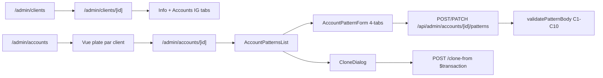

# Clients / Comptes IG / Patterns

## Pitch
Admin gère la hiérarchie Client → InstagramAccount → AccountPattern. Liste clients, vue plate des comptes IG, fiche compte avec onglets Patterns / Bibliothèques accessibles, drawer 4-tabs (Identité/Production/Workflow/Équipe) pour patterns, clone atomique inter-comptes.

## Schéma Mermaid

## Entry points UI

| Composant | Fichier:Ligne | Rôle |
|---|---|---|
| Liste clients | `app/(app)/admin/clients/page.tsx:8` | Server gate ADMIN |
| Détail client server | `app/(app)/admin/clients/[id]/page.tsx:24` | Wrapper |
| ClientDetailClient | `app/(app)/admin/clients/[id]/ClientDetailClient.tsx:39` | 2-tabs (Info + Accounts IG) |
| Vue plate comptes | `app/(app)/admin/accounts/page.tsx:8` | Tous comptes groupés par client |
| Fiche compte | `app/(app)/admin/accounts/[id]/page.tsx:20` | Patterns + Bibliothèques accessibles |
| ClientsListAdmin | `components/admin/ClientsListAdmin.tsx` | Liste |
| AccountsListAdmin | `components/admin/AccountsListAdmin.tsx` | Liste plate |
| AccountPatternsList | `components/admin/AccountPatternsList.tsx` | Liste patterns + thumbnail dernier render |
| AccountPatternForm | `components/admin/AccountPatternForm.tsx:82` | Drawer xl 4-tabs (Identité/Production/Workflow/Équipe) |
| CloneDialog | `components/admin/CloneDialog.tsx:30` | Modal + Combobox fuzzy comptes sources |
| CoverConfigEditor | `components/admin/CoverConfigEditor.tsx` | Éditeur JSON cover config |

## Routes API

### Client
| Méthode | Path | Effets |
|---|---|---|
| GET | `/api/admin/clients:6` | Liste |
| POST | `/api/admin/clients:6` | Création |
| GET | `/api/admin/clients/[id]:9` | Détail |
| PATCH | `/api/admin/clients/[id]:9` | Update |
| DELETE | `/api/admin/clients/[id]:9` | onDelete SetNull sur accounts.clientId |

### InstagramAccount
| Méthode | Path | Effets |
|---|---|---|
| GET | `/api/admin/accounts:7` | Filtre `?clientId` |
| POST | `/api/admin/accounts:7` | Création (handle @unique) |
| PATCH | `/api/admin/accounts/[id]:6` | Édition |
| DELETE | `/api/admin/accounts/[id]:6` | Suppression |

### AccountPattern
| Méthode | Path | Effets |
|---|---|---|
| GET | `/api/admin/accounts/[id]/patterns:125` | Liste patterns |
| POST | `/.../patterns:125` | `validatePatternBody(body, requireAll=true)` strict |
| GET/PATCH/DELETE | `/.../patterns/[patternId]:89` | PATCH merge body + existing avant cross-field validation, DELETE bloqué si slots liés |
| POST | `/.../patterns/clone-from:17` | Clone atomique `$transaction` (rollback si fail) |

## Modèles Prisma

- **`Client`** (`schema.prisma:885`) — id, name, contactName, email, phone, accounts[] 1:N
- **`InstagramAccount`** (`schema.prisma:646`) — id, name, handle @unique, clientId FK SetNull, publicationSlots[], accountPatterns[], cursors[]
- **`AccountPattern`** (`schema.prisma:900`) — gros modèle composite :
  - `id, accountId, label, source` (auto_template/manual_rushes/external_upload)
  - `templateId` FK (requis si source=auto_template)
  - `coverMode` (none/manualSelect/autoPack/monteurUpload), `coverConfig` JSON
  - `needsDescription` (preFilled/autoGenerate/manualWrite/none)
  - `needsCaptionsMode` (none/auto/manual) — V8 source de vérité, `needsCaptions` Boolean back-compat
  - `needsAdminValidation`, `needsClientValidation`, `allowsClientRevision` Boolean (Phase 2.3)
  - `needsRushes`, `needsBrief` Boolean
  - `dayOfWeek` Int[] (1-7), `publishTime` HH:MM regex
  - `isActive` (default true)
  - `defaultAssigneeMonteurId/CmId/VideasteId` FK User nullable
  - `captionPresetId`, `descriptionPromptId` FK nullable

## Validation Cross-Field (`patternValidation.ts`)

| Code | Règle |
|---|---|
| C1 | `coverMode=autoPack` → `coverConfig.coverPresetName` requis |
| C2 | `coverConfig.coverPresetName` doit exister dans `template.coverPresets` |
| C3 | `needsCaptionsMode=auto` → `captionPresetId` requis |
| C4 | `needsDescription=autoGenerate` → `descriptionPromptId` requis |
| C5 | `source=auto_template` → `templateId` requis |
| C6 | `coverMode=monteurUpload` → `source=manual_rushes` |
| C10 | `allowsClientRevision=true` → `needsClientValidation=true` |

## Pré-conditions & Guards

- **Admin-only** : `userContext.canAdminBypass`
- **handle @unique** global
- **dayOfWeek ∈ [1,7]** : dédupliqué/trié côté serveur
- **publishTime format strict** regex HH:MM
- **Pattern.delete bloqué** si `publicationSlots.count > 0`
- **Clone atomique** : $transaction
- **V8 migration** : `needsCaptionsMode` source de vérité, `needsCaptions` Boolean fallback legacy

## Variants par rôle

| Rôle | Ce qui change |
|---|---|
| ADMIN | Seul accès CRUD client/comptes/patterns |
| Autres | Aucun accès (pages 404/redirect) |

## Skills/agents pertinents

- `.claude/skills/admin-permissions/SKILL.md`
- Agent `toolbox-generalist`
