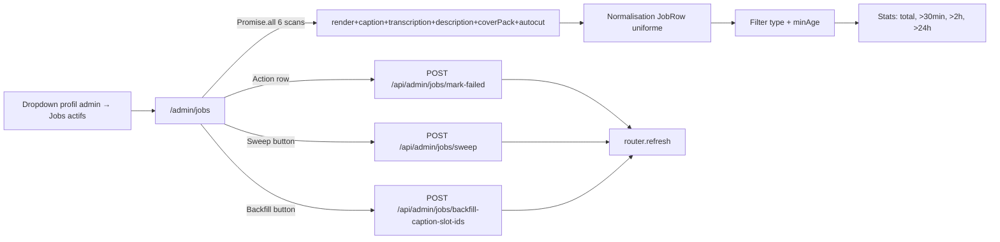

# Admin jobs monitoring

## Pitch

Page admin `/admin/jobs` qui scanne les 6 modèles de jobs actifs (Render, CaptionJob, TranscriptionJob, DescriptionJob, CoverFramePack, MediaAutocutJob) en statuts QUEUED/PROCESSING/PENDING, affiche leur âge avec badges colorés (>30min peach, >2h rose, >24h zombie), et permet :

- **Filtrer** par type et âge minimum (30min, 2h, 24h)
- **Marquer FAILED** un job individuellement (libère le slot bloqué)
- **Sweep auto** : marque FAILED tous les jobs zombies (au-delà des seuils serveur)
- **Backfill caption slot IDs** : utilitaire ponctuel pour rétro-coller le `slotId` sur d'anciens CaptionJob

Accessible uniquement via dropdown footer profil admin (pas en nav principale — surface opérationnelle rare). Lien vers la source du job (publication / listing / asset) pour creuser le contexte sans copier l'ID.

## Schéma Mermaid



## Entry points UI

| Composant | Fichier:Ligne | Rôle |
|---|---|---|
| Lien dropdown profil | `components/layout/AppNav.tsx:365-373` | "Jobs actifs" → `/admin/jobs` |
| Page SSR | `app/(app)/admin/jobs/page.tsx:88-385` | Scan parallèle 6 modèles + filters + table |
| JobsActionButtons | `app/(app)/admin/jobs/_components/JobsActionButtons.tsx:20-61` | Bouton "Marquer FAILED" inline (par row) |
| SweepButton | `app/(app)/admin/jobs/_components/SweepButton.tsx:18-71` | Bouton "Sweep auto" (header) |
| BackfillCaptionSlotIdsButton | `app/(app)/admin/jobs/_components/BackfillCaptionSlotIdsButton.tsx` | Utilitaire ponctuel rétro-tag |
| RefreshButton | `components/ui/RefreshButton.tsx` | Re-scan via SSR refresh |

## Routes API

| Méthode | Path | Effets |
|---|---|---|
| POST | `/api/admin/jobs/mark-failed` | Body `{type, id}` — Marque le job FAILED (libère slot) |
| POST | `/api/admin/jobs/sweep` | Sweep zombies (seuils serveur) → `{swept: {total: N}}` |
| POST | `/api/admin/jobs/backfill-caption-slot-ids` | Rétro-coller slotId sur anciens CaptionJob |

## Scan multi-modèles

`app/(app)/admin/jobs/page.tsx:98-144`

```ts
Promise.all([
  prisma.render.findMany({ where: { status: { in: ["PENDING", "PROCESSING"] } }, ... }),
  prisma.captionJob.findMany({ where: { status: { in: ["QUEUED", "PROCESSING"] } }, ... }),
  prisma.transcriptionJob.findMany({ ... }),
  prisma.descriptionJob.findMany({ ... }),
  prisma.coverFramePack.findMany({ ... include: render.publicationSlotId + publicationVersion.slotId ... }),
  prisma.mediaAutocutJob.findMany({ ... }),
]);
```

Chaque résultat → `JobRow { type, id, status, userId, createdAt, label, href }` avec un `href` qui pointe vers la source (`/publications/[slot]` ou `/listings` ou `/admin/libraries/media`).

## Stats et badges d'âge

`page.tsx:225-230, 63-82`

```ts
stats = {
  total: allRows.length,
  over30min: filter(ageMs >= 30 * 60_000),
  over2h:    filter(ageMs >= 2 * 60 * 60_000),
  over24h:   filter(ageMs >= 24 * 60 * 60_000),  // zombies
};
```

Badge âge :
- `< 30min` : gris neutre
- `≥ 30min` : peach (peach-100 + peach-300 border)
- `≥ 2h` : rose (rose-100 + rose-300 border)
- `≥ 24h` : red (apparait via "zombies" stats card)

## Filtres URL-state

| Param | Valeurs | Effet |
|---|---|---|
| `?type=` | `render \| caption \| transcription \| description \| cover-pack \| autocut` | Filtre par type de job |
| `?minAge=` | `0, 30, 120, 1440` (minutes) | Filtre par âge minimum |

Filtres dans URL search params → reload SSR à chaque clic. Pas de state client.

## Permissions

`page.tsx:89-92`

```ts
if (!ctx?.actualUser || ctx.actualUser.role !== "ADMIN") {
  redirect("/home");
}
```

**Strict** : `actualUser.role === "ADMIN"` requis (pas via impersonation). C'est une surface SUPERADMIN — un admin impersonant un MONTEUR perd l'accès (sinon impersonation = bypass non voulu).

## Modèles Prisma scannés

- `Render` (status PENDING/PROCESSING) — listingId, publicationSlotId, pipeline, stage
- `CaptionJob` (QUEUED/PROCESSING) — slotId, userId, updatedAt
- `TranscriptionJob` (QUEUED/PROCESSING) — userId, updatedAt + render.publicationSlotId join
- `DescriptionJob` (QUEUED/PROCESSING) — slotId, userId
- `CoverFramePack` (QUEUED/PROCESSING) — renderId, publicationVersionId + render.publicationSlotId + publicationVersion.slotId joins
- `MediaAutocutJob` (QUEUED/PROCESSING) — assetId

**LIMIT 200 par modèle** : `take: 200` sur chaque findMany — si la file dépasse 200 jobs pour un type, la page ne montre que les 200 plus anciens (ordre `asc` sur createdAt).

## Actions

### Marquer FAILED (par row)

`JobsActionButtons.tsx:25-47`

- `useConfirm` (dialog "irréversible")
- `POST /api/admin/jobs/mark-failed` body `{type, id}`
- Toast success/error + `router.refresh()`

### Sweep auto

`SweepButton.tsx:23-55`

- `useConfirm` (dialog "irréversible")
- `POST /api/admin/jobs/sweep` (pas de body — seuils côté serveur)
- Toast : `${count} jobs marqués FAILED` ou "Aucun job zombie détecté"
- `router.refresh()`

### Backfill caption slot IDs

Utilitaire ponctuel : remplit `slotId` sur d'anciens `CaptionJob` qui n'avaient pas ce champ. Hérité d'une migration.

## Pré-conditions / invariants

- Aucun cron auto-sweep pour l'instant — la page est consultée manuellement quand un slot semble bloqué
- Job marqué FAILED → cascade côté slot via `markJobsStaleForSlot` (cf. publication-versions-lifecycle)
- Pas de "Relancer" actuellement (mentionné comme future iteration dans `JobsActionButtons.tsx:7`)

## Side effects

- `router.refresh()` après chaque action → re-scan SSR complet
- Toast success/error
- Console error si fetch échoue
- Pas de log activity (action superadmin, pas un événement métier publication)

## Variants par rôle

| Rôle | Accessible? |
|---|---|
| ADMIN (actual) | ✅ Tout |
| ADMIN impersonnant un autre | ❌ Redirect `/home` (actualUser.role check strict) |
| Autres rôles | ❌ Redirect `/home` |

## Skills/agents pertinents

- `.claude/skills/render-engine/SKILL.md` — RunPod stalls, NVENC failures
- `.claude/skills/captions-transcription/SKILL.md` — CaptionJob / TranscriptionJob orchestration
- `.claude/skills/app-hardening/SKILL.md` — guardrails, stale state recovery

## Liens vers code

- Page : `web/src/app/(app)/admin/jobs/page.tsx`
- Actions : `web/src/app/(app)/admin/jobs/_components/`
- API : `web/src/app/api/admin/jobs/mark-failed/`, `sweep/`, `backfill-caption-slot-ids/`
- Workflow lié : `publication-versions-lifecycle` (stale cascade), `sse-events-system` (job events)
