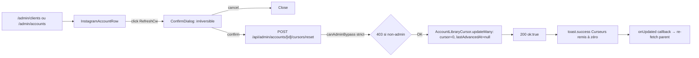

# Admin rotation — reset + ajustement manuel

## Pitch

Deux surfaces admin pour piloter les cursors :
1. **Reset compte** (`/admin/accounts/[id]`) — wipe tous les `AccountLibraryCursor` d'un compte à `cursor=0, lastAdvancedAt=null`.
2. **Ajustement par lib** (`/admin/cursors`, Phase 5 — commit `060564a`) — UI top-level pour modifier manuellement `cursor`, `lastUsedSetTag`, `lastUsedCategory` pour un (lib × compte) précis. Couvre Media + Data.

Trigger : bouton `RefreshCw` dans la row d'un compte IG sur `/admin/clients` ou `/admin/accounts` → `ConfirmDialog` "irréversible" → `POST /api/admin/accounts/[id]/cursors/reset` → tous les `AccountLibraryCursor` du compte passent à `cursor=0, lastAdvancedAt=null`.

## Schéma Mermaid



## Entry points UI

| Composant | Fichier:Ligne | Rôle |
|---|---|---|
| InstagramAccountRow | `components/admin/InstagramAccountRow.tsx:30-169` | Affiche compte + bouton RefreshCw + cursors expandable |
| Bouton reset | `InstagramAccountRow.tsx:91-97` | Icône `RefreshCw` titre "Remettre les curseurs à zéro" |
| ConfirmDialog | `InstagramAccountRow.tsx:146-155` | `variant="danger"` + label "Remettre à zéro" |
| Expandable cursors | `InstagramAccountRow.tsx:107-143` | Affiche état actuel : `nom lib → "{theme} ({cursor}/{n})" + lastAdvancedAt` |

## Route API

| Méthode | Path | Fichier:Ligne | Auth | Effets |
|---|---|---|---|---|
| POST | `/api/admin/accounts/[id]/cursors/reset` | `route.ts:6-23` | **canAdminBypass strict (403 sinon)** | `AccountLibraryCursor.updateMany({ where: { accountId }, data: { cursor: 0, lastAdvancedAt: null } })` |

## Pipeline serveur (très simple)

`api/admin/accounts/[id]/cursors/reset/route.ts:6-23`

```ts
async function POST(_req, { params }) {
  const ctx = await getUserContext();
  if (!ctx?.effectiveUser.id || !ctx.canAdminBypass) return 403;

  await prisma.accountLibraryCursor.updateMany({
    where: { accountId: id },
    data: { cursor: 0, lastAdvancedAt: null },
  });
  return { ok: true };
}
```

**Pas de soft-mode / preview** — tout est wiped en une fois. C'est volontaire (V1 : si on veut reset, on reset tout).

## Modèles Prisma touchés

- **`AccountLibraryCursor`** — `(accountId, libraryId)` unique. Champs : `cursor: Int`, `lastAdvancedAt: DateTime?`, `libraryId`, `accountId`
- **`InstagramAccount`** (lecture seule pour le row)
- **`MediaLibrary`** (joint pour afficher `setSequence` actuel et calculer le thème courant)

## Affichage state actuel (avant reset)

`InstagramAccountRow.tsx:118-138`

```ts
let themes: string[] = JSON.parse(c.library.setSequence);
const activeTheme = themes[c.cursor % themes.length];
// Affiche : "Atelier Bois → tenue1 (3/8) · avancé 28/05/2026"
```

Permet à l'admin de voir AVANT reset où en est chaque curseur, et de comprendre l'impact ("ah le prochain rendu pour ce compte aurait été tenue4").

## Permissions

```ts
if (!ctx?.effectiveUser.id || !ctx.canAdminBypass) return 403;
```

- **canAdminBypass strict** : un ADMIN impersonant un autre rôle perd l'accès (sinon impersonation = bypass non voulu sur action destructrice)
- **Pas de RLS** : `accountId` du compte fourni → tous les cursors maj, peu importe leur library

## Side effects

- `cursor=0, lastAdvancedAt=null` sur tous les `AccountLibraryCursor` du compte
- Pas de log activity (action admin technique, pas un événement publication)
- Pas de SSE event
- Le prochain rendu sur ce compte repartira du thème `setSequence[0]`
- **`MediaAssetUsage`** non touché — c'est un table séparée qui track les usages individuels (pas le curseur de séquence)

## Variants par rôle

| Rôle | Accessible? |
|---|---|
| ADMIN | ✅ Bouton visible + action OK |
| Autres rôles | ❌ N'ont pas accès aux pages `/admin/accounts` (gated en amont) |

## Pré-conditions / invariants

- L'action est **irréversible** (dialog le dit explicitement)
- Pas de partial reset (impossible de reset juste une library) — c'est tout ou rien
- Si le compte n'a pas encore de cursor (row pas créée), `updateMany` n'a rien à faire → 200 ok sans erreur
- N'affecte pas la rotation `shared` (qui utilise `MediaAsset.usageCount`, pas `AccountLibraryCursor`)

## /admin/cursors — UI ajustement manuel (Phase 5, commit `060564a`)

### Surface

Page top-level dans la nav admin. Sélecteur `type` (media|data) + `libraryId`. Liste les comptes ayant accès à la lib (ou un cursor existant) avec leur état actuel.

### Composants

| Composant | Fichier:Ligne | Rôle |
|---|---|---|
| Page server | `app/(app)/admin/cursors/page.tsx` | SSR : load libs disponibles |
| CursorManagementClient | `components/admin/cursors/CursorManagementClient.tsx` | State management, fetch, layout |
| CursorAccountList | `components/admin/cursors/CursorAccountList.tsx` | Table compte × état + bouton "Ajuster" |
| CursorAdjustModal | `components/admin/cursors/CursorAdjustModal.tsx` | Modal édition (cursor int, setTag/category strings) |

### Routes API

| Méthode | Path | Fichier | Auth | Effets |
|---|---|---|---|---|
| GET | `/api/admin/cursors?type=media\|data&libraryId=X` | `route.ts:35` | canAdminBypass | Liste rows avec scope info |
| PATCH | `/api/admin/cursors/media/[libraryId]/[accountId]` | `route.ts` | canAdminBypass | UPDATE `AccountLibraryCursor` |
| PATCH | `/api/admin/cursors/data/[libraryId]/[accountId]` | `route.ts` | canAdminBypass | UPDATE `AccountDataLibraryCursor` |

### Cas d'usage

- **Désaxage** : avancer manuellement le cursor de 2 pour skip un asset en pause.
- **Sync 2 comptes** : aligner `lastUsedSetTag` de 2 comptes pour leur faire jouer le même thème.
- **Debug post-incident** : après un revert qui a partiellement échoué, set un état stable connu.
- **Demo / test** : revenir à une configuration figée pour reproduire un scenario.

### Garde-fous

- Auth strict `canAdminBypass` (impersonation perd l'accès).
- Validation Zod sur `cursor` (≥ 0).
- Pas de log activity (action admin technique).

### Préview simulation

Possible de coupler avec `/api/admin/libraries/media/[id]/simulate-rotation?accountId=X` pour vérifier la prochaine sélection AVANT submit du PATCH.

## Lien avec asset-rotation-engine

`AccountLibraryCursor` est le cœur de la rotation `theme_sequence` en mode `per_account` scope. Voir `.claude/workflows/asset-rotation-engine.md` pour :
- `pickFromGroup` et `selectMediaAssetBySetSequence`
- Comment le cursor est incrémenté (post-render via `advanceLibraryCursorsOnSubmit` + `recordLibraryUsage`)
- Revert via `revertLibraryCursors` au cas ERROR

## Skills/agents pertinents

- `.claude/skills/asset-rotation/SKILL.md` — Algo theme_sequence + curseurs
- `.claude/skills/content-library/SKILL.md` — MediaLibrary, DataLibrary
- `.claude/skills/admin-permissions/SKILL.md` — canAdminBypass

## Liens vers code

- API : `web/src/app/api/admin/accounts/[id]/cursors/reset/route.ts`
- Row UI : `web/src/components/admin/InstagramAccountRow.tsx`
- Algo rotation : `web/src/lib/contentLibraryResolver.ts`
- Workflows liés : `asset-rotation-engine.md`, `accounts-clients-crud.md`
