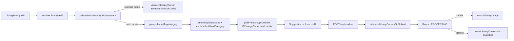

# Moteur de rotation des assets

## Pitch
Sélection d'un MediaAsset (ou DataEntry) lors d'une génération, en respectant le mode de rotation (`auto` / `override` / `none`), le scope (`shared` / `per_account`), l'exclusion de catégorie/setTag consécutive, et le quota `maxUsageCount`. Curseur via `AccountLibraryCursor`, usages via `MediaAssetUsage` (per_account) ou `MediaAsset.usageCount` (shared).

## Schéma Mermaid

## Algo principal

- `web/src/lib/contentLibraryResolver.ts:117-254` — **`selectMediaAsset()`** : sélection par stratégie (`random`, `oldest_used`, `least_used`, `not_used_in_cycle`). Filtres : access control + burn-once `maxUsageCount` + tagConditions + duration min. Order `usageCount, lastUsedAt` (per_account si accountId présent, sinon global).
- `web/src/lib/contentLibraryResolver.ts:332-777` — **`selectMediaAssetBySetSequence()`** : 2 niveaux
  - **Override mode** (`setSequence` non-vide) : curseur entier dans la liste, advance atomique `FOR UPDATE` (l/467-548). Reverted si render fail.
  - **Auto mode** (`setSequence` vide) : groupes `(category, setTag)`, anti-répétition 3 niveaux (exclut catégorie dernière utilisée OU setTag si 1 seule catégorie).
  - **Pinned group** (2+ blocks mêmes libs) : skip discovery, pick from specific group.
  - **READ-ONLY path** (prefill page, pas d'écriture) : l/555-611.
  - Locking : `SELECT FOR UPDATE SKIP LOCKED` isolation des gens concurrents.
- `web/src/lib/contentLibraryResolver.ts:265-291` — **`selectMediaAssetByMetadataValue()`** : pick par matching JSON metadata field (utilisé par schema field `optionsSource.type="metadata-values-from-library"`).

## Helpers de groupes

- `web/src/lib/contentLibraryResolver.ts:421-455` — **`pickFromGroup()`** : fetch asset dans groupe `(setTag, category)`, order par usage. `usageAccountId` peut différer du real `accountId` (shared libs → sentinel).
- `web/src/lib/contentLibraryResolver.ts:402-416` — **`selectEligibleGroups()`** : anti-répétition doux. Exclut `lastUsedCategory` (ou `lastUsedSetTag` si 1 seule cat) si `hasHistory=true`. Fallback full pool si épuisé.
- `web/src/lib/contentLibraryResolver.ts:109-115` — **`buildBurnFilter()`** : SQL fragment `maxUsageCount` — per-account via `MediaAssetUsage.usageCount`, global via `MediaAsset.usageCount`.

## Modèles Prisma

- **`MediaLibrary`** (`schema.prisma:409-451`) — `setSequence` (JSON string[]), `rotationMode` (null|auto|override|none), `rotationScope` (per_account|shared), `maxUsageCount`, `metadataSchema`
- **`MediaAsset`** (`schema.prisma:454-490`) — `setTag`, `category`, `tags` JSON, `usageCount` (global), `lastUsedAt` (global), `disabled`, `metadata` JSON
- **`MediaAssetUsage`** (`schema.prisma:704-713`) — `(assetId, accountId)` unique, `usageCount`, `lastUsedAt` — **isolation per_account**
- **`AccountLibraryCursor`** (`schema.prisma:717-734`) — `(accountId, libraryId)` unique, `cursor` (override mode), `lastUsedSetTag`, `lastUsedCategory` (anti-répétition), `lastAdvancedAt` (discrimine "jamais joué" vs "dernier")
- **`DataLibrary`** (`schema.prisma:564-597`) — mirror MediaLibrary (mêmes champs rotation)
- **`DataEntry`** (`schema.prisma:625-643`) — `setTag`, `category`, `usageCount`, `lastUsedAt`, `usedInCycle` (sentinel "cycle" policy)
- **`DataEntryUsage`** (`schema.prisma:680-689`) — `(entryId, accountId)` unique — per-account isolation
- **`MediaAssetAccess`** / **`DataEntryAccess`** (`schema.prisma:669-700`) — contrôle accès : 0 entrées = global, 1+ = restreint aux comptes listés

## Sélection DataEntry (DataLibrary)

`web/src/lib/contentLibraryResolver.ts:1357-1568` — **`selectDataEntry()`** : 4 policies
- **`cycle`** (défaut) : global `not_used_in_cycle` + fallback `least_used`
- **`cycle_per_account`** : per-account never-used (INSERT DataEntryUsage claim), fallback to `usageCount>=1` (cycle restart)
- **`once_per_account`** : per-account hard limit, null si all used
- **`once_global`** : global hard limit via `usedInCycle=false` sentinel + `usageCount=0`
- **`unlimited`** : no constraint, always `least_used`

Locking : `FOR UPDATE SKIP LOCKED` pour concurrent claim isolation.

## Enregistrement usage (post-DONE)

- `web/src/lib/recordLibraryUsage.ts:50-214` — **`recordLibraryUsage()`** : incrément `MediaAsset.usageCount` + `lastUsedAt` global, upsert `MediaAssetUsage`. Pour libs `shared` : write avec `SHARED_CURSOR_ACCOUNT_ID` pour ordering global.
- `web/src/lib/recordLibraryUsage.ts:446-555` — **`revertLibraryCursors()`** : rollback si ERROR via snapshot. Conditional UPDATE — reverted seulement si cursor encore `claimedCursor` (no race).
- `web/src/lib/recordLibraryUsage.ts:253-432` — **`revertRenderUsage()`** : admin-initiated full rollback, decrement counts + clear lastUsedAt si count→0, returns RevertSummary avec warnings si conflicts.

## Préfill & contexte

- `web/src/lib/contentLibraryResolver.ts:786-900+` — **`resolveLibraryPrefill()`** : résout suggestions pour form. VideoBlocks + VideoSequenceSlots groupés par `libraryId`. Set-sequence : 1ère block découvre group via cursor, suivantes reçoivent `pinnedSetTag`. Batch-load `rotationScope` pour omettre accountId si shared.
- `web/src/types/libraryPrefill.ts` — **`LibraryPrefillContext`** : `fieldLibraryMap`, `initialSuggestions`, `setSequencedLibraryIds`, `usedSetTagByLibrary`, `usedCategoryByLibrary`, `prevDataEntryState`, `metadataDrivenLinks`.
- `web/src/lib/generate/buildLibraryPrefillContext.ts:80-150+` — Extracteur server component pour generate page.

## Simulation & debug (vue admin)

- `web/src/app/api/admin/libraries/media/[id]/simulate-rotation/route.ts:1-200` — **GET `/api/admin/libraries/media/[id]/simulate-rotation?accountId=X`** : simule prochaine sélection (readOnly=true), affiche asset + cursor state + raison
- `web/src/components/admin/libraries/mediaAssets/MediaAssetsRotationView.tsx:1-100+` — Vue UI ordre flat, drag-reorder sequence, next-asset preview

## Gestion config (routes admin)

- PATCH `/api/admin/libraries/media/[id]` — update name, description, tags, setSequence, rotationScope, rotationMode, metadataSchema, maxUsageCount
- POST `/api/admin/libraries/media/[id]/reset-usage` — remet `usageCount=0` + `lastUsedAt=null` tous assets
- DELETE `/api/admin/libraries/media/[id]` — supprime lib + cascade assets (R2 cleanup)

## Side effects & invariants

- `recordLibraryUsage` est idempotent via snapshot
- Cursor advance race : `FOR UPDATE SKIP LOCKED` sérialise
- Conditional revert via snapshot : idempotent si gen suivante avance déjà
- maxUsageCount filtering : saturated assets retirés, recycle au cycle complet
- Shared-scope libs : `SHARED_CURSOR_ACCOUNT_ID = "__shared__"` (cursor/usage global tout en respectant real accountId pour MediaAssetAccess checks)
- Phase 2 orphelins (2026-05-30) : assets `setTag=null AND category=null` forment groupe `(null, null)` éligible

## Skills/agents pertinents

- **`.claude/skills/asset-rotation/SKILL.md`** — **map détaillée du moteur (à lire en priorité)**
- `.claude/skills/content-library/SKILL.md` — MediaLibrary/DataLibrary haut niveau
- Agent `toolbox-generalist` pour modif
- Agent `bug-hunter` si race condition rotation

## Liens vers code

- Tests : `web/src/lib/__tests__/contentLibraryResolver.test.ts`, `recordLibraryUsage.test.ts`
- Cible audit visuel : `medialib-admin-tour` scenario step 06 (vue rotation simulation)
