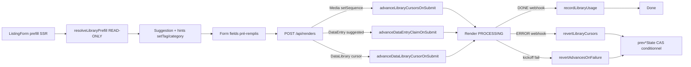

# Moteur de rotation des assets

## Pitch
Sélection d'un MediaAsset (ou DataEntry) lors d'une génération, en respectant le mode de rotation (`auto` / `override` / `none`), le scope (`shared` / `per_account`), l'anti-répétition `category` / `setTag`, et les usagePolicy (`unlimited` / `cycle` / `cycle_per_account` / `once_per_account` / `once_global`). Le claim est posé au **submit** (read-only au prefill), avancé via CAS conditionnel, et reverté au ERROR via snapshot.

## Schéma Mermaid



## Layers du moteur

```
1. Prefill SSR        — resolveLibraryPrefill (READ-ONLY, hints uniquement)
2. Submit             — advance* (claim + advance cursor, snapshot prev*State)
3. Persistence claim  — sanitizedUsedAssets stocké dans Render.usedAssets (JSON)
4. DONE webhook       — recordLibraryUsage (compteurs idempotents)
5. ERROR/kickoff fail — revertLibraryCursors + revertAdvancesOnFailure (CAS revert)
```

## MediaAsset — selection

- `contentLibraryResolver.ts:117-254` — **`selectMediaAsset()`** : strategy (`random` / `oldest_used` / `least_used` / `not_used_in_cycle`). Filtres `access` + `maxUsageCount` + `tagConditions` + `minDuration`. Order `usageCount, lastUsedAt` (per_account si accountId, sinon global).
- `contentLibraryResolver.ts:332-880+` — **`selectMediaAssetBySetSequence()`** :
  - **Override mode** (`setSequence` non-vide) : cursor entier `FOR UPDATE`, advance atomique.
  - **Auto mode** : groupes `(category, setTag)`, anti-répétition 3 niveaux (`selectEligibleGroups`).
  - **Pinned group** : skip discovery (block leader décide pour suivants).
  - **READ-ONLY path** : prefill sans écriture.
  - **`buildBurnFilter()`** : combine `maxUsageCount` + `minDuration` (Phase 4 — un seul SQL fragment évite 13 injection sites).
- `contentLibraryResolver.ts:265-291` — **`selectMediaAssetByMetadataValue()`** : match JSON metadata field.
- `contentLibraryResolver.ts:421-455` — **`pickFromGroup()`** : fetch dans groupe `(setTag, category)`, order par usage. `usageAccountId` peut différer (shared lib → sentinel).
- `contentLibraryResolver.ts:402-416` — **`selectEligibleGroups()`** : exclut `lastUsedCategory` (ou `lastUsedSetTag` si 1 seule cat) si `hasHistory=true`. Fallback full pool si épuisé.

## DataEntry — selection (parité Media, Phase 8.M1)

- `contentLibraryResolver.ts:1857-2400+` — **`selectDataEntry()`** : 5 policies × 2 scopes
  - **`unlimited`** : pas de claim, always least-used.
  - **`cycle`** : global `usedInCycle=false` + fallback `least_used` (cycle restart).
  - **`cycle_per_account`** : per-account never-used (INSERT DataEntryUsage claim) + **fallback cycle restart avec claim soft** (bug-hunter B4 fix — DataEntryUsage upsert `lastUsedAt=now` empêche submits concurrents de re-piocher la même entry).
  - **`once_per_account`** : hard per-account limit. Null si exhausted.
  - **`once_global`** : `usedInCycle=true` sentinel + `usageCount=0`. CAS revert via DELETE WHERE usageCount=0.
- `contentLibraryResolver.ts:1532-1700` — **`advanceDataEntryClaimOnSubmit()`** : mirror de `advanceLibraryCursorsOnSubmit` côté DataEntry. Pose le claim au submit (pas au prefill).
  - **Bug-hunter B1 fix** : compare `dataClaim.claimState.entryId !== originalDataEntryId` (avant : comparaison à `campaignId` toujours truthy → re-fetch parasite).
  - **Bug-hunter B5 fix** : `findUnique({id: suggestedEntryId})` gardée par `if (accountId && suggestedEntryId)` (avant : empty string silently null → `prevCursorState` undefined → anti-rep cassée au fallback).
- `contentLibraryResolver.ts:1955-2114` — **`selectEligibleDataGroups()` + `pickDataEntryFromGroup()`** : équivalent groupes DataEntry, anti-rep 3 niveaux. Couvre les 4 modes (cat+set, cat seul, set seul, orphelins null/null).
- **READ-ONLY au prefill** : `readOnly=true` skip tous les claim — l'user qui abandonne la page ne consomme rien. Phase 8.M1.

## DataLibrary cursor — submit + revert

- `contentLibraryResolver.ts:1447-1530` — **`advanceDataLibraryCursorOnSubmit()`** : mirror de `advanceLibraryCursorsOnSubmit` pour AccountDataLibraryCursor. Détermine `effectiveCursorId` (shared → `SHARED_DATA_CURSOR_ACCOUNT_ID`, per_account → `accountId`).
- Snapshot `prevDataLibraryCursorState` côté caller (`POST /api/renders`) pour revert CAS.
- `recordLibraryUsage.ts:revertLibraryCursors` — revert CAS conditionnel sur `(claimedSetTag, claimedCategory)` post-ERROR.

## Scope shared vs per_account

- Sentinels : `SHARED_CURSOR_ACCOUNT_ID = "__shared__"` (Media), `SHARED_DATA_CURSOR_ACCOUNT_ID = "__shared_data__"` (Data).
- **Media `shared`** : `MediaAsset.usageCount` + `lastUsedAt` global, `AccountLibraryCursor` keyed par sentinel.
- **Media `per_account`** : `MediaAssetUsage(assetId, accountId)` per-account, `AccountLibraryCursor` keyed par `accountId`.
- **Data parité (Phase 3.B)** : même pattern via `effectiveCursorId`. `AccountDataLibraryCursor` keyed par sentinel ou `accountId` selon scope.
- Cohérence : `recordLibraryUsage` détermine le bon scope au DONE.

## Claim flow + revert (post-Phase 8 + bug-hunter)

| Étape | Media | Data |
|---|---|---|
| Prefill SSR | `selectMediaAssetBySetSequence(readOnly=true)` | `selectDataEntry(readOnly=true)` |
| Submit advance | `advanceLibraryCursorsOnSubmit` (cursor + lastUsedSetTag/Cat) | `advanceDataEntryClaimOnSubmit` (claim) + `advanceDataLibraryCursorOnSubmit` (cursor) |
| Snapshot revert | `prevCursorStateByLibrary` | `prevDataEntryState` (B2) + `prevDataLibraryCursorState` |
| DONE webhook | `recordLibraryUsage` → MediaAsset.usageCount++ ou MediaAssetUsage upsert | `recordLibraryUsage` → DataEntry.usageCount++ ou DataEntryUsage upsert |
| ERROR webhook | `revertLibraryCursors` (CAS sur claimedCursor + lastUsedCat/SetTag) | `revertLibraryCursors` (CAS sur claimedSetTag/Cat) + DELETE DataEntryUsage WHERE usageCount=0 |
| Kickoff fail (Render.create ou submit external) | `revertAdvancesOnFailure` | `revertAdvancesOnFailure` étendu (B2) revert aussi `prevDataEntryState` |

## Bug-hunter fixes récents (2026-06-04)

| ID | Sévérité | Description | Commit |
|---|---|---|---|
| B1 | CRITICAL | `entryId !== campaignId` toujours truthy → re-fetch parasite, cursor jamais avancé si entry supprimée entre temps | `fa8d931` |
| B2 | CRITICAL | `revertAdvancesOnFailure` ignorait `prevDataEntryState` → DataEntry leak au kickoff fail | `fa8d931` |
| B3 | HIGH | Auto-mode trustait `usedSetTagByLibrary`/`usedCategoryByLibrary` du payload client → tamper pollue anti-rep. Re-dérive depuis `MediaAsset.setTag/category` des assets choisis | `45f9085` |
| B4 | HIGH | `cycle_per_account` fallback path sans claim → submits concurrents re-choisissaient la même entry. Claim soft (`DataEntryUsage` upsert `lastUsedAt=now`) | `45f9085` |
| B5 | HIGH | `findUnique({id: suggestedEntryId ?? ""})` silently null → `prevCursorState` undefined au fallback re-pick | `fa8d931` |
| B7 | (Faux positif) | AccountLibraryCursor isolé par `(accountId, libraryId)` — pas de partage audio/vidéo | — |
| B10 | MEDIUM | Submit acceptait `duration=NULL` silencieusement quand `block.minDuration` explicite. Reject avec message clair | `fa8d931` |

## Modèles Prisma

- **`MediaLibrary`** (`schema.prisma:409-451`) — `setSequence` (JSON string[]), `rotationMode` (null/auto/override/none), `rotationScope` (per_account/shared), `maxUsageCount`, `metadataSchema`.
- **`MediaAsset`** (`schema.prisma:454-490`) — `setTag`, `category`, `tags` JSON, `usageCount` global, `lastUsedAt` global, `disabled`, `metadata` JSON, **`duration` (probé à l'upload pour vidéo ET audio depuis 2026-06-04, commit `16ab8e1`)**.
- **`MediaAssetUsage`** (`schema.prisma:704-713`) — `(assetId, accountId)` unique, `usageCount`, `lastUsedAt`.
- **`AccountLibraryCursor`** (`schema.prisma:717-734`) — `(accountId, libraryId)` unique, `cursor` (override), `lastUsedSetTag`, `lastUsedCategory`, `lastAdvancedAt` (discrimine "jamais joué" vs "dernier").
- **`DataLibrary`** (`schema.prisma:564-597`) — mirror MediaLibrary.
- **`DataCampaign`** (`schema.prisma:600-622`) — `usagePolicy` (cycle/cycle_per_account/once_per_account/once_global/unlimited), `isActive` mutex.
- **`DataEntry`** (`schema.prisma:625-643`) — `setTag`, `category`, `usageCount`, `lastUsedAt`, `usedInCycle` (sentinel cycle).
- **`DataEntryUsage`** (`schema.prisma:680-689`) — `(entryId, accountId)` unique.
- **`AccountDataLibraryCursor`** — `(accountId, libraryId)` unique, `lastUsedSetTag`, `lastUsedCategory`, `lastAdvancedAt`. Créée Phase 1.3 (commit `a676681`).
- **`MediaAssetAccess`** / **`DataEntryAccess`** — 0 entrées = global, 1+ = restreint.

## Length validation (Phase 4)

- **Types** : `VideoBlock.minDuration?: number`, `MusicBlock.minDuration?: number` (`types/template.ts`).
- **Auto-select** : `selectAndClaimMediaAsset(...minDuration)` via `buildBurnFilter` combine burn+duration en un seul SQL fragment.
- **Manual picker** : `/api/libraries/[libraryId]/assets?minDuration=X`, `LibraryPicker` grise les assets trop courts.
- **Submit validation** : `POST /api/renders` re-vérifie `MediaAsset.duration >= block.minDuration`. **Bug-hunter B10** : reject NULL duration si `block.minDuration` explicite (message "re-uploadez ou backfill admin").

## Recordage et revert

- `recordLibraryUsage.ts:50-214` — **`recordLibraryUsage()`** : DONE handler, MediaAsset.usageCount++ + MediaAssetUsage upsert + `recordDataEntryUsage` parité.
- `recordLibraryUsage.ts:446-555` — **`revertLibraryCursors()`** : CAS rollback Media + Data cursor + DataEntry claim.
- `recordLibraryUsage.ts:253-432` — **`revertRenderUsage()`** : admin-initiated full rollback.
- `api/renders/route.ts:19-150` — **`revertAdvancesOnFailure()`** : appelé si `Render.create` ou `startRenderGeneration` throw. **Étendu B2** pour revert aussi `prevDataEntryState` claim.

## Concurrence

- **`FOR UPDATE SKIP LOCKED`** sur `AccountLibraryCursor` + `AccountDataLibraryCursor` (sérialise advance).
- **CAS revert** : `UPDATE ... WHERE cursor IS NOT DISTINCT FROM claimed AND lastUsedCategory IS NOT DISTINCT FROM claimed AND lastUsedSetTag IS NOT DISTINCT FROM claimed` (Phase 6 — ajoute `lastUsedSetTag` à la condition).
- **DataEntry claim** : `INSERT DataEntryUsage usageCount=0` lève unique constraint si concurrent → fallback `selectDataEntry(readOnly=false)` re-pioche.
- **`once_global`** : CAS atomic `UPDATE DataEntry SET usedInCycle=true WHERE usedInCycle=false`.

## Préfill & contexte

- `contentLibraryResolver.ts:786-900+` — **`resolveLibraryPrefill()`** : VideoBlocks + VideoSequenceSlots groupés par `libraryId`. Set-sequence : 1ère block découvre group via cursor, suivantes reçoivent `pinnedSetTag`. Batch-load `rotationScope`.
- `types/libraryPrefill.ts` — **`LibraryPrefillContext`** : `fieldLibraryMap`, `initialSuggestions`, `setSequencedLibraryIds`, `usedSetTagByLibrary`, `usedCategoryByLibrary`, **`prevDataEntryState`**, `metadataDrivenLinks`.
- `lib/generate/buildLibraryPrefillContext.ts:80-150+` — Extracteur server component.

## Simulation & admin

- `app/api/admin/libraries/media/[id]/simulate-rotation/route.ts` — **GET** simule prochaine sélection (readOnly), affiche asset + cursor state + raison.
- `app/api/admin/cursors/route.ts` — **GET** liste cursors par lib (`?type=media|data&libraryId=X`). Mirror new Phase 5.
- `app/api/admin/cursors/[type]/[libraryId]/[accountId]/route.ts` — **PATCH** ajustement manuel cursor.
- `app/(app)/admin/cursors/page.tsx` — UI top-level.

## Tests

- **Unit Vitest** (101 tests verts) :
  - `rotation.media-{cycle-per-account, cycle-shared, once-per-account, once-global, unlimited, revert-on-error, anti-repetition, access-filter}.test.ts`
  - `rotation.data-{cycle-per-account, cycle-shared, unlimited, once-per-account, revert-on-error, anti-repetition, access-filter}.test.ts`
  - `advanceDataEntryClaim.test.ts` — 9 tests dédiés Phase 8.M1.
- **E2E Playwright** (Phase 10) :
  - `rotation-flow.spec.ts` — 5 générations consécutives, vérifie anti-rep.
  - `rotation-revert.spec.ts` — webhook ERROR, vérifie revert.
  - `rotation-claim-leak.spec.ts` — abandon prefill, vérifie pas de claim posé.
  - `rotation-concurrent.spec.ts` — submits parallèles, vérifie pas de doublon.
  - `e2e/helpers/rotation-e2e.ts` — helpers `triggerPrefill`, `submitRender`, `simulateRenderDone`, etc.

## Skills/agents pertinents

- **`.claude/skills/asset-rotation/SKILL.md`** — map détaillée du moteur (à lire en priorité).
- `.claude/skills/content-library/SKILL.md` — MediaLibrary/DataLibrary haut niveau.
- Agent `toolbox-generalist` pour modif.
- Agent `bug-hunter` si race condition rotation.

## Liens vers code

- Algo : `web/src/lib/contentLibraryResolver.ts` (~2500 LOC)
- Record/revert : `web/src/lib/recordLibraryUsage.ts`
- Submit endpoint : `web/src/app/api/renders/route.ts`
- Tests : `web/src/lib/__tests__/rotation*.test.ts`
- E2E : `web/e2e/rotation-*.spec.ts`
- Workflows liés : `admin-rotation-cursor-reset.md`, `generation-render-template.md`, `medialib-admin-crud.md`, `datalib-admin-crud.md`
