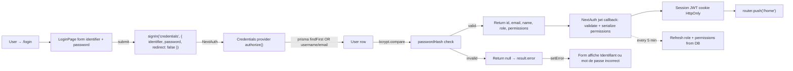

# Auth login credentials

## Pitch

Workflow d'entrée pour tous les rôles : form `/login` avec identifiant (username OU email, case-insensitive) + mot de passe → `signIn("credentials")` NextAuth → bcrypt compare → JWT issued → redirect `/home`. JWT carrying `role` + `permissions` (JSON string) avec refresh toutes les 5 minutes depuis la DB pour propager les revoke admin rapidement.

Pas de magic link signup (les magic links de `publication-validation-client` ne sont pas ce flow — ce sont des liens d'action client, pas d'auth user). Pas de Google/SSO. Credentials only. Session strategy : JWT (pas database).

## Schéma Mermaid



## Entry points UI

| Composant | Fichier:Ligne | Rôle |
|---|---|---|
| Page login | `app/login/page.tsx:7-107` | Form client + signIn + redirect |
| Form fields | `page.tsx:57-84` | Input identifier + Input password |
| Submit button | `page.tsx:92-98` | Gradient indigo→rose, loading state |
| Error display | `page.tsx:86-90` | Red banner "Identifiant ou mot de passe incorrect" |
| Decorative halos | `page.tsx:38-45` | Sky/rose blur halos (esthétique uniquement) |

## Routes API & handlers

| Méthode | Path | Fichier | Effets |
|---|---|---|---|
| POST | `/api/auth/[...nextauth]` | `app/api/auth/[...nextauth]/route.ts` | NextAuth handlers (POST = signIn, GET = session/providers) |
| (interne) | NextAuth signIn | `lib/auth.ts:9-44` | Credentials provider `authorize()` + bcrypt |

## NextAuth config

`lib/auth.ts:6-44`

```ts
NextAuth({
  trustHost: true,
  providers: [Credentials({
    credentials: { identifier, password },
    async authorize(credentials) {
      const user = await prisma.user.findFirst({
        where: { OR: [
          { username: { equals: id, mode: "insensitive" } },
          { email:    { equals: id, mode: "insensitive" } },
        ]},
      });
      if (!user) return null;
      const valid = await bcrypt.compare(password, user.passwordHash);
      if (!valid) return null;
      return { id, email, name, role, permissions };
    },
  })],
  session: { strategy: "jwt" },
  pages: { signIn: "/login" },
})
```

## JWT callbacks

`lib/auth.ts:48-100+`

1. **Au login (`user` présent)** :
   - `token.id = user.id`
   - `token.role = user.role ?? "EXTERNAL_GENERATOR"` (fallback rôle par défaut)
   - `parsedPermissions = JSON.parse(user.permissions)` (validate array of strings, fallback `[]` si corrupt)
   - `token.permissions = JSON.stringify(parsedPermissions)` (serialize back, JWT-safe)
   - `token.refreshedAt = now`

2. **À chaque request (`REFRESH_INTERVAL_S = 5 * 60`)** :
   - Si `now - lastRefresh > 5min` → re-fetch User depuis DB → maj `role` et `permissions`
   - Permet de propager un revoke admin (dégradation ADMIN → MONTEUR) en <5min sans forcer logout
   - Cadence assez longue pour ne pas plomber serverless, assez courte pour rester réactif

## Modèles Prisma

- **`User`** — `id, email, username, name, passwordHash, role, permissions, createdAt`
- `permissions` : JSON string array (ex: `'["captions","templates","covers"]'`) — pas un champ relationnel
- `role` : `ADMIN | VIDEASTE | MONTEUR | CM | EXTERNAL_GENERATOR`
- `passwordHash` : bcrypt hash (set au create user via `bcrypt.hash`)

## Identifier resolution

`lib/auth.ts:18-26`

```ts
findFirst({
  where: {
    OR: [
      { username: { equals: id, mode: "insensitive" } },
      { email:    { equals: id, mode: "insensitive" } },
    ],
  },
});
```

L'identifiant entré matche soit `username` soit `email` (insensitive). UX-friendly : un user qui a oublié si son login est son email ou son username peut utiliser n'importe lequel.

## Permissions encoding

`User.permissions` = JSON string serialized `Array<Tool>`. Tools possibles : `templates | captions | transcription | description | covers` (cf. `lib/permissions.ts`).

**Validation au JWT issue** :
- `JSON.parse` puis check `Array.isArray + every typeof === "string"`
- Si invalid → log warning + fallback `[]`
- Re-serialize systématiquement pour garantir un JWT propre

## Side effects

- **Cookie session** : JWT HttpOnly + Secure + SameSite (gérés par NextAuth)
- **Pas de log activity au login** (volontaire — `PublicationActivity` n'est pas un audit log auth)
- **`signOut({ callbackUrl: "/login" })`** appelé depuis `AppNav.tsx:381` (dropdown profil)
- **JWT refresh DB** : 1 query toutes les 5min par session active (acceptable)

## Variants par rôle

Le login lui-même est identique pour tous les rôles. La redirect `/home` dispatch ensuite :
- **ADMIN** → HomeAdmin (KPI + versions à valider)
- **MONTEUR** → HomeMonteur (worklist)
- **CM** → HomeCm
- **VIDEASTE** → HomeVideaste
- **EXTERNAL_GENERATOR** → HomeExternalClient (gateway templates)

## Pré-conditions / invariants

- User créé via admin (pas de signup public) — pas de route `/register`
- `passwordHash` doit être bcrypt-compatible (sinon bcrypt.compare retourne false sans erreur)
- Sessions JWT 30 jours par défaut (cookie expiry)
- Refresh DB 5min — couvre les cas user dégradé / permissions modifiées
- **Pas d'impersonation au login** — l'impersonation se fait POST-login via cookie séparé (`TOOLBOX_IMPERSONATION` — cf. workflow `impersonation-view-as`)

## Sécurité

- **bcrypt** pour password storage + compare
- **Identifier OR query** : un user peut être trouvé par username OU email, mais pas par un autre champ (anti-enum)
- **Generic error** : "Identifiant ou mot de passe incorrect" — ne distingue pas "user n'existe pas" vs "mauvais mot de passe" (anti-enum)
- **HttpOnly cookie** : pas accessible JS, mitige XSS-driven session theft
- **Pas de rate-limit applicatif visible** : repose sur infra layer (Vercel, Cloudflare, etc.) — à vérifier en prod

## Side notes

- Page login utilise du CSS Tailwind direct (pas les primitives glass v2) — c'est volontaire (page hors shell standard, design d'entrée distinct, gradient indigo→rose plutôt que pastel Coastal Studio)
- `setError("")` avant chaque submit pour reset l'erreur précédente
- `redirect: false` + `router.refresh()` manuel pour contrôler la transition (au lieu de la nav automatique NextAuth)

## Skills/agents pertinents

- `.claude/skills/admin-permissions/SKILL.md` — `getUserContext`, impersonation, permissions
- `.claude/skills/security-review/SKILL.md` — bcrypt, JWT, anti-enum
- Workflow lié : `impersonation-view-as.md` (qui prend le relais une fois authentifié), `external-generator-flow.md` (qui commence par ce login)

## Liens vers code

- Page : `web/src/app/login/page.tsx`
- NextAuth config : `web/src/lib/auth.ts`
- Route handler : `web/src/app/api/auth/[...nextauth]/route.ts`
- userContext consumer : `web/src/lib/userContext.ts`
- Permissions encoding : `web/src/lib/permissions.ts`
