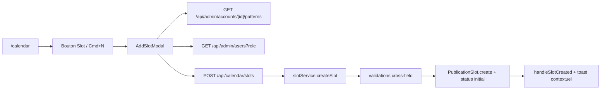

# Calendrier — création slot

## Pitch
Admin crée un PublicationSlot manuellement depuis le calendrier via AddSlotModal. Picker du compte, picker du pattern actif (avec assignées préfillées) ou mode manuel libre, scheduledAt + overrides one-off optionnels.

## Schéma Mermaid

## Entry points UI

| Composant | Fichier:Ligne | Rôle |
|---|---|---|
| Page calendrier | `web/src/app/(app)/calendar/page.tsx:17-104` | Server load comptes + assignés |
| CalendarView | `web/src/components/calendar/CalendarView.tsx:20-240` | Bouton "Slot" + raccourci Cmd+N |
| AddSlotModal | `web/src/components/calendar/AddSlotModal.tsx:93-677` | Drawer pickers compte/pattern/assignées/scheduledAt + overrides |

## Routes API

| Méthode | Path | Fichier | Effets |
|---|---|---|---|
| POST | `/api/calendar/slots` | `route.ts:52-65` | createSlot (admin only, canAdminBypass) |
| GET | `/api/admin/accounts/[id]/patterns` | `route.ts:125-145` | Picker patterns actifs |
| GET | `/api/admin/users?role=X` | `route.ts:9-22` | Pickers assignées (MONTEUR/CM/VIDEASTE) |
| GET | `/api/caption-presets` | — | Picker preset captions (one-off override) |
| GET | `/api/templates/[id]/cover-presets` | — | Picker preset cover |
| GET | `/api/description/prompts` | — | Picker prompt IA |

## Helpers / triggers

- `web/src/lib/services/slot/slotService.ts:115-294` — `createSlot(input, ctx)` :
  - Auth : `!ctx.canAdminBypass` → 403 (impersonation refusée)
  - Validation accountId + scheduledAt requis
  - Si patternId fourni : load pattern + cross-account guard + préfill assignées
  - Assert assignées rôle correct (`assertAssigneeRole`)
  - Cross-field Phase 5 (needsCaptions↔captionPresetId, autoGenerate↔descriptionPromptId, autoPack↔coverPresetId)
  - `PublicationSlot.create` avec status initial via `mapSourceToInitialStatus`
- `web/src/lib/calendarEngine.ts:17-31` — `mapSourceToInitialStatus(source)` :
  - `auto_template` → PLANNED
  - `manual_rushes` → RUSHES_EXPECTED
  - `external_upload` → READY_FOR_CM

## Modèles Prisma touchés

- `PublicationSlot` (`schema.prisma:737-853`) — création complète avec status initial, scheduledAt, assignées, overrides
- `AccountPattern` (`schema.prisma:900-970`) — lecture (préfill assignées + status mapping)
- `PublicationActivity` (`schema.prisma:869-880`) — type `SLOT_CREATED` éventuel

## Side effects

- Status initial via `mapSourceToInitialStatus`
- Préfill assignées : `assigneeMonteurId = body.assigneeMonteurId ?? pattern.defaultAssigneeMonteurId` (override admin prime)
- Toast contextuel post-création : `formatNextActionLine(status, assignees)` (ex. "Monteur X attend les rushes")

## Variants par rôle

| Rôle | Ce qui change |
|---|---|
| ADMIN | Seul rôle autorisé — orchestration calendrier |
| Autres | Pas d'accès au calendrier ni à AddSlotModal |

## Pré-conditions / invariants

- `canAdminBypass` requis (impersonation pas suffisante)
- accountId + scheduledAt obligatoires
- Si patternId : pattern doit appartenir au même accountId (anti-cross-account)
- Assignées si fournies doivent avoir le bon rôle
- Cross-field validation : si needs* = true → preset/prompt requis
- Mode manuel forcé si compte sans pattern actif

## Skills/agents pertinents

- `.claude/skills/admin-permissions/SKILL.md`
- `.claude/skills/ui-design/SKILL.md` (drawer + form patterns)

## Liens vers code

- Tests : `web/src/lib/services/slot/__tests__/slotService.test.ts`, `calendarEngine.test.ts`
- E2E : `web/e2e/calendar.spec.ts`
