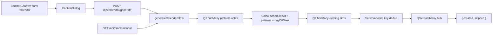

# Calendrier — génération de la semaine

## Pitch
Admin clique "Générer" dans le calendrier (ou un cron hit l'endpoint dédié) → l'app crée 1 slot par AccountPattern actif × dayOfWeek configuré, sur la plage demandée. Bulk createMany, idempotent via clé composite `(accountId, scheduledAt, patternId)`.

## Schéma Mermaid

## Entry points UI

| Composant | Fichier:Ligne | Rôle |
|---|---|---|
| CalendarView | `web/src/components/calendar/CalendarView.tsx:425-434` | Bouton "Générer" (ADMIN, icon Sparkles) |
| ConfirmDialog | `CalendarView.tsx:630-642` | Confirmation + avertissement "Les slots existants ne seront pas écrasés" |
| handleGenerateConfirmed | `CalendarView.tsx:299-322` | POST + reload |

## Routes API

| Méthode | Path | Fichier | Effets |
|---|---|---|---|
| POST | `/api/calendar/generate` | `route.ts:10-65` | Admin only, body `{ accountIds?, dateFrom, dateTo }`, MAX_RANGE_DAYS=90, tronque dateFrom si passé |
| GET | `/api/cron/calendar` | `route.ts:9-31` | Cron auto (Bearer CRON_SECRET), génère la semaine suivante via `nextWeekRange()` |

## Helpers / triggers

- `web/src/lib/calendarEngine.ts:74-207` — **`generateCalendarSlots(options)`** :
  - Q1 `prisma.accountPattern.findMany(isActive=true)` + filtre accountId optionnel
  - Loop : pour chaque semaine [start, end] × chaque pattern × chaque dayOfWeek → calculer scheduledAt
  - Q2 `prisma.publicationSlot.findMany` (patternId in [...], scheduledAt dans plage)
  - Dedup via `Set` de clé `accountId|scheduledAtISO|patternId`
  - Q3 `prisma.publicationSlot.createMany` avec données propagées
- `web/src/lib/calendarEngine.ts:17-31` — `mapSourceToInitialStatus()` (idem create-slot)
- `web/src/lib/calendarEngine.ts:53-61` — `toMondayUTC()` normalisation lundi 00:00 UTC
- `web/src/lib/calendarEngine.ts:210-224` — `nextWeekRange()` retourne plage [lundi, dimanche] de la semaine suivante

## Modèles Prisma touchés

- `PublicationSlot` (`schema.prisma:737-853`) — création bulk avec `isAuto: true`, status initial via `mapSourceToInitialStatus`
- `AccountPattern` (`schema.prisma:900-970`) — lecture (`isActive=true`)

## Idempotence

Clé composite `accountId|scheduledAtISO|patternId` :
- Slot existant → skipped (incrémente `result.skipped`)
- Slot manquant → créé
- Sécuritaire pour appels répétés ou parallélisés

Test : `calendarEngine.test.ts:223-268`.

## Side effects

- Propagation assignées depuis `pattern.defaultAssignee*`
- Status initial dérivé
- Pas de logActivity par slot (volume trop élevé)
- Note `note?` éventuel dans le résultat (warnings dayOfWeek vide, publishTime malformé)

## Variants par rôle

| Rôle | Ce qui change |
|---|---|
| ADMIN | Bouton "Générer" + endpoint accessible |
| Cron | Endpoint Bearer CRON_SECRET, génère la semaine suivante (`nextWeekRange`) |

## Pré-conditions / invariants

- Au moins 1 AccountPattern `isActive=true` sur le(s) compte(s)
- `dayOfWeek[]` non vide (sinon warn + skip silencieux)
- `publishTime` format HH:MM (sinon warn + skip)
- `dateFrom < dateTo`, plage ≤ 90 jours
- Pas de rétroactivité : `effectiveFrom = max(dateFrom, now)`
- `CRON_SECRET` env var pour le cron

## Skills/agents pertinents

- `.claude/skills/admin-permissions/SKILL.md`
- Agent `toolbox-generalist` pour modifs

## Liens vers code

- Tests : `web/src/lib/__tests__/calendarEngine.test.ts` (15 describe + 30+ assertions)
