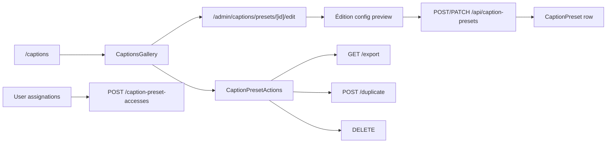

# Caption Preset admin

## Pitch
Admin gère CaptionPreset (configs sous-titres : font, color, position, animation, highlight). Création depuis /tools/captions (UserCaptionsMode), édition config, partage via CaptionPresetAccess, builtin (userId=null). Users avec TOOLS.CAPTIONS accèdent à leurs presets + partagés + builtin.

## Schéma Mermaid

## Entry points UI

| Composant | Fichier:Ligne | Rôle |
|---|---|---|
| Page captions | `app/(app)/captions/page.tsx:1` | Redirect → CaptionsGallery |
| CaptionsGallery | `components/captions/CaptionsGallery.tsx:20` | Galerie presets, create/edit/delete (admin + user) |
| CaptionsApp | `components/captions/CaptionsApp.tsx:69` | Éditeur preset (isAdmin flag, config + preview) |
| UserCaptionsMode | `components/captions/UserCaptionsMode.tsx:48` | Mode USER simplifié (étapes 1-4) |
| Édition admin | `app/(app)/admin/captions/presets/[id]/edit/page.tsx:10` | ADMIN only, actualUser owner |
| CaptionPresetActions | `components/captions/CaptionPresetActions.tsx:12` | Menu export/duplicate/delete |
| ImportCaptionPresetButton | `components/captions/ImportCaptionPresetButton.tsx` | Bouton import (admin) |

## Routes API

| Méthode | Path | Effets |
|---|---|---|
| GET | `/api/caption-presets:6` | Admin=all, user=own + CaptionPresetAccess + builtin |
| POST | `/api/caption-presets:46` | **Admin only**, config JSON sérialisé, owner=actualUser |
| PATCH | `/api/caption-presets/[id]:6` | **Admin only** name/isBuiltin/config |
| DELETE | `/api/caption-presets/[id]:49` | Admin=any, user=own non-builtin |
| GET | `/api/caption-presets/[id]/export:8` | Admin OR user avec Access |
| POST | `/api/caption-presets/[id]/duplicate:5` | **Admin only**, owner=actualUser |
| POST | `/api/caption-presets/import:6` | **Admin only**, owner=effectiveUser |
| GET | `/api/admin/users/[id]/caption-preset-accesses:8` | Liste preset IDs |
| POST | `/api/admin/users/[id]/caption-preset-accesses:22` | **Admin only** assigne |
| DELETE | `/api/admin/users/[id]/caption-preset-accesses:39` | **Admin only** révoque |

## Modèles Prisma

- `CaptionPreset` (`schema.prisma:77`) — id, name, userId nullable=builtin, **config JSON string**, isBuiltin, createdAt, updatedAt
- `CaptionPresetAccess` (`schema.prisma:94`) — (userId, presetId) unique (partage avec users non-admin)
- `User` relations (`schema.prisma:24,25`) — captionPresets[], captionPresetAccesses[]

## Helpers & Normalization

- `lib/captionPresetConfig.ts:86` — **`mergeCaptionConfig()`** (deep-merge base/highlight/highlight2/layout/effects)
- `lib/captionPresetConfig.ts:1` — `CaptionConfigState` type (base/highlight/highlight2/layout/effects/animation/export_profile/preview_time)
- `lib/captionPresetConfig.ts:66` — `DEFAULT_CAPTION_CONFIG` (font, color, size_ratio, spacing, shadow, glow, outline, layout)
- `lib/captionPresetTransfer.ts:18` — `buildCaptionPresetTransferPayload()` (version + exportedAt + preset + config)
- `lib/captionPresetTransfer.ts:32` — `parseCaptionPresetTransferPayload()` (validation/parsing + normalisation)
- `lib/captionPresetTransfer.ts:58` — `buildCaptionPresetExportFilename()` (slug name → `.caption-preset.json`)

## Permissions

- `lib/permissions.ts:19` — `TOOLS.CAPTIONS = "captions"`
- `lib/permissions.ts:87` — **`hasTool()`** (ADMIN=true, CM/MONTEUR=role scope + permissions JSON, EXTERNAL_GENERATOR=permissions JSON only)
- `app/(app)/captions/page.tsx:11` — Guard `hasTool(TOOLS.CAPTIONS)` pour users

## Variants & Conditions

| Rôle | Ce qui change |
|---|---|
| ADMIN | Crée/édite/supprime/duplique tous presets, marque isBuiltin, exporte/importe, attribue via Access |
| USER (TOOLS.CAPTIONS) | Voit presets propres + partagés + builtin, peut éditer les leurs, exporte, importe |
| BUILTIN | `userId=null + isBuiltin=true`, visible par tous, non-supprimable par users |
| IMPERSONATION | POST/PATCH crée sous `actualUser` (audit), GET lit `effectiveUser` (contexte de travail) |

## Pré-conditions / invariants

- Schema config valide via `mergeCaptionConfig()` (defaults merged)
- User authentifié (`getUserContext()` non-null)
- Admin verified (`canAdminBypass` pour création/édition/partage)
- Preset trouvé (`findUnique`/`findFirst` avant PATCH/DELETE)
- CaptionPresetAccess constraint unique(userId, presetId) anti-dupes

## Skills/agents pertinents

- `.claude/skills/captions-transcription/SKILL.md`
- `.claude/skills/ass-rendering/SKILL.md` (config détaillée)
- `.claude/skills/admin-permissions/SKILL.md`
