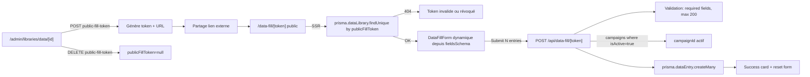

# Data library external fill

## Pitch

Page publique `/data-fill/[token]` qui permet à une personne externe (sans authentification) de soumettre des fiches dans une `DataLibrary` via un lien magique généré côté admin. Le token EST l'auth. La personne voit le nom + description + fieldsSchema de la lib, et peut soumettre N fiches d'un coup (max 200). Politique V1 : push direct sans approval — si une fiche est invalide, l'admin la supprimera depuis son écran habituel.

L'externe ne voit JAMAIS les fiches existantes (anti-leak basique). Token révocable depuis l'admin. Pas d'index SEO (`robots: noindex,nofollow`).

## Schéma Mermaid



## Entry points UI

| Composant | Fichier:Ligne | Rôle |
|---|---|---|
| Page publique | `app/data-fill/[token]/page.tsx:21-57` | SSR : load lib via token + render form |
| DataFillForm | `app/data-fill/[token]/DataFillForm.tsx:57-226` | Form dynamique multi-fiches (add/remove/submit) |
| Admin token gen | (probablement) `app/(app)/admin/libraries/data/[id]/page.tsx` | Génère/révoque le token + copie URL |
| Success card | `DataFillForm.tsx:117-133` | "N fiches envoyées" + bouton "Ajouter d'autres fiches" |

## Routes API

| Méthode | Path | Auth | Effets |
|---|---|---|---|
| GET | `/api/data-fill/[token]` | **Public (token)** | Retourne `libraryName + templateType + fieldsSchema` — pas les fiches existantes |
| POST | `/api/data-fill/[token]` | **Public (token)** | Validation + `dataEntry.createMany` dans la campagne active |
| POST | `/api/admin/libraries/data/[id]/public-fill-token` | Admin | Génère un token aléatoire 32+ chars + maj `publicFillToken` |
| DELETE | `/api/admin/libraries/data/[id]/public-fill-token` | Admin | Révoque (`publicFillToken: null` → 404 sur lien existant) |

## Modèles Prisma

- **`DataLibrary`** — `publicFillToken` (unique nullable), `name`, `templateType`, `description`, `fieldsSchema` (JSON array `{ key, label, type, required? }`)
- **`DataCampaign`** — `libraryId`, `isActive` (le POST cible la campagne `isActive=true`)
- **`DataEntry`** — `campaignId`, `setTag?`, `category?`, `fields` (JSON string `Record<string, string>`)

## Pipeline POST détaillé

`api/data-fill/[token]/route.ts:52-106`

```
1. loadLibraryByToken(token) → 404 si invalid ou token longueur < 16
2. Extract campaignId actif : lib.campaigns[0]?.id (where isActive=true)
   → 500 si pas de campagne active (lib mal configurée)
3. Validate body.entries Array + length 1-200 (sinon 400)
4. Parse lib.fieldsSchema en FieldDef[]
5. Pour chaque entry : vérifier required fields (sinon 400 avec index)
6. prisma.dataEntry.createMany() → push direct
7. 201 { ok: true, created: N }
```

## Validation côté client

`DataFillForm.tsx:78-87`

- Required fields : check `e.fields[f.key]?.trim()` avant submit
- Toast error avec index "Fiche #N : « Label » est requis"
- Si schema vide → pas de form (message "Demande à l'équipe de configurer les champs")

## Schéma de champs (fieldsSchema)

```ts
[
  { key: "address", label: "Adresse", type: "text", required: true },
  { key: "price", label: "Prix", type: "number", required: false },
  { key: "website", label: "Site agence", type: "url" },
  { key: "description", label: "Description longue", type: "textarea" },
]
```

Types supportés (`DataFillForm.tsx:18`) : `text | number | url | textarea` → render via `Input` ou `Textarea`.

## Champs optionnels `setTag` et `category`

`DataFillForm.tsx:171-186`

- Affichés en haut de chaque fiche
- Permettent au remplisseur externe de tagger (ex : "set1", "tenue1")
- Optionnels — pas dans le schema, libres
- Utilisés downstream par le moteur de rotation (`asset-rotation-engine`)

## Permissions

| Surface | Auth requise? |
|---|---|
| `/data-fill/[token]` | ❌ Public — le token EST l'auth |
| `GET /api/data-fill/[token]` | ❌ Public |
| `POST /api/data-fill/[token]` | ❌ Public |
| `POST/DELETE /api/admin/libraries/data/[id]/public-fill-token` | ✅ Admin only |

## Sécurité

- **Token longueur min 16 chars** : `token.length < 16` → 404 immédiat (anti-fuzzing)
- **Pas d'index SEO** : `metadata.robots = { index: false, follow: false }`
- **Anti-leak fiches existantes** : GET retourne seulement schema, pas les `DataEntry`
- **Limite 200 entries/POST** : anti-DoS
- **Révocation immédiate** : DELETE token → lien existant 404 instantané (token unique en base)
- **Validation required** : double-check côté serveur même si client validate (anti-tampering)

## Side effects

- `prisma.dataEntry.createMany` → les fiches arrivent directement dans la campagne active
- Pas de notification user — l'externe voit juste le success card
- Pas de SSE event — l'admin recharge sa page admin pour voir les nouvelles fiches
- Pas de log activity côté slot (les fiches ne sont pas rattachées à un slot)

## Variants

| Cas | Comportement |
|---|---|
| Token invalide | 404 `notFound()` côté page + 404 côté API |
| Token révoqué | Même que invalide (publicFillToken=null en base) |
| Lib sans campagne active | POST 500 "Bibliothèque mal configurée" |
| Lib sans fieldsSchema | DataFillForm affiche "pas encore de schéma" empty state |
| Soumission >200 | 400 "Trop de fiches en une soumission" |

## Pré-conditions / invariants

- DataLibrary doit avoir une `DataCampaign isActive=true` pour accepter les POST
- `fieldsSchema` doit être un JSON array parseable (validation tolérante : si parse échoue, tout accepté tel quel)
- Le token est unique en base — révocation = clear pas overwrite
- Push direct sans approval (V1) — trade-off simplicité documenté en commentaire route

## Skills/agents pertinents

- `.claude/skills/content-library/SKILL.md` — DataLibrary, DataCampaign, DataEntry
- `.claude/skills/asset-rotation/SKILL.md` — usage downstream des DataEntry tagged

## Liens vers code

- Page publique : `web/src/app/data-fill/[token]/page.tsx`
- Form : `web/src/app/data-fill/[token]/DataFillForm.tsx`
- API public : `web/src/app/api/data-fill/[token]/route.ts`
- API admin : `web/src/app/api/admin/libraries/data/[id]/public-fill-token/route.ts`
- Workflow lié : `datalib-admin-crud.md` (admin CRUD), `asset-rotation-engine.md` (usage)
