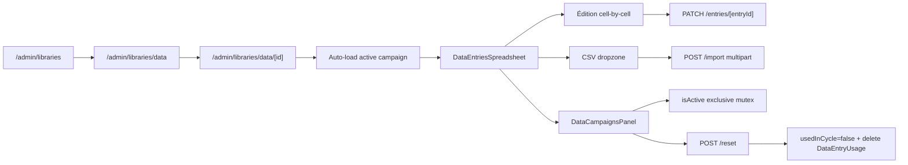

# DataLibrary admin — CRUD

## Pitch
Admin gère DataLibrary (fiches structurées : RPI, RTIPS, RPOD, etc.) + DataCampaign + DataEntry via spreadsheet inline. CSV/XLSX import, reset cycle (global ou per-account), 5 usagePolicy possibles, fieldsSchema custom validation. Toutes routes admin-only.

## Schéma Mermaid

## Entry points UI

| Composant | Fichier:Ligne | Rôle |
|---|---|---|
| Hub Ressources | `app/(app)/admin/libraries/page.tsx:48` | Compteurs lib/campagne |
| Liste libraries | `app/(app)/admin/libraries/data/page.tsx:64` | DataLibrariesPanel |
| Page lib auto | `app/(app)/admin/libraries/data/[id]/page.tsx:100` | DataEntriesPanel + résout campagne active, crée "Default" |
| Page campagne | `app/(app)/admin/libraries/data/[id]/[campaignId]/page.tsx` | Navigation alternative |
| Formulaire public | `app/data-fill/[token]/page.tsx` | Sans auth, fieldsSchema exposé via token |
| DataLibrariesPanel | `components/admin/libraries/DataLibrariesPanel.tsx` | Cards glass + create modal + settings drawer |
| DataLibrarySettingsDrawer | — | Drawer édition (rotation, schema, public token generate/revoke) |
| DataEntriesPanel | `DataEntriesPanel.tsx:84` | Load/import CSV drop-zone + row creator |
| DataEntriesSpreadsheet | `dataEntries/DataEntriesSpreadsheet.tsx` | Table dense Airtable-like (sticky, input autoFocus, blur/Enter commit) |
| DataCampaignsPanel | `DataCampaignsPanel.tsx` | Campagnes glass + toggle isActive + usagePolicy 5-state + progress bar |

## Routes API

### CRUD DataLibrary
| Méthode | Path | Effets |
|---|---|---|
| GET | `/api/admin/libraries/data` | Liste + activeCampaign meta |
| POST | `/api/admin/libraries/data` | Crée DataLib + auto-crée DataCampaign "Default" isActive=true |
| PATCH | `/api/admin/libraries/data/[id]` | Update rotation/maxUsage/fieldsSchema |
| DELETE | `/api/admin/libraries/data/[id]` | Cascade campaigns + entries |
| POST | `/.../[id]/public-fill-token` | Génère token (randomBytes 24 hex) |
| DELETE | `/.../[id]/public-fill-token` | Révoque token |

### CRUD DataCampaign
| Méthode | Path | Effets |
|---|---|---|
| GET | `/.../[id]/campaigns` | Liste + usedInCycleCount per campaign |
| POST | `/.../[id]/campaigns` | Crée campaign, exclusive isActive mutex |
| PATCH | `/.../campaigns/[campaignId]` | isActive (mutex) + usagePolicy enum |
| DELETE | `/.../campaigns/[campaignId]` | Cascade entries |

### CRUD DataEntry
| Méthode | Path | Effets |
|---|---|---|
| GET | `/.../campaigns/[id]/entries?accountId=X` | Liste + per-account usage stats |
| POST | `/.../campaigns/[id]/entries` | Manual create (alternative à CSV) |
| PATCH | `/.../entries/[entryId]` | Update fields/setTag/category/access/reset usage |
| DELETE | `/.../entries/[entryId]` | Cascade access + usage via FK |

### Import & Reset
| Méthode | Path | Effets |
|---|---|---|
| POST | `/.../campaigns/[id]/import` | CSV/XLSX multipart, ExcelJS dynamic import, force flag |
| POST | `/.../campaigns/[id]/reset` | Reset global OU per-account |

Routes ZIP export/import génériques (`GET /.../libraries/[libraryId]/export`, `POST /.../libraries/import`) **supprimées (purge 2026-08, code mort — 0 appelant UI)**. `lib/libraryExport.ts` / `lib/libraryImport.ts` restent dans le repo mais n'ont plus de consommateur applicatif.

### Bulk edit access comptes IG (Phase 3.C, commit `9913bb1`)
| Méthode | Path | Effets |
|---|---|---|
| POST | `/.../campaigns/[campaignId]/entries/bulk` | `{ entryIds[], accessAction: "add"\|"remove_all", accountId?, accountIds?[], setTag?, category? }` — mirror exact MediaAsset bulk. createMany skipDuplicates pour add, deleteMany pour remove_all |

UI : `DataEntriesBulkActionBar.tsx` (mirror `MediaAssetsBulkActionBar`) + hook `useBulkEditDataEntries`. Multi-select via checkbox dans `DataEntriesSpreadsheet`, bar sticky bottom avec actions :
- Ajouter compte(s) IG (multi-select via `Combobox`)
- Retirer tous les accès (back to global)
- Bulk setTag / category (alignement thématique d'un lot)

Pas de log activity (action admin technique). Pas d'effet rotation immédiat (les claims existants restent).

## Helpers / validators

- `[id]/route.ts:13-35` — `validateFieldsSchema()` (tableau, keys uniques lowercase alphanumeric, types text/number/url/textarea, reserved keys interdits)
- `import/route.ts:194-230` — `parseCSV()` (quoted cells, `;` ou `,`, sanitizeKey/sanitizeValue, slugify NFD accents)
- `import/route.ts:13-54` — `readFileAsCSVText()` (XLSX via ExcelJS dynamic OR CSV `.text()`)

## Modèles Prisma

- `DataLibrary` (`schema.prisma:564-597`) — name, templateType, rotationMode, rotationScope, maxUsageCount, fieldsSchema JSON FieldDef[], publicFillToken unique
- `DataCampaign` (`schema.prisma:600-622`) — libraryId FK Cascade, name, isActive, cycleResetAt, **usagePolicy** : `cycle | cycle_per_account | once_per_account | once_global | unlimited`
- `DataEntry` (`schema.prisma:625-643`) — campaignId FK Cascade, fields JSON, setTag, category, usageCount, usedInCycle
- `DataEntryAccess` (`schema.prisma:669-676`) — (entryId, accountId) unique
- `DataEntryUsage` (`schema.prisma:680-689`) — (entryId, accountId) unique + lastUsedAt + usageCount per-account

## Side effects & Batch operations

- Reset cycle : `DataEntry.updateMany({usedInCycle: false}) + DataEntryUsage.deleteMany() + DataCampaign.update(cycleResetAt: now())`
- CSV import : `DataEntry.createMany({data: entries[]})` avec fields JSON.stringify
- Create lib : transaction lib + auto-crée DataCampaign "Default" `usagePolicy: "unlimited"`
- Set campaign active : `updateMany({id != campaignId}, {isActive: false}) + update target` (mutex)
- Delete entry : cascade onDelete (DataEntryAccess + DataEntryUsage)

## Variants par rôle

| Rôle | Ce qui change |
|---|---|
| ADMIN | Toutes routes via `canAdminBypass` |
| Public form `/data-fill/[token]` | Sans auth, fieldsSchema exposé, formulaire pour remplissage externe |
| DataEntryAccess vide | Accès global |
| DataEntryAccess ≥1 row | Accès restreint aux comptes listés |

## Pré-conditions / invariants

- fieldsSchema valide pour import CSV (sinon fallback auto-déduction)
- setTag auto-généré via `slugify(première_colonne_données)` si absent
- publicFillToken non-null → URI `/data-fill/[token]` active
- Force flag requis si campaign existante non-vide (anti-rewrite)
- usagePolicy `cycle` vs `cycle_per_account` : scope du compteur usedInCycle

## Skills/agents pertinents

- `.claude/skills/content-library/SKILL.md`
- `.claude/skills/admin-permissions/SKILL.md`
