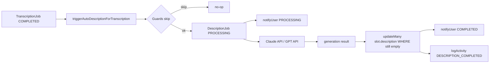

# Publication — description auto

## Pitch
Pour un slot dont le pattern `needsDescription = "autoGenerate"`, la légende Instagram est générée automatiquement via Claude (ou GPT) à partir de la transcription Whisper + un prompt admin custom. Triggerée post-transcription COMPLETED ou post-validation client.

## Schéma Mermaid

## Entry points UI

| Composant | Fichier:Ligne | Rôle |
|---|---|---|
| DescriptionSection | `src/components/publications/sections/DescriptionSection.tsx:2-19` | Section "Légende Instagram" fiche |
| États jobInFlight / jobFailed | `DescriptionSection.tsx:306-308` | Bannières contextuelles |
| pendingJobResult | `DescriptionSection.tsx:344-347` | "Appliquer cette légende" si COMPLETED mais slot.description vide |
| waitingForClient | `DescriptionSection.tsx:335-338` | "En attente approbation client" si needsClientValidation actif |
| DescriptionTool standalone | `src/components/description/DescriptionTool.tsx:109-867` | Page `/descriptions` (upload SRT + génération inline) |
| Admin patterns | `src/components/admin/AccountPatternForm.tsx:99-112` | Champs `needsDescription` + `descriptionPromptId` |

## Routes API

| Méthode | Path | Fichier | Effets |
|---|---|---|---|
| POST | `/api/description/generate` | `route.ts:331-711` | Génère via Claude/GPT, recipes multiples |
| POST | `/api/publications/[id]/trigger-description` | `route.ts:4-132` | Trigger admin manuel (3 paths : description_only, transcription_in_flight, lance nouvelle tx) |
| GET / POST | `/api/description/prompts` | `route.ts:26-85` | Liste / crée DescriptionPrompt (admin only) |
| GET | `/api/description/jobs` | `route.ts:12-29` | Historique user (limit 50) |

## Helpers / triggers

- `web/src/lib/triggerAutoDescriptionFromTranscription.ts:169-567` — **`triggerAutoDescriptionForTranscription(transcriptionJobId)`** : entrée principale
- `web/src/lib/triggerAutoDescriptionFromTranscription.ts:88-100` — **SkipReasons enum** : no_render, no_slot, needs_description_not_auto, description_already_set, description_already_in_flight, no_prompt_resolved, prompt_inactive, no_transcription_output, r2_not_configured, no_anthropic_key, awaiting_client_validation, client_review_in_flight
- `web/src/lib/triggerAutoDescriptionFromTranscription.ts:139-167` — **`createFailedJob()`** : matérialise les erreurs config/infra en `DescriptionJob FAILED` visible (fix 2026-05-30)
- `web/src/lib/triggerAutoDescriptionFromTranscription.ts:348-410` — résolution transcript cascade : `providedTranscriptText` → `segmentsJson` → `outputJsonKey` R2
- `web/src/lib/triggerAutoDescriptionFromTranscription.ts:41-86` — **`extractFallbackFrame()`** : ExtractCovers API via render-engine pour fallback image-only (vidéo silencieuse)
- `web/src/app/api/description/generate/route.ts:217-274` — `generateWithClaude()` : Anthropic SDK, image support (base64), system prompt expert
- `web/src/app/api/description/generate/route.ts:276-329` — `generateWithGPT()` : OpenAI API, image_url, temperature 0.5

## Garde-fous (skip conditions)

- `needsDescription !== "autoGenerate"` → skip
- Status `AWAITING_CLIENT` ou `CLIENT_REVISION` → skip (client revoit)
- `needsClientValidation=true` + status NOT in `POST_VALIDATION_STATUSES` → skip (attend approbation)
- `slot.description` non vide → skip (CM a rédigé manuellement)
- Anti-double-trigger : skip si `DescriptionJob PROCESSING` existe déjà (V4 bug #7)
- Re-check anti-écrasement : `updateMany` atomique avec WHERE `description IS NULL` (errorMsg si manuel overwrite pendant Claude)

## Modèles Prisma touchés

- `DescriptionPrompt` (`schema.prisma:354-372`) — `prompt`, `isActive`, `recipeKind` (transcript_only | transcript_and_frame | two_pass_reformulate | context_enriched), `recipeConfig` JSON
- `DescriptionJob` (`schema.prisma:375-404`) — `status` (COMPLETED|FAILED), `inputType` (upload|transcription), `transcriptionId`, `promptId`, `promptSnapshot`, `personalization`, `model` (claude|gpt), `result`, `errorMsg`, `slotId`, `staleSince`
- `PublicationSlot` (`schema.prisma:794-812`) — `descriptionPromptIdOverride`, `needsDescriptionOverride`, **`description`** (texte final)
- `AccountPattern` (`schema.prisma:900-960`) — `needsDescription` (none|preFilled|autoGenerate|manualWrite), `descriptionPromptId`
- `TranscriptionJob` (`schema.prisma:199-200`) — `outputJsonKey` (R2), `segmentsJson` (inline fallback)

## Modes IA et inputs

- Model : env `ANTHROPIC_MODEL` (default `claude-sonnet-4-6`) ou `OPENAI_MODEL` (default `gpt-5.4`)
- Max transcript : 50 000 chars (`MAX_TRANSCRIPT_CHARS`)
- Max image : 4 Mo (PNG / JPEG / WEBP)
- Recipes :
  - **transcript_only** : prompt + transcript
  - **transcript_and_frame** : + image fallback si vidéo silencieuse
  - **two_pass_reformulate** : pass 1 résumé + pass 2 rédaction
  - **context_enriched** : injection `PublicationSlot.fields` (title + metadata custom, max 500 chars/field)

## Side effects

- `logActivity` types `DESCRIPTION_COMPLETED` (autoTriggered=true, promptId, descriptionJobId)
- SSE `notifyUser({jobType: "description", status: ...})` (PROCESSING / COMPLETED / FAILED)
- PATCH atomique `slot.description` via `updateMany WHERE description IS NULL`
- V8.11 — DescriptionSection masque FAILED transient pendant un retry transcription, wording user-friendly anti-jargon

## States UI

- `jobInFlight` = QUEUED || PROCESSING
- `jobFailed` = FAILED
- `transcriptionStillRunning` = transcription PROCESSING / QUEUED (V8.11 masque FAILED)
- `pendingJobResult` = job COMPLETED + result non null + slot.description vide → "Appliquer cette légende"
- `waitingForClient` = needsClientValidation + status non POST_VALIDATION

## Variables env

- `ANTHROPIC_API_KEY` — requis Claude
- `ANTHROPIC_MODEL` — default `claude-sonnet-4-6`
- `OPENAI_API_KEY` — optionnel
- `OPENAI_MODEL` — default `gpt-5.4`
- `R2_*` — outputJsonKey transcription
- `CAPTIONS_API_URL` — fallback ExtractCovers

## Permissions

- Page `/descriptions` : `hasTool("description")` sauf admin
- POST prompts : ADMIN uniquement (`actualUser.role === ADMIN`)

## Pré-conditions / invariants

- `pattern.needsDescription === "autoGenerate"` (ou override)
- `descriptionPromptId` requis et `prompt.isActive = true`
- Transcription COMPLETED avec `segmentsJson` ou `outputJsonKey`
- Pour client validation : status passé en post-validation OU `needsClientValidation = false`
- ANTHROPIC_API_KEY ou OPENAI_API_KEY configuré

## Skills/agents pertinents

- `.claude/skills/description-generation/SKILL.md` — workflow détaillé
- `.claude/skills/captions-transcription/SKILL.md` — transcription en amont
- Agent `toolbox-generalist` pour modifs

## Liens vers code

- Tests : `web/src/lib/__tests__/triggerAutoDescription.test.ts` (si existe)
- Tests E2E : couvert par les scenarios P1/P2/P4 dans pattern coherence + audit-ux
