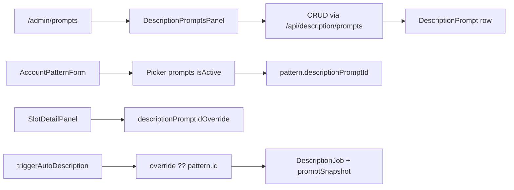

# DescriptionPrompt admin

## Pitch
Admin gère DescriptionPrompt (prompts IA pour génération auto de descriptions Claude/GPT). Création prompt avec recipe (transcript_only / transcript_and_frame / transcript_multi_frame / two_pass_reformulate / context_enriched), recipeConfig, activation/désactivation, choix par AccountPattern.descriptionPromptId ou override per-slot.

## Schéma Mermaid

## Entry points UI

| Composant | Fichier:Ligne | Rôle |
|---|---|---|
| Liste prompts | `app/(app)/admin/prompts/page.tsx:56` | ADMIN CRUD prompts description + captions |
| Hub Ressources | `app/(app)/admin/libraries/page.tsx:62` | Lien vers /admin/prompts + compteur |
| AccountPatternForm | `components/admin/AccountPatternForm.tsx:248-377` | Picker pattern.descriptionPromptId, filtre isActive=true |
| SlotDetailPanel | `components/calendar/SlotDetailPanel.tsx:768-774` | Override `descriptionPromptIdOverride` (null = use pattern default) |
| DescriptionTool | `app/(app)/descriptions/page.tsx:70-74` | Affiche prompts actifs pour pickers |
| DescriptionPromptsPanel | `components/admin/DescriptionPromptsPanel.tsx:46` | CRUD + isActive toggle + recipe picker |
| DescriptionPromptsManager | `components/.../DescriptionPromptsManager.tsx` | CRUD léger dans DescriptionTool |

## Routes API

| Méthode | Path | Effets |
|---|---|---|
| GET | `/api/description/prompts:26` | Liste prompts actifs (user authentifié) |
| POST | `/api/description/prompts:49` | **Admin only**, validation recipeKind enum |
| PATCH | `/api/description/prompts/[id]:35` | **Admin only** isActive/name/recipe/config |
| DELETE | `/api/description/prompts/[id]:85` | **Admin only** + check dépendances (refuse si patterns/slots la ref, 409) + force=true bypass |

## Modèles Prisma

- **`DescriptionPrompt`** (`schema.prisma:354-372`) :
  - `id, name, prompt String, isActive Boolean default true`
  - `recipeKind String default "transcript_only"` (enum: transcript_only | transcript_and_frame | transcript_multi_frame | two_pass_reformulate | context_enriched)
  - `recipeConfig JSON` (`{ frameCount, contextFieldKeys? }`)
  - Relations : `jobs: DescriptionJob[]`, `accountPatterns: AccountPattern[]`, `slotsOverride: PublicationSlot[]`
- `AccountPattern.descriptionPromptId` (`schema.prisma:959`) — FK nullable, **SetNull on delete**
- `PublicationSlot.descriptionPromptIdOverride` (`schema.prisma:811`) — FK nullable, override per-slot
- `DescriptionJob.promptId` (`schema.prisma:385`) — FK nullable (SetNull safe)
- `DescriptionJob.promptSnapshot` (`schema.prisma:388`) — **Snapshot texte prompt** au moment création (audit, ne dépend pas du prompt current)

## Helpers / triggers

- `route.ts:11-24,20-24` — `normalizeRecipeKind()` fallback "transcript_only" si invalide
- `route.ts:77-80` — Validation recipeConfig : `transcript_multi_frame` → `{frameCount: 1-6}` requis
- `prompts/[id]/route.ts:102-137` — DELETE check dependencies (retourne patterns + slots affectés, prevent silent breakage)
- `lib/triggerAutoDescriptionFromTranscription.ts:318` — **Résolution prompt** : `slot.descriptionPromptIdOverride ?? pattern.descriptionPromptId ?? null`
- `lib/publications/patternValidation.ts:134-142` — **C4 `MISSING_DESCRIPTION_PROMPT`** : `needsDescription="autoGenerate"` exige `descriptionPromptId`

## Variantes d'accès

- **ADMIN** : Création, modification (isActive, recipeKind, recipeConfig), suppression
- **Users READ** : GET retourne prompts actifs (global resource, pas de scope user)
- **AccountPattern assignation** : 1 prompt par pattern défaut (picker côté client filtre isActive=true)
- **PublicationSlot override** : `descriptionPromptIdOverride` permet override per-slot (prime sur pattern)

## Flux de Génération (Description Auto)

1. Slot hérite prompt du pattern OU override (`SlotDetailPanel:770`, `triggerAutoDescription:318`)
2. `TranscriptionJob` complétée → trigger auto-description si `needsDescription="autoGenerate"`
3. `DescriptionJob` créé avec `promptId` + **`promptSnapshot`** (snapshot capture texte courant pour audit)
4. Executor appelle LLM avec recipe sélectionné (`recipe_executor.py` côté render-engine)

## Pré-conditions / invariants

- `recipeKind` valide enum (5 valeurs)
- `recipeConfig` conforme au recipe :
  - `transcript_multi_frame` → `{ frameCount: 1-6 }` requis
  - `context_enriched` → `{ contextFieldKeys: string[] }` optionnel
  - Autres → null acceptable
- C4 cross-field : `needsDescription="autoGenerate"` → `descriptionPromptId` requis
- DELETE refuse si référencé (409 Conflict) sauf `?force=true`

## Variants par rôle

| Rôle | Ce qui change |
|---|---|
| ADMIN | CRUD complet, force delete possible |
| Autres rôles authentifiés | Lecture pour pickers seulement |

## Skills/agents pertinents

- `.claude/skills/description-generation/SKILL.md` (DescriptionJob, recipes, Claude/GPT)
- `.claude/skills/admin-permissions/SKILL.md`
