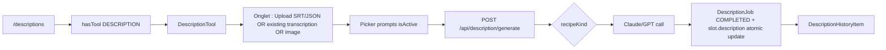

# Description tool

## Pitch
Outil standalone `/descriptions` accessible aux users avec `TOOLS.DESCRIPTION` ou ADMIN. Upload SRT/JSON OU sélection transcription existante OU image référence, picker prompt + model (Claude/GPT), génération DescriptionJob, historique 50 derniers. Mode "from publication" via `?slotId=X&returnTo=/publications/X` qui peut appliquer atomiquement au slot.

## Schéma Mermaid

## Entry points UI

| Composant | Fichier:Ligne | Rôle |
|---|---|---|
| Page `/descriptions` | `app/(app)/descriptions/page.tsx:21` | Server : auth + charge prompts actifs + historique jobs |
| Legacy redirect | `app/(app)/tools/description/page.tsx:12` | `/tools/description` → `/descriptions` |
| DescriptionTool | `components/description/DescriptionTool.tsx:109` | Orchestrateur 867 LOC (onglets/picker/genération/historique) |
| DescriptionHistoryItem | `components/description/DescriptionHistoryItem.tsx:23` | Row historique collapsible (120 chars preview, copy button) |
| DescriptionPromptsManager | `components/description/DescriptionPromptsManager.tsx:20` | CRUD admin inlined modal si isAdmin |

## Routes API

### Génération + Jobs
| Méthode | Path | Effets |
|---|---|---|
| POST | `/api/description/generate:331` | Validation input + dispatcher recipes + appels Claude/GPT + DescriptionJob COMPLETED/FAILED + **atomic write slot.description** (anti-écrasement CM) + logActivity |
| GET | `/api/description/jobs:12` | 50 derniers jobs (user ou admin), include `prompt.name + user metadata` |

### Prompts (cf. description-prompt-admin)
| Méthode | Path | Effets |
|---|---|---|
| GET | `/api/description/prompts:26` | Liste actifs |
| POST | `/api/description/prompts:49` | Crée (admin only) |
| PATCH/DELETE | `/api/description/prompts/[id]:35` | Update/Delete |

### Intégration Publication
| Méthode | Path | Effets |
|---|---|---|
| POST | `/api/publications/[id]/trigger-description:32` | Déclenche chaîne manuellement (admin) : si transcription COMPLETED → triggerAutoDescription direct, sinon → triggerAutoTranscription + auto-chaîne |

## Composant Intégration Fiche Publication

- `components/publications/sections/DescriptionSection.tsx:114` — Section "Légende Instagram" :
  - Modes auto/manuel/préRempli
  - Modal IA inline rapide
  - Boutons "Générer avec IA" + "Mode avancé" → `/descriptions?slotId=X&returnTo=/publications/X`
  - Apply-to-slot atomic patch
  - Fallback "job completed mais slot vide"

## Modèles Prisma

- **`DescriptionPrompt`** — name, prompt LLM, isActive, recipeKind, recipeConfig JSON
- **`DescriptionJob`** — userId, status (COMPLETED/FAILED), inputType (upload/transcription), transcriptionId?, promptId?, **promptSnapshot** (audit), personalization, model (claude/gpt), result?, errorMsg?, slotId?, staleSince?, staleReason?, `@@index([slotId])`
- `PublicationSlot.descriptionPromptIdOverride`, `descriptionJobs[]`, `description?`

## Helpers Automate (webhook chain)

- `lib/triggerAutoDescriptionFromTranscription.ts:169` — `triggerAutoDescriptionForTranscription(transcriptionJobId)` :
  - Pré-conditions : `slot.needsDescription="autoGenerate"`, prompt résolu, description vide, pas de PROCESSING en vol
  - **Fallback frame extraction si transcript vide** (vidéo silencieuse)
  - Appel Claude
  - **Update atomique `slot.description`** (anti-écrasement CM)
  - SSE notify user

## Permissions & Access Control

- `lib/permissions/tools.ts:61` — `canAccessTool(user, "description")` :
  - ADMIN → true
  - CM/MONTEUR → `["captions", "transcription", "description", "cover"]`
  - USER → User.permissions JSON
- `app/(app)/descriptions/page.tsx:28` — Check `hasTool(userId, "description")` côté page (redirect `/home` si refusé)
- `app/api/description/generate/route.ts:342` — Check côté API
- `app/api/description/prompts/route.ts:56` — POST prompts : `actualUser.role === "ADMIN"` (impersonation bypass)

## Recipe dispatcher

5 recipes :
- `transcript_only` — texte seul
- `transcript_and_frame` — texte + 1 image
- `transcript_multi_frame` — texte + N frames (`{frameCount: 1-6}` requis)
- `two_pass_reformulate` — génération + reformulation
- `context_enriched` — `{contextFieldKeys: string[]}` optionnel (DataLibrary)

## Pré-conditions & Flux

1. Authentification user
2. Permission "description" via `canAccessTool`
3. Prompt valide (`isActive=true`)
4. Input source valide : SRT/JSON parsed OR transcriptionId COMPLETED OR image PNG/JPG/WEBP max 4Mo base64
5. Model disponible (ANTHROPIC_API_KEY ou OPENAI_API_KEY)
6. **Anti-écrasement** : update atomique `WHERE description IS NULL OR ""` si slotId
7. Recipe dispatcher normalize via `normalizeRecipeKind`

## Variants & Integration Points

| Mode | Trigger | Comportement |
|---|---|---|
| Standalone | `/descriptions` | Upload + result copié manuellement |
| From Publication | `?slotId=X&returnTo=/publications/X` | DescriptionSection avec bouton "Appliquer au slot" → atomic update + redirect |
| Auto-triggered | Webhook RunPod TranscriptionJob.COMPLETED | Si `slot.needsDescription="autoGenerate"` + pattern prompt + no manual content |
| Admin trigger | `/api/publications/[id]/trigger-description` | Relance chaîne manuellement |

## Key Risk Gates

- **No transcription + image seule** : fallback frame extraction ou 400 + FAILED
- **Prompt inactive** : 404 + FAILED
- **R2/RunPod missing** : graceful degradation via CAPTIONS_API_URL local OR full failure logged
- **Content filter** : LLM response vide → FAILED avec msg "réponse filtrée probable"
- **Admin bypass during impersonation** : `actualUser.role === "ADMIN"` pour prompts (global resource)

## Skills/agents pertinents

- `.claude/skills/description-generation/SKILL.md`
