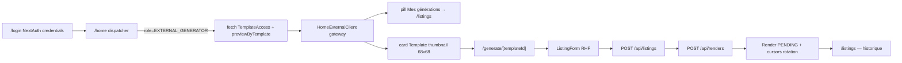

# External Generator flow

## Pitch

Flow complet pour EXTERNAL_GENERATOR (clients externes) : login NextAuth credentials → `/home` (HomeExternalClient — gateway templates accessibles avec thumbnails de leur dernier rendu) → `/generate/[templateId]` (formulaire) → `/api/renders` → `/listings` (historique). Accès limité à TOOLS.TEMPLATES + TOOLS.COVERS (pas captions/transcription/description). Hors pipeline éditoriale (calendrier/publications inaccessibles).

Nav minimaliste : 2 items (Accueil + Mes générations) — pas de Studio (l'accueil expose déjà les templates avec preview). Wordmark perso `User.name` au lieu de "Team PDC" (leur espace, pas une marque d'agence).

## Schéma Mermaid



## Entry points UI

| Composant | Fichier:Ligne | Rôle |
|---|---|---|
| Page login | `app/login/page.tsx` | NextAuth credentials (email + password) |
| Dispatcher /home | `app/(app)/home/page.tsx:40-100` | Role fallback → EXTERNAL_GENERATOR + load previewByTemplate |
| HomeExternalClient | `components/home/HomeExternalClient.tsx:44-234` | Gateway templates + CTA listings + outils granulaires |
| AppNav | `components/layout/AppNav.tsx:175-186` | Nav 2 items (Accueil + Mes générations) si `isExternalGenerator` |
| Wordmark perso | `components/layout/AppNav.tsx:206-209` | `navUser.name?.trim() ?? "Mon espace"` au lieu de "Team PDC" |
| Page /generate | `app/(app)/generate/[templateId]/page.tsx:39-100` | Form génération + `canAccessTemplate` + prefill library |
| ListingForm | `components/form/ListingForm.tsx:80+` | Form RHF + submit render |
| Page /listings | `app/(app)/listings/page.tsx:41-383` | Historique avec tab Covers (si `hasCovers`) |

## /home enrichi (2026-06-01) — thumbnails et CTA

`app/(app)/home/page.tsx:54-100`

```ts
// Charge le dernier render DONE par template (limite à ceux assignés à l'user)
ownRenders = prisma.render.findMany({
  where: {
    status: "DONE",
    listing: { userId: effectiveUser.id },
    templateId: { in: assignedTemplateIds },
  },
  orderBy: { createdAt: "desc" },
  select: { templateId, pngUrl, videoUrl, coverFramePack: { status, finalCoverUrl } },
});

// Priorité d'affichage : cover finale > pngUrl > videoUrl muet
previewByTemplate[templateId] = { coverUrl, pngUrl, videoUrl };
```

`components/home/HomeExternalClient.tsx:133-187` :
- Cards 2-col responsive grid
- Thumbnail 68x68 `object-contain` (respecte format vertical 9:16, carré, paysage)
- Fallback `LayoutTemplate` icône si aucun preview
- Sublabel "Dernière génération" vs "Pas encore généré"
- CTA "Générer" + ArrowRight

## Routes API

### Auth & Templates
| Méthode | Path | Effets |
|---|---|---|
| POST | `/api/auth/[...nextauth]` | NextAuth credentials handler (bcrypt) |
| GET | `/api/templates` | Liste accessibles (admin=tous, user=via TemplateAccess) |
| GET | `/api/templates/[id]` | Détail + `canAccessTemplate` check |

### Listings & Renders
| Méthode | Path | Effets |
|---|---|---|
| POST | `/api/listings` | Validation schema + `canAccessTemplate` |
| GET | `/api/listings` | Liste filtrée userId |
| POST | `/api/renders` | `hasTool(TOOLS.TEMPLATES)` + `canAccessTemplate` + advance cursors |
| GET | `/api/renders/[id]` | Statut + owner check via `listing.userId` |
| GET | `/api/cover-packs` | `hasTool(TOOLS.COVERS)` |
| POST | `/api/cover-packs/[id]/regenerate` | `canUserAccessSlot` ou owner |

### Admin TemplateAccess
| Méthode | Path | Effets |
|---|---|---|
| GET | `/api/admin/users/[id]/accesses` | **Admin only** liste templates assignés |
| POST | `/api/admin/users/[id]/accesses` | **Admin only** `TemplateAccess.upsert` |
| DELETE | `/api/admin/users/[id]/accesses` | **Admin only** revoke |
| PATCH | `/api/admin/users/[id]` | **Admin only** valide `EXTERNAL_GENERATOR_ALLOWED_TOOLS` |

## Modèles Prisma

- **`User`** — `role="EXTERNAL_GENERATOR"` (default), `permissions="[]"` JSON, `name` (affiché en wordmark)
- **`TemplateAccess`** — `(userId, templateId)` PK unique
- **`Template`** — id, name, client, formats, jsonData, accesses[]
- **`Listing`** — templateId, jsonData, userId, renders[]
- **`Render`** — listingId, status, pngUrl, videoUrl, coverFramePack? (1-1)
- **`CoverFramePack`** — finalCoverUrl, status (utilisé pour thumbnails /home)

## Helpers & Permissions

- `lib/permissions.ts:115-125` — `canAccessTemplate(userId, templateId, role)` : admin=true sinon `TemplateAccess.findUnique`
- `lib/permissions.ts:51` — `EXTERNAL_GENERATOR_ALLOWED_TOOLS = [TOOLS.TEMPLATES, TOOLS.COVERS]`
- `lib/permissions/tools.ts:43` — `ROLE_TOOL_SCOPE[EXTERNAL_GENERATOR] = []` (rôle sans scope par défaut)
- `lib/permissions.ts:87-104` — `hasTool` : admin=true, EXTERNAL_GENERATOR lit `User.permissions` JSON

## Gates de filtrage

- `/calendar` redirect : `app/(app)/calendar/page.tsx:22` — EXTERNAL_GENERATOR redirige
- `/api/worklist/count` : retourne 0 pour EXTERNAL_GENERATOR
- `/api/admin/*` : `canAdminBypass` strict (403)
- `whereClauseForUser(EXTERNAL_GENERATOR)` : `{id: "__never__"}` (filtre out slots)

## Nav minimaliste

`components/layout/AppNav.tsx:175-186`

```ts
if (isExternalGenerator) {
  navSections = [{
    items: [
      { href: "/home", label: "Accueil", icon: <Home /> },
      { href: "/listings", label: "Mes générations", icon: <History /> },
    ],
  }];
}
```

**Raisonnement (commentaire `:175-179`)** : l'accueil expose déjà les templates accessibles avec preview, le hub `/templates` n'apporte rien de plus pour un client externe (et il polluait avec d'autres entités du pipeline interne).

## Wordmark personnalisé (2026-06-01)

`components/layout/AppNav.tsx:206-209`

```ts
const wordmark = isExternalGenerator
  ? (navUser.name?.trim() || "Mon espace")
  : "Team PDC";
```

**Raison** : un client externe ne doit pas voir une marque d'agence dans SA navigation. C'est SON espace.

## Pré-conditions critiques

- **Login requis** : user role=EXTERNAL_GENERATOR + bcrypt validation
- **≥1 TemplateAccess** : sinon "Aucun accès actif" empty state (`HomeExternalClient.tsx:53-78`)
- **Tool TEMPLATES** : requis pour POST `/api/renders`
- **Tool COVERS** : optionnel pour `/api/cover-packs` et tab Covers de /listings
- **Ownership via Listing.userId** : GET `/api/renders/[id]` + POST `/api/renders` vérifient `listing.userId === effectiveUser.id`

## Variants & comportement

| Surface | Accessible? |
|---|---|
| /login | ✅ Public |
| /home | ✅ HomeExternalClient gateway (thumbnails templates) |
| /templates | ⚠️ Pas en nav, mais route accessible si forcée (filtré par TemplateAccess) |
| /generate/[templateId] | ✅ Si TemplateAccess existe |
| /listings | ✅ Limité à ses listings, tab Covers si hasCovers |
| /calendar | ❌ Redirect |
| /publications/[id] | ❌ shouldRenderForRole filtre tout |
| /admin/* | ❌ canAdminBypass strict |
| /captions, /transcriptions, /descriptions | ❌ Outils non assignés par défaut |

## Side effects spécifiques

- Wordmark affiché en `font-hand text-[22px]` — design "espace personnel"
- Thumbnail des templates re-fetched à chaque load `/home` (pas de cache)
- `coverFramePack` filtré par status `READY|SELECTED` (évite d'afficher un pack PROCESSING/FAILED)

## Skills/agents pertinents

- `.claude/skills/admin-permissions/SKILL.md`
- Workflows liés : `listings-management`, `generation-render-template`, `auth-login-credentials`

## Liens vers code

- Dispatcher : `web/src/app/(app)/home/page.tsx`
- Home composant : `web/src/components/home/HomeExternalClient.tsx`
- Nav : `web/src/components/layout/AppNav.tsx`
- Form génération : `web/src/components/form/ListingForm.tsx`
- Permissions : `web/src/lib/permissions.ts`
