# External Generator flow

## Pitch
Flow complet pour EXTERNAL_GENERATOR (clients externes) : login → /home (HomeExternalClient gateway) → /templates filtré par TemplateAccess → /generate/[templateId] (formulaire) → /api/renders → /listings (historique). Accès limité à TOOLS.TEMPLATES + TOOLS.COVERS (pas captions/transcription). Hors pipeline éditoriale.

## Schéma Mermaid

```mermaid
flowchart LR
  Login["/login NextAuth credentials"] --> Home["/home → HomeExternalClient"]
  Home --> Gateway[Gateway templates + CTA Mes générations]
  Gateway --> Templates["/templates filtré TemplateAccess"]
  Templates --> Generate["/generate/[templateId]"]
  Generate --> Form[ListingForm]
  Form --> CreateListing["POST /api/listings"]
  CreateListing --> CreateRender["POST /api/renders"]
  CreateRender --> Pipeline[Render PENDING + cursors rotation]
  Pipeline --> Listings["/listings"]
```

## Entry points UI

| Composant | Fichier:Ligne | Rôle |
|---|---|---|
| Login page | `app/login/page.tsx:1-87` | NextAuth credentials (username/email + password) |
| Page /home | `app/(app)/home/page.tsx:40-58` | Dispatcher gateway pour EXTERNAL_GENERATOR + charge templates via TemplateAccess |
| HomeExternalClient | `components/home/HomeExternalClient.tsx:37-190` | Page d'accueil dédiée : templates assignés + CTA /listings |
| /generate/[templateId] | `app/(app)/generate/[templateId]/page.tsx:39-100` | Form génération + `canAccessTemplate` + prefill library |
| ListingForm | `components/form/ListingForm.tsx:80-100` | Form RHF + submit render |
| /listings | `app/(app)/listings/page.tsx:41-100` | Historique renders + jobs (filtre role + userId) |

## Routes API

### Auth & Templates
| Méthode | Path | Effets |
|---|---|---|
| POST | `/api/auth/[...nextauth]` | NextAuth credentials handler |
| GET | `/api/templates:8-38` | Liste templates accessibles (admin=tous, user=via TemplateAccess) |
| GET | `/api/templates/[id]` | Détail + `canAccessTemplate` check |

### Listings & Renders
| Méthode | Path | Effets |
|---|---|---|
| POST | `/api/listings:9-80` | Validation schema + `canAccessTemplate` |
| GET | `/api/listings` | Liste filtrée userId (+ slot si slotId queryParam) |
| POST | `/api/renders:81-355` | Crée render PENDING, `hasTool(TOOLS.TEMPLATES)` + `canAccessTemplate`, avance cursors |
| GET | `/api/renders/[id]:16-94` | Statut + owner check via `listing.userId` |
| GET | `/api/cover-packs:59-156` | `hasTool(TOOLS.COVERS)` + user check |

### Admin TemplateAccess
| Méthode | Path | Effets |
|---|---|---|
| GET | `/api/admin/users/[id]/accesses:8-21` | **Admin only** liste templates assignés |
| POST | `/api/admin/users/[id]/accesses:24-42` | **Admin only** `TemplateAccess.upsert` |
| DELETE | `/api/admin/users/[id]/accesses:45-61` | **Admin only** revoke |
| PATCH | `/api/admin/users/[id]:10-79` | **Admin only** valide `EXTERNAL_GENERATOR_ALLOWED_TOOLS` |

## Modèles Prisma

- **`User`** (`schema.prisma:10-41`) — `role="EXTERNAL_GENERATOR"` (default), `permissions="[]"` JSON array, `accesses TemplateAccess[]`
- **`TemplateAccess`** (`schema.prisma:172-181`) — PK `(userId, templateId)` unique
- **`Template`** (`schema.prisma:117-136`) — id, name, client, formats, jsonData, accesses[]
- **`Listing`** (`schema.prisma:183-193`) — templateId, jsonData (form data), userId, renders[]
- **`Render`** (`schema.prisma:195+`) — listingId, status, usedAssets, accountId?, publicationSlotId?

## Helpers & Permissions

- `lib/permissions.ts:115-125` — **`canAccessTemplate(userId, templateId, role)`** : admin=true sinon `TemplateAccess.findUnique`
- `lib/permissions.ts:51` — **`EXTERNAL_GENERATOR_ALLOWED_TOOLS = [TOOLS.TEMPLATES, TOOLS.COVERS]`** — utilisée par PATCH route + UsersPanel
- `lib/permissions/tools.ts:43` — `ROLE_TOOL_SCOPE[EXTERNAL_GENERATOR] = []` (rôle sans scope par défaut, accès via User.permissions JSON uniquement)
- `lib/permissions.ts:87-104` — `hasTool` : admin=true, EXTERNAL_GENERATOR lit permissions JSON uniquement

## Gates de filtrage

- `/calendar` redirect : `app/(app)/calendar/page.tsx:22` — EXTERNAL_GENERATOR 403 (pas d'accès pipeline)
- `/api/worklist/count` : `app/api/worklist/count/route.ts:9,33` — EXTERNAL_GENERATOR retourne `0`
- `/api/admin/*` : `canAdminBypass` strict
- `whereClauseForUser(EXTERNAL_GENERATOR)` : `{id: "__never__"}` (filtre out slots)

## Pré-conditions Critiques

- **Login requis** : user role=EXTERNAL_GENERATOR + bcrypt validation
- **≥1 TemplateAccess** : pour voir templates dans /home + /generate
- **Tool TEMPLATES** : requis pour POST `/api/renders`
- **Tool COVERS** : optionnel pour GET `/api/cover-packs`
- **Ownership via Listing.userId** : GET `/api/renders/[id]` + POST `/api/renders` vérifient `listing.userId === effectiveUser.id`

## Variants & Comportement

| Surface | Accessible? |
|---|---|
| /home | ✅ HomeExternalClient gateway |
| /templates | ✅ Filtré par TemplateAccess |
| /generate/[templateId] | ✅ Si TemplateAccess existe |
| /listings | ✅ Limited à ses listings |
| /calendar | ❌ 403 redirect |
| /publications/[id] | ❌ shouldRenderForRole filtre tout |
| /admin/* | ❌ canAdminBypass strict |
| /captions, /transcriptions, /descriptions | ❌ Outils non assignés |

## Skills/agents pertinents

- `.claude/skills/admin-permissions/SKILL.md`
- Workflow lié : `listings-management`, `template-builder-studio`
