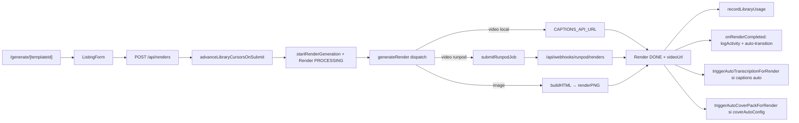

# Génération render template

## Pitch
L'admin / CM / EXTERNAL_GENERATOR génère une vidéo ou image depuis un template + listing. Pipeline image = HTML → PNG. Pipeline vidéo = soit local FastAPI soit RunPod, avec ou sans videoSequence multi-slots. Asset rotation + cursor advance gérés au submit.

## Schéma Mermaid



## Entry points UI

| Composant | Fichier:Ligne | Rôle |
|---|---|---|
| Page generate | `web/src/app/(app)/generate/[templateId]/page.tsx:1` | SSR : load template + listing prefill + library context |
| ListingForm | `web/src/components/form/ListingForm.tsx:80` | Form client : fields, file uploads, library picker, SSE polling |
| Galerie templates | `web/src/app/(app)/templates/page.tsx:1` | Liste accessibles |
| Page édition template | `web/src/app/(app)/templates/[id]/edit/page.tsx:1` | Studio/Builder |
| RenderResult | `web/src/components/renders/RenderResult.tsx:1` | Affichage vidéo/image post-DONE |

## Routes API

| Méthode | Path | Fichier | Effets |
|---|---|---|---|
| POST | `/api/renders` | `route.ts:81` | sanitize usedAssets + advanceLibraryCursorsOnSubmit + startRenderGeneration |
| GET | `/api/renders/[id]` | `[id]/route.ts:17` | Polling status + stall detection (local & RunPod pre-submit) |
| DELETE | `/api/renders/[id]` | `[id]/route.ts:74` | Admin only |
| POST webhook | `/api/webhooks/runpod/renders` | `route.ts:28` | Render DONE/FAILED + recordLibraryUsage + auto chain captions/cover |
| GET SSE | `/api/events/jobs` | (stream) | Broadcast JobEventPayload pour ListingForm polling |

## Helpers / triggers

- `web/src/lib/renderer/generateRender.ts:164` — **`getActiveSequenceSlots()`** (2026-06-01) : filtre les slots videoSequence inutilisables (binding pointant vers un champ schema masqué par showIf, sans libraryId de secours) avant la décision de pipeline. Sans ça, un template "photo OU vidéo" dont le slot vidéo a été auto-créé par `ensureVideoSequence` pousse le pipeline en mode séquence même quand l'utilisateur a choisi "Photo" — `resolveSlotVideoUrl` échoue avec "aucune vidéo trouvée".
- `web/src/lib/renderer/generateRender.ts:190` — `startRenderGeneration()` : prépare PROCESSING + async generateRender()
- `web/src/lib/renderer/generateRender.ts:221` — `generateRender()` : dispatch image vs vidéo (utilise activeSequenceSlots)
- `web/src/lib/renderer/generateRender.ts` — `generateVideoRenderLocal()` (USE_RUNPOD=false)
- `web/src/lib/renderer/generateRender.ts` — `generateSequenceRender()` pipeline multi-slot RunPod
- `web/src/lib/renderer/generateRender.ts` — `generateSequenceRenderLocal()` exécution locale seq
- `web/src/lib/renderer/generateRender.ts` — `failRender()` marque ERROR + revert cursors
- `web/src/lib/services/slot/pipelineHooks.ts:30` — `onRenderCompleted()` log + auto-transition pipeline (DRAFT → PLANNED)
- `web/src/lib/triggerAutoTranscription.ts:148` — `triggerAutoTranscriptionForRender()` post-DONE si `captionAutoConfig.enabled`
- `web/src/lib/coverAuto.ts:565` — `triggerAutoCoverPackForRender()` post-DONE si `coverAutoConfig` activé

### Décision de pipeline (généralisation 2026-06-01)

```ts
// generateRender.ts:253-264
const videoBlocks = getActiveVideoBlocks(templateJson, enrichedListing);
const activeSequenceSlots = getActiveSequenceSlots(templateJson, enrichedListing);

if (activeSequenceSlots.length > 0) {
  // Pipeline vidéo (sequence) avec slots filtrés
  const effectiveTemplateJson = { ...templateJson, videoSequence: activeSequenceSlots };
  await generateSequenceRender(renderId, effectiveTemplateJson, enrichedListing, accountId);
} else {
  // Pipeline image (HTML → PNG) ou vidéo single legacy
  ...
}
```

**Symétrie** : `getActiveSequenceSlots` est le miroir de `getActiveVideoBlocks` côté `videoSequence`. Tout slot dont le binding pointe vers un champ schema déclaré mais non visible (showIf=false), ou vers un block masqué par conditionalRules, est filtré — sauf s'il a un `libraryId` de secours (binding library independant).

## Asset rotation (préfill + advance)

- `web/src/lib/generate/buildLibraryPrefillContext.ts:80` — `buildLibraryPrefillContext()` côté SSR
- `web/src/lib/contentLibraryResolver.ts:786` — `resolveLibraryPrefill()` (rotation auto)
- `web/src/lib/contentLibraryResolver.ts:332` — `selectMediaAssetBySetSequence()` (override mode + auto mode)
- `web/src/lib/contentLibraryResolver.ts:1142` — `advanceLibraryCursorsOnSubmit()` (serveur, prévient abandon)
- `web/src/lib/recordLibraryUsage.ts:50` — `recordLibraryUsage()` post-DONE
- `web/src/lib/recordLibraryUsage.ts:436` — `revertLibraryCursors()` au ERROR (conditional via snapshot)

Voir map dédiée : `.claude/workflows/asset-rotation-engine.md`.

## Modèles Prisma touchés

- `Template` (`schema.prisma:117`) — `jsonData` (TemplateJSON serialized), `clientId`, `accessControl`
- `Render` (`schema.prisma:195`) — status, pipeline, stage, videoUrl, pngUrl, runpodJobId, **usedAssets JSON**, accountId, publicationSlotId
- `PublicationSlot` (`schema.prisma:737`) — relation render (optionnel)
- `MediaLibrary`, `MediaAsset`, `MediaAssetUsage`, `AccountLibraryCursor` (rotation)
- `DataLibrary`, `DataEntry`, `DataCampaign`, `DataEntryUsage` (data rotation)

## TemplateJSON et blocks

- `web/src/types/template.ts:557` — `TemplateJSON` : canvas, theme, blocks[], videoSequence[], captionAutoConfig, contentLibrary, coverAutoConfig
- `web/src/types/template.ts:512` — `VideoSequenceSlot` : videoBlockId, libraryId, binding, maxDuration, slotTimings
- `web/src/types/template.ts:404` — `AnyBlock` union : TextBlock | ImageBlock | VideoBlock | MusicBlock | ShapeBlock | DpeBlock
- `web/src/lib/templateNormalization.ts:107` — `normalizeTemplateJSON()` (enrichit videoSequence, injecte slots orphelins)
- `web/src/lib/validation/conformite.ts:33` — `validateConformite()` enrichit listing + warnings

## Pipelines & stages

```
RENDER_STAGE: QUEUED
            → LOAD_RENDER
            → VALIDATE_LISTING
            → {IMAGE_BUILD_HTML | VIDEO_SUBMIT}
            → {IMAGE_RENDER_PNG | VIDEO_PROCESSING}
            → {DONE | ERROR | STALLED}
```

- **Image** : buildHTML → renderPNG → `/renders/{id}.png`
- **Vidéo local** : `${CAPTIONS_API_URL}/render` → `/renders/{id}.mp4`
- **Vidéo RunPod** : `submitRunpodJob()` → webhook callback → videoUrl R2

## Side effects

- `recordLibraryUsage` (`recordLibraryUsage.ts:50`) — incrémente MediaAssetUsage / DataEntryUsage / advance AccountLibraryCursor stamp
- `onRenderCompleted` — logActivity `RENDER_COMPLETED` + transition pipeline
- `triggerAutoTranscriptionForRender` — chaîne post-DONE si template demande captions auto
- `triggerAutoCoverPackForRender` — chaîne post-DONE si `coverAutoConfig` activé
- `revertLibraryCursors` au ERROR — conditional UPDATE via snapshot (anti-race)
- SSE `notifyUser({jobType: "render", status: ...})` broadcast

## Permissions

- `web/src/lib/permissions.ts:115` — `canAccessTemplate()` : ADMIN bypass, TemplateAccess via FK
- `web/src/app/api/renders/route.ts:90` — `hasTool(TOOLS.TEMPLATES)` check
- EXTERNAL_GENERATOR : limité aux templates assignés via TemplateAccess

## Variants par rôle

| Rôle | Ce qui change |
|---|---|
| ADMIN | Voit tous templates, peut générer sans slot |
| CM | Peut générer pour ses comptes |
| VIDEASTE | Accès limité (rare) |
| EXTERNAL_GENERATOR | Accès via TemplateAccess uniquement, voit "Mes générations" |

## Pré-conditions / invariants

- Template avec `jsonData` valide (parsing, normalisation)
- Listing valide (`validateConformite`)
- RunPod : RUNPOD_API_KEY + ENDPOINT_ID + R2 configurés
- Local : `USE_RUNPOD=false` + `CAPTIONS_API_URL` joignable
- Asset rotation : `recordLibraryUsage` doit être idempotent (revert utilise snapshot)
- Slot lié optionnel (Render.publicationSlotId)

## Skills/agents pertinents

- `.claude/skills/render-engine/SKILL.md` — RunPod / FFmpeg / R2 / local
- `.claude/skills/template-builder/SKILL.md` — builder, normalisation, blocks
- `.claude/skills/asset-rotation/SKILL.md` — rotation engine
- `.claude/skills/content-library/SKILL.md` — MediaLibrary / DataLibrary

## Liens vers code

- Tests : `web/src/lib/renderer/__tests__/` + `web/src/lib/__tests__/templateNormalization.test.ts`
- E2E : pas de scenario dédié pour l'instant (RunPod / render-engine pas mockables facilement)
