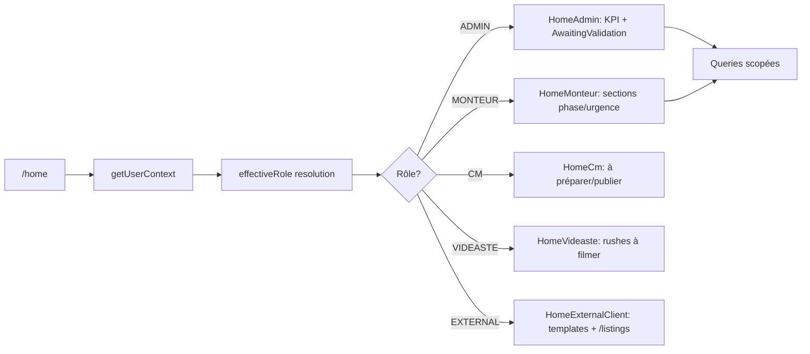

# /home — Worklists par rôle

## Pitch
Page `/home` dispatch selon effectiveRole vers 5 surfaces distinctes : HomeAdmin (KPI + versions à valider), HomeMonteur (slots assignés par phase), HomeCm (slots à publier), HomeVideaste (rushes à filmer), HomeExternalClient (gateway templates + lien /listings). Scoping unifié via `whereClauseForUser`. Pas d'action surface (click → fiche).

## Schéma Mermaid

## Entry points UI

| Composant | Fichier:Ligne | Rôle |
|---|---|---|
| Page /home | `app/(app)/home/page.tsx:17` | Dispatcher selon rôle, getUserContext |
| Page /home:44 | `home/page.tsx:44` | TemplateAccess query pour client externe |
| HomeAdmin | `components/home/HomeAdmin.tsx:36` | KPI cards (overdue/noPattern/noMonteur/noVideaste) + section "Versions à valider" + liens /calendar et /admin |
| HomeAdmin queries | `HomeAdmin.tsx:39-86` | overdueCount, noPatternCount, noMonteurCount, noVideasteCount, editReviewSlots (EDIT_REVIEW) |
| HomeMonteur | `components/home/HomeMonteur.tsx:43` | Sections : overdue, thisWeekTodo, upcoming, waiting |
| HomeMonteur query | `HomeMonteur.tsx:48-58` | `assigneeMonteurId === userId`, MONTEUR_STATUSES, orderBy scheduledAt |
| HomeCm | `components/home/HomeCm.tsx:37` | Sections : overdue, toPrepare, toPublishThisWeek, publishedRecently |
| HomeCm query | `HomeCm.tsx:44-57` | `assigneeCmId === userId`, CM_STATUSES, charge render.coverFramePack |
| HomeVideaste | `components/home/HomeVideaste.tsx:39` | Sections : overdue, thisWeekShoots, upcomingShoots, delivered, inProduction |
| HomeVideaste query | `HomeVideaste.tsx:44-54` | `assigneeVideasteId === userId`, VIDEASTE_STATUSES |
| HomeExternalClient | `components/home/HomeExternalClient.tsx:37` | Gateway : CTA "Mes générations" → /listings + grille templates + outils granulaires |
| WorklistSection | `components/home/WorklistSection.tsx:48` | Section header eyebrow + titre + count + collapsible |
| WorklistSlotCard | `components/home/WorklistSlotCard.tsx` | Card slot (titre, compte, pattern, badges) |

## Routes API

| Méthode | Path | Effets |
|---|---|---|
| GET | `/api/worklist/count:23-80` | Count actives par rôle (ADMIN: overdue, MONTEUR/CM: assignés non-terminaux, VIDEASTE/EXTERNAL: 0) |

**Note** : les données des Home* sont chargées **server-side directement dans chaque component**, pas via routes `/api/home/*`.

## Helpers & Types de permissions

- `lib/permissions/slotScope.ts:71-94` — **`whereClauseForUser(role, userId)`** :
  - ADMIN : `{}`
  - MONTEUR : `{assigneeMonteurId: userId}`
  - CM : `{assigneeCmId: userId}`
  - VIDEASTE : `{assigneeVideasteId: userId}`
  - EXTERNAL_GENERATOR : `{id: "__never__"}` (filtre out)
- `lib/permissions/slotScope.ts:112-138` — `canUserAccessSlot(slot, role, userId)`
- `lib/permissions/slotScope.ts:164-205` — `ALLOWED_PATCH_FIELDS_BY_ROLE`
- `lib/permissions/publications.ts:50-59` — `canSeePublication(user, slot)`
- `lib/permissions/role.ts:18-21` — `toUserRole(raw)` defaut EXTERNAL_GENERATOR

## Types & Mapping Statuts

- `types/worklist.ts:62-98` — **`getMonteurSection(status)`** → `"todo" | "in_progress" | "waiting" | null`
- `types/worklist.ts:142-144` — **`getCmSection(status)`** → `"to_prepare" | "to_publish" | "published" | null`
- `types/worklist.ts:191-193` — **`getVideasteSection(status)`** → `"to_shoot" | "shooting_done" | "in_edit" | null`
- `types/roles.ts:45-71` — SlotStatus (17 statuts + 5 legacy), SLOT_STATUSES, TERMINAL_STATUSES
- `types/roles.ts:15-22` — UserRole (5 rôles), USER_ROLES

## Modèles Prisma

- `PublicationSlot` — `assigneeMonteurId`, `assigneeCmId`, `assigneeVideasteId`, `status`, `scheduledAt`, `patternId`
- `PublicationVersion` — soft-delete via deletedAt
- `TemplateAccess` — userId, templateId (m-n pour EXTERNAL_GENERATOR)

## Contexte Utilisateur & Impersonation

- `lib/userContext.ts:25-38` — UserContext shape
- `lib/userContext.ts:50-80` — `resolveUserContext` (impersonation + view-as)
- `lib/userContext.ts:6-15` — Cookies impersonation + view-as

## Variants & Comportements par rôle

| Rôle | Vocation |
|---|---|
| ADMIN | Vue superviseur — KPI globaux, versions à valider, lien /calendar (orchestration) |
| MONTEUR | Slots assignés découpés par urgence (overdue, cette semaine, à venir, en attente client) |
| CM | Slots assignés par étape (à préparer, à publier cette semaine, récemment publiés) |
| VIDEASTE | Missions de shoot assignées + shoots livrés + montages en cours |
| EXTERNAL_GENERATOR | Gateway templates + lien /listings (hors pipeline éditoriale) |

## Pré-conditions / invariants

- `getUserContext()` résout effectiveUser via actualUser + impersonation/viewAsRole
- VIDEASTE retiré de `/api/worklist/count` (Phase 6.1 fix P1)
- Aucune route `/api/home/*` — server components fetch direct

## Skills/agents pertinents

- `.claude/skills/admin-permissions/SKILL.md`
