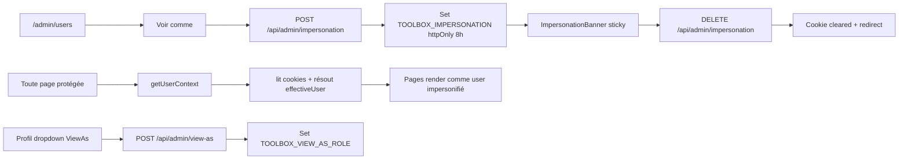

# Impersonation & View-as

## Pitch
Admin peut impersonifier un user (debug/support) ou "view-as" un rôle (prévisualisation UI). Stockage cookies HttpOnly 8h (TOOLBOX_IMPERSONATION + TOOLBOX_VIEW_AS_ROLE), résolution via `getUserContext()`, banner sticky top. Impersonation prime sur view-as. `canAdminBypass=false` en impersonation pour respecter les restrictions du rôle simulé.

## Schéma Mermaid



## Entry points UI

| Composant | Fichier:Ligne | Rôle |
|---|---|---|
| ImpersonationBanner | `components/ImpersonationBanner.tsx:30` | Sticky top — warning peach (imperso) ou info sky (view-as) + bouton stop |
| UsersPanel | `components/admin/UsersPanel.tsx:304` | Bouton "Voir comme" dans liste users admin |
| AppNav profil | `components/layout/AppNav.tsx:111` | Dropdown footer profil avec setViewAsRole |
| Layout | `app/(app)/layout.tsx:30-38` | Affichage conditionnel banners selon isImpersonating + isRoleOverride |

## Routes API

| Méthode | Path | Effets |
|---|---|---|
| POST | `/api/admin/impersonation:10` | Body `{userId}` → set cookie `toolbox_impersonate_user_id` (httpOnly secure lax 8h max-age). **Clears view-as cookie**. Audit log. |
| DELETE | `/api/admin/impersonation:73` | Clear cookie + redirect `/admin/users`. Audit log. |
| POST | `/api/admin/view-as:19` | Body `{role}` → set cookie `toolbox_view_as_role` (8h max-age). Audit log. |
| DELETE | `/api/admin/view-as:55` | Clear cookie view-as |

**Exception architecturale** : ces 2 routes utilisent `auth()` direct (pas `getUserContext()`) car elles établissent/détruisent le cookie — sinon dépendance circulaire.

## Helpers & Context Resolution

- `lib/userContext.ts:6-13` — **Constantes cookies** :
  - `IMPERSONATION_COOKIE_NAME = "toolbox_impersonate_user_id"`
  - `VIEW_AS_ROLE_COOKIE_NAME = "toolbox_view_as_role"`
  - `VALID_VIEW_AS_ROLES = ["VIDEASTE", "MONTEUR", "CM"]`
- `lib/userContext.ts:25-38` — **Type UserContext** :
  ```ts
  { session, actualUser, effectiveUser, isAdmin, isImpersonating, isRoleOverride, canAdminBypass }
  ```
- `lib/userContext.ts:114` — `getUserContext()` async — lit cookies + appelle `resolveUserContext()`
- `lib/userContext.ts:50` — **`resolveUserContext(session, impersonatedUserId?, viewAsRole?)`** — logique de résolution

### Priorités

```
1. Impersonation mode (ligne 59-86) :
   isAdmin && impersonatedUserId != actualUser.id
   → effectiveUser = lookup(impersonatedUserId)
   → isImpersonating=true, canAdminBypass=false

2. View-as-role mode (ligne 90-99) :
   isAdmin && viewAsRole in VALID_VIEW_AS_ROLES
   → effectiveUser = actualUser avec role overridé
   → isRoleOverride=true, canAdminBypass=false

3. Mode normal (ligne 103-111) :
   → effectiveUser = actualUser
   → canAdminBypass = (role === "ADMIN")
```

**Impersonation prime sur view-as** : si les 2 cookies coexistent, impersonatedUserId l'emporte.

## Contrôle d'accès

- `/api/admin/users:GET` — check `!userContext?.canAdminBypass ? 403` (bloque impersonation + view-as)
- `slotService.createSlot` — `if (!ctx.canAdminBypass) throw ForbiddenError` → impersonation n'autorise pas operations admin
- `/api/admin/impersonation:12,75` — check `session.user.role !== "ADMIN"` direct (évite circular dependency)

## Hooks Client

- `hooks/useImpersonation.ts:35` — `stopImpersonation()` → DELETE + `router.push("/admin/users")` + toast error si échec
- `hooks/useImpersonation.ts:49` — `setViewAsRole(role|null)` → POST ou DELETE + `router.refresh()` + toast error si échec

## Modèles Prisma

**Pas de modèle dédié** — impersonation/view-as stockés uniquement en cookies HttpOnly. User lu pour le target.

## Points architecturaux clés

- **Circular dependency avoidance** : routes `/api/admin/impersonation` + `/api/admin/view-as` utilisent `auth()` direct
- **Impersonation prime sur view-as** : cleanup view-as cookie au start impersonation (ligne 63) prévient surprise override
- **Cookie 8h** : couvre journée de travail mais expire la nuit (évite reprises silencieuses)
- **canAdminBypass comme gate** : toutes les routes admin-only utilisent ce flag (pas le rôle session) → impersonation/view-as respectent les restrictions
- **Audit logs** : `console.info` [impersonation] start/stop et [view-as] start/stop avec actorId, targetUserId, role, timestamp

## Variants par rôle

| Rôle | Ce qui change |
|---|---|
| ADMIN | Peut activer impersonation + view-as |
| Tous | Banner visible si actif sur leur session |

## Pré-conditions / invariants

- Session ADMIN valide
- Target user existe (pour impersonation)
- Role valide (`VALID_VIEW_AS_ROLES`)
- Cookie signé par NEXTAUTH_SECRET
- Pas d'impersonation circulaire (userId != actualUser.id)
- Pas d'impersonation ADMIN target (security)

## Skills/agents pertinents

- `.claude/skills/admin-permissions/SKILL.md`
- ADR : `web/docs/adr/001-access-control-patterns.md`
