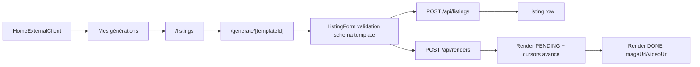

# Listings management

## Pitch
"Mes générations" pour EXTERNAL_GENERATOR. Listing = projet de génération sur 1 template assigné. CRUD listing, formulaire validé contre `template.jsonData.schema`, déclenche Render(s) via `/api/renders`. ADMIN voit cross-user via `/api/admin/listings`. Pas de champ `status` direct sur Listing — porté par Renders enfants.

## Schéma Mermaid

## Entry points UI

| Composant | Fichier:Ligne | Rôle |
|---|---|---|
| Lien HomeExternalClient | `components/home/HomeExternalClient.tsx:100` | Pill button → `/listings` |
| Page liste | `app/(app)/listings/page.tsx:1` | Listings + Renders + Jobs associés |
| Page génération | `app/(app)/generate/[templateId]/page.tsx:1` | Création/édition listing |
| ListingForm | `components/form/ListingForm.tsx:80` | RHF + validation + SSE polling |
| DeleteListingButton | `components/listings/DeleteListingButton.tsx:13` | Client-side delete |

## Routes API

### Listing
| Méthode | Path | Effets |
|---|---|---|
| POST | `/api/listings:9` | Création + validation schema template + `canAccessTemplate` |
| GET | `/api/listings:83` | Liste user courant |
| GET | `/api/listings/[id]:7` | Détail (owner check) |
| PUT | `/api/listings/[id]:51` | Édition jsonData (owner + admin) |
| DELETE | `/api/listings/[id]:28` | **ADMIN only** |
| GET | `/api/admin/listings:15` | Cross-user (admin + canAdminBypass stricte) |

### Render
| Méthode | Path | Effets |
|---|---|---|
| POST | `/api/renders:81` | Génération img/vidéo, vérifie `hasTool(TOOLS.TEMPLATES)` |
| GET | `/api/renders/[id]:16` | Statut + owner check via listing.userId |

## Modèles Prisma

- **`Listing`** (`schema.prisma:183`) — id, templateId FK, **jsonData JSON** (form data), userId FK, createdAt, updatedAt, renders[]
- **`Render`** (`schema.prisma:195`) — id, listingId FK, status (PENDING|PROCESSING|DONE|ERROR), pngUrl, videoUrl, pipeline, runpodJobId, accountId?, publicationSlotId?
- **`Template`** (`schema.prisma:117`) — id, jsonData (TemplateJSON), userId FK, accesses[] (TemplateAccess)
- **`TemplateAccess`** (`schema.prisma:172`) — (userId, templateId) unique

## Helpers & Validation

- `lib/validation/listing.schema.ts:5` — `listingSchema` zod : titre, adresse, prix, DPE, agence, etc.
- `lib/permissions.ts:115` — `canAccessTemplate(userId, templateId, role)` : ADMIN=true sinon `TemplateAccess.findUnique`
- `lib/permissions.ts:87` — `hasTool(userId, tool)` : check "templates" sur user
- `app/api/listings/route.ts:44` — Schema field validation depuis `template.jsonData` (required fields, visibility conditions)
- `lib/renderer/generateRender.ts` — `startRenderGeneration()` : dispatch local OR RunPod (image/video)

## Access Control & Variants

- `lib/permissions.ts:51` — **`EXTERNAL_GENERATOR_ALLOWED_TOOLS = ["templates", "covers"]`**
- `app/(app)/listings/page.tsx:98` — ADMIN voit tout / USER+MONTEUR+CM voient leurs listings + assignés via slot
- `app/api/listings/[id]/route.ts:34` — DELETE ADMIN only / PUT owner+admin / GET owner check
- `components/form/ListingForm.tsx:24` — **`libraryPrefillContext`** : pré-remplissage depuis DataEntry/MediaAsset (rotation mode, usagePolicy)
- `ListingForm.tsx:112` — `resolveVariant()` : terminal states SSE + polling

## Flux & Pré-conditions

1. EXTERNAL_GENERATOR a ≥1 TemplateAccess
2. `/generate/[templateId]` → `canAccessTemplate` check avant form
3. POST `/api/listings` → validation + create row
4. POST `/api/renders` → vérifie `hasTool(TOOLS.TEMPLATES)` + create Render PENDING + avance cursors rotation
5. ListingForm SSE poll `/api/events/jobs` pour update variants

## Key Observations

- **Pas de status Listing** : porté par Renders enfants (PENDING/PROCESSING/DONE/ERROR)
- **Template Assignment** : `TemplateAccess` → EXTERNAL_GENERATOR ne génère que sur templates assignés
- **Asset Rotation** : `libraryPrefillContext` (auto mode avec curseur per_account/library OU override fixe)
- **Impersonation Compliance** : `/api/listings` filtre userId courant ; `/api/admin/listings` strict sur `canAdminBypass`
- **Render Pipeline agnostique** : Render a accountId/publicationSlotId optionnels — un Listing peut générer N Renders

## Variants par rôle

| Rôle | Ce qui change |
|---|---|
| EXTERNAL_GENERATOR | Voit ses listings, templates assignés |
| ADMIN | Voit tout cross-user via `/api/admin/listings` |
| Autres rôles | Listings limités à leurs créations |

## Skills/agents pertinents

- `.claude/skills/admin-permissions/SKILL.md`
- `.claude/skills/asset-rotation/SKILL.md`
