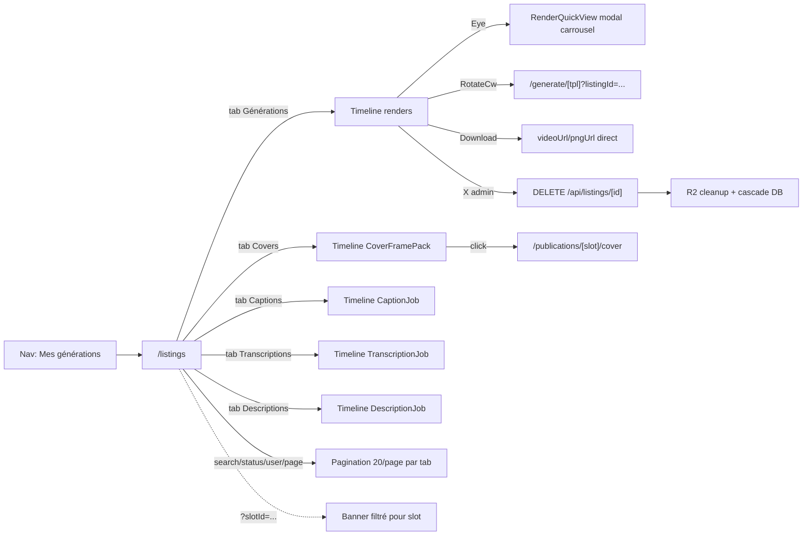

# Listings management

## Pitch

"Mon historique" — surface unifiée qui regroupe toutes les générations d'un user en 5 onglets (Générations / Covers / Captions / Transcriptions / Descriptions) avec timeline groupée par date, filtres (search/status/user), pagination 20/page et live updates (SSE captions/transcriptions + polling 5s renders).

ADMIN voit cross-user (filtre user dispo) + croix de suppression avec nettoyage R2 sur les listings non rattachés à un slot. MONTEUR/CM/VIDEASTE ne voient que ce qu'ils ont eux-mêmes généré (règle 2026-06-01 : plus de listings assignés via slot — ces cas passent par la fiche `/publications/[id]`). EXTERNAL_GENERATOR voit ses listings + ses cover packs.

## Schéma Mermaid



## Entry points UI

| Composant | Fichier:Ligne | Rôle |
|---|---|---|
| Lien nav latérale | `components/layout/AppNav.tsx:164,198` | "Mes générations" — visible pour tous rôles |
| Lien HomeExternalClient | `components/home/HomeExternalClient.tsx:106-112` | CTA pill "Mes générations" |
| Page liste | `app/(app)/listings/page.tsx:41-383` | SSR : fetch listings + jobs scopés par rôle, filtre `slotId` |
| ListingsClient | `components/listings/ListingsClient.tsx:546-967` | Client : tabs, filters, timeline, pagination, polling |
| TimelineRow | `components/listings/ListingsClient.tsx:274-389` | Row avec actions inline (Eye/RotateCw/Download/X) |
| RenderQuickView | `components/listings/RenderQuickView.tsx:42-207` | Modal carrousel variantes (clavier ←/→, dots, footer Régénérer/Télécharger) |
| DeleteListingButton | `components/listings/DeleteListingButton.tsx:14-96` | Croix admin avec confirm inline (Check/X) + toast |
| Pagination | `components/ui/Pagination.tsx` | Composant primitive, 20/page, état par tab |

## Routes API

### Listing
| Méthode | Path | Fichier:Ligne | Auth | Effets |
|---|---|---|---|---|
| POST | `/api/listings` | `route.ts:9-80` | getUserContext + canAccessTemplate | Création + validation schema template |
| GET | `/api/listings` | `route.ts:83+` | getUserContext | Liste filtrée userId, slotId queryParam optionnel |
| GET | `/api/listings/[id]` | `[id]/route.ts:17-36` | getUserContext (owner ou admin) | Détail + parse jsonData |
| PUT | `/api/listings/[id]` | `[id]/route.ts:170-191` | owner ou canAdminBypass | Édition jsonData |
| **DELETE** | `/api/listings/[id]` | `[id]/route.ts:38-168` | **ADMIN only** | **409 si linkedSlot, sinon R2 cleanup + cascade DB** |
| GET | `/api/admin/listings` | `route.ts:15+` | canAdminBypass strict | Cross-user (admin uniquement) |

### Render
| Méthode | Path | Fichier:Ligne | Effets |
|---|---|---|---|
| POST | `/api/renders` | `route.ts:81+` | `hasTool(TOOLS.TEMPLATES)` + `canAccessTemplate` + advance cursors |
| GET | `/api/renders/[id]` | `[id]/route.ts:16+` | Statut polling (owner via listing.userId) |
| DELETE | `/api/renders/[id]` | `[id]/route.ts:74+` | Admin only |

### Cover pack (régénération depuis listings/fiche)
| Méthode | Path | Fichier:Ligne | Effets |
|---|---|---|---|
| POST | `/api/cover-packs/[id]/regenerate` | `route.ts:11-70` | **canUserAccessSlot** (CM/MONTEUR assignés OK, plus juste pack.userId) |

## DELETE listing — pipeline détaillé (nouveau 2026-06-01)

`web/src/app/api/listings/[id]/route.ts:38-168`

```
1. Auth + isAdmin check (403 sinon)
2. Load listing + renders + coverFramePack(.candidates) + transcriptionJob
3. Si UN render a publicationSlotId → 409 "Passe par la fiche de publication"
4. Collecte clés R2 à nettoyer :
   - pour chaque render : videoUrl, pngUrl
   - coverFramePack SI sans publicationVersionId : finalCoverKey + candidates.imageKey
   - transcriptionJob SI sans publicationVersionId ET sans slotId : inputKey, outputJsonKey
5. R2 cleanup tolérant (Promise.all + catch silencieux par clé)
6. DB cleanup ordonné : coverFramePack.deleteMany → transcriptionJob.deleteMany
   → render.deleteMany → listing.delete
7. console.warn audit log (admin, listing, counts)
8. 204 No Content
```

**Garde-fou 409** : éviter de vider silencieusement la production d'une mission active.

**R2 cleanup tolérant** : un échec unitaire (objet déjà absent, réseau passager) n'interrompt pas la suppression DB — l'orphan sweep (`r2Cleanup.ts`) rattrape au prochain run.

**Cover pack épargné si publicationVersionId** : le pack sert ailleurs (cover finale d'une version uploadée), Prisma fait juste un SetNull sur renderId.

## Pagination & filtres (client-side)

`components/listings/ListingsClient.tsx:768-797`

- `PAGE_SIZE = 20`
- État `pageByTab` : 1 page courante par tab, conservée quand l'user bascule
- `filterSignature = "tab|search|statusFilter|userFilter"` — reset auto à `page=1` quand la signature change
- Filtres status : `all | in_progress | done | failed` (sets `STATUS_IN_PROGRESS / STATUS_DONE / STATUS_ERROR`)
- Search : matche `title + sublabel + ownerName` (lowercase)
- Filtre user : admin only, `<Combobox>` peuplé depuis `allUsers` (dédupliqué cross-tab)

## Live updates

- **Renders** : polling `setInterval(5s)` sur `/api/renders/[id]` pour les renders en PROCESSING/PENDING (ref pour éviter stale closures)
- **Captions/Transcriptions** : `useAllJobEvents` (SSE bus) — `event.jobType = "captions" | "transcription"` → maj `captionStates / transcriptionStates`
- **Descriptions/Covers** : pas de live update direct (refresh manuel via Refresh button du header)

## Modèles Prisma touchés

- `Listing` (`schema.prisma:183-193`) — id, templateId FK, jsonData JSON, userId FK, renders[]
- `Render` (`schema.prisma:195+`) — id, listingId FK, status, pngUrl, videoUrl, errorMsg, publicationSlotId?, accountId?, coverFramePack? (1-1)
- `CoverFramePack` (`schema.prisma`) — status (QUEUED|PROCESSING|READY|SELECTED|FAILED), finalCoverUrl, finalCoverKey, renderId, publicationVersionId, candidates[]
- `CoverFrameCandidate` — imageKey (R2)
- `CaptionJob`, `TranscriptionJob`, `DescriptionJob` (chacun avec inputKey/outputJsonKey/slotId/publicationVersionId)

## Permissions & scope

`app/(app)/listings/page.tsx:96-100`

- **ADMIN** : `where = {}` → tous listings cross-user
- **Autres rôles** : `where = { userId }` → uniquement leurs créations
- **(2026-06-01)** MONTEUR/CM/VIDEASTE ne voient plus listings via `slot.assignee*` — règle "je ne vois que ce que je génère, sauf admin"
- **Filtre slotId** (queryParam) : post-fetch filter, jobs/listings rattachés à un slot précis (banner sky en haut)

## Variants par rôle

| Rôle | Ce qui change |
|---|---|
| ADMIN | Voit tout cross-user, filtre par user, croix suppression visible sur listings non-rattachés |
| EXTERNAL_GENERATOR | Voit ses listings + ses cover packs, accès via nav (Accueil + Mes générations) |
| MONTEUR/CM/VIDEASTE | Voient ce qu'ils ont eux-mêmes généré (plus de scope via slot assignee) |

## Side effects

- `router.refresh()` après DELETE (refresh SSR + refetch live)
- `toast.success("Génération supprimée")` ou `toast.error(<message API>)`
- `console.warn` audit DELETE côté API

## Pré-conditions / invariants

- Listings sans renders (cas dégénéré) restent supprimables admin
- Liens `coverFramePack ↔ publicationVersion` épargnent le pack si il sert encore
- `linkedSlotId` calculé via `r.publicationSlot?.id` (joint dans `LISTING_INCLUDE`)
- `coverAutoEnabled` activé via `r.publicationSlot.pattern.coverMode === "autoPack"`

## Skills/agents pertinents

- `.claude/skills/admin-permissions/SKILL.md`
- `.claude/skills/asset-rotation/SKILL.md` (pour les cursors)
- `.claude/skills/render-engine/SKILL.md` (R2 cleanup)

## Liens vers code

- Page : `web/src/app/(app)/listings/page.tsx`
- Client : `web/src/components/listings/ListingsClient.tsx`
- Modal : `web/src/components/listings/RenderQuickView.tsx`
- Delete : `web/src/components/listings/DeleteListingButton.tsx`
- API DELETE : `web/src/app/api/listings/[id]/route.ts:38-168`
- Cover regen : `web/src/app/api/cover-packs/[id]/regenerate/route.ts`
