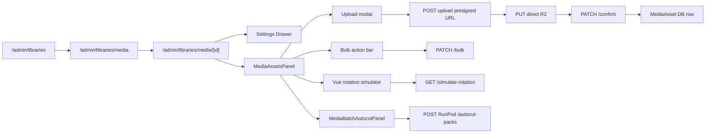

# MediaLibrary admin — CRUD

## Pitch
Admin gère MediaLibrary (vidéo/audio) + assets via panel /admin/libraries/media/[id]. Upload via R2 presign, édition metadata (setTag/category/tags/metadata custom), suppression cascade R2, reset usages, simulation rotation, batch autocut Whisper. Toutes routes admin-only via `canAdminBypass`.

## Schéma Mermaid

## Entry points UI

| Composant | Fichier:Ligne | Rôle |
|---|---|---|
| Hub Ressources | `app/(app)/admin/libraries/page.tsx:48` | 5 cards (Médias / Audio / Data / Fonts / Prompts) |
| Liste libraries | `app/(app)/admin/libraries/media/page.tsx:8` | Cards glass, search, create |
| Détail library | `app/(app)/admin/libraries/media/[id]/page.tsx:10` | Layout + MediaAssetsPanel |
| MediaLibrariesPanel | `components/admin/libraries/MediaLibrariesPanel.tsx:58` | Container CRUD library |
| MediaAssetsPanel | `components/admin/libraries/MediaAssetsPanel.tsx:36` | Grid/grouped/rotation views |
| MediaLibrarySettingsDrawer | `MediaLibrarySettingsDrawer.tsx:60` | Settings (rotation mode/scope, metadata schema, maxUsageCount) |
| MediaAssetDetailDrawer | `MediaAssetDetailDrawer.tsx:60` | Édition asset (category/pack/tags/metadata/access/trim) |
| MediaAssetsUploadModal | `mediaAssets/MediaAssetsUploadModal.tsx:90` | Dropzone + presign + progress + bulk metadata |
| MediaAssetsToolbar | `mediaAssets/MediaAssetsToolbar.tsx` | Search/sort/view/tag filter/advanced toggle |
| MediaAssetsBulkActionBar | `mediaAssets/MediaAssetsBulkActionBar.tsx` | Sticky bar bulk tags/category/pack/access |
| MediaAssetsRotationView | `mediaAssets/MediaAssetsRotationView.tsx` | Vue cursor + next pick simulation |
| MediaBatchAutocutPanel | `MediaBatchAutocutPanel.tsx:49` | Whisper autocut batch |

## Routes API

### CRUD MediaLibrary
| Méthode | Path | Effets |
|---|---|---|
| GET | `/api/admin/libraries/media` | Liste + previewAssets (1 cover vidéo la plus récente) |
| POST | `/api/admin/libraries/media` | Crée (name, type video/audio, tags, setSequence) |
| PATCH | `/api/admin/libraries/media/[id]` | Update rotation/metadataSchema/maxUsageCount |
| DELETE | `/api/admin/libraries/media/[id]` | Cascade R2 cleanup + suppression DB |

### CRUD MediaAsset
| Méthode | Path | Effets |
|---|---|---|
| GET | `/.../[id]/assets` | Liste + accesses + per-account usage |
| POST | `/.../[id]/upload` | Presigned PUT URL + création row pending |
| PATCH | `/.../assets/[assetId]/confirm` | Verify R2 + cleanup phantom + probe duration |
| PATCH | `/.../assets/[assetId]` | Update duration/tags/setTag/category/access/metadata + reset usage |
| GET | `/.../assets/[assetId]` | Download presigned URL |
| DELETE | `/.../assets/[assetId]` | Check no edit pending + delete R2 + delete row |
| PATCH | `/.../[id]/assets/bulk` | Bulk (tags/category/access add-remove/metadata) |
| POST | `/.../assets/[assetId]/edit` | Trim/audio edit RunPod (MediaEditJob) |
| GET | `/.../assets/[assetId]/edit` | Polling status + fallback RunPod check 15min |

### Rotation & Autocut
| Méthode | Path | Effets |
|---|---|---|
| GET | `/.../[id]/simulate-rotation?accountId=X` | Next pick + reason + cursor state |
| GET | `/.../[id]/autocut-queue` | Pending review jobs + counts |
| POST | `/.../[id]/autocut-packs` | Batch submit Whisper (MediaAutocutBatch) |
| DELETE | `/.../[id]/autocut-jobs` | Cancel autocut jobs |

### Duration backfill admin (commit `16ab8e1`, 2026-06-04)
| Méthode | Path | Effets |
|---|---|---|
| POST | `/api/admin/libraries/media/backfill-duration` | Probe `duration` pour tous les assets vidéo/audio avec `duration=NULL` (one-shot, optionnel `{ libraryId }`). Délègue à render-engine `/api/probe-duration`. Retour : `{ processed, succeeded, failed }` |

Use case : assets legacy uploadés avant 2026-06-04 (vidéos non probées) restent NULL en DB. La nouvelle validation `block.minDuration` au submit reject ces assets (bug-hunter B10). Le backfill admin permet de tous probéer en masse.

## Helpers / triggers

- `web/src/lib/r2.ts:105` — `createPresignedUploadUrl` (PUT, contentLength binding)
- `web/src/lib/r2.ts:136` — `createPresignedDownloadUrl` (GET, Content-Disposition attachment)
- `web/src/lib/r2.ts:34` — `r2Configured()`
- `web/src/lib/contentLibraryResolver.ts` — `selectMediaAssetBySetSequence` (rotation auto/override, per-account/shared, least_used)
- `mediaAssets/useMediaAssetsLoader.ts` — Fetch + per-account usage isolation
- `mediaAssets/useBulkEdit.ts` — Bulk select + action queueing
- `mediaAssets/useAssetSequence.ts` — setSequence reordering

## Modèles Prisma

- `MediaLibrary` (`schema.prisma:409`) — name, type, tags[], setSequence[], rotationScope (per_account/shared), rotationMode (auto/override/none), metadataSchema, maxUsageCount
- `MediaAsset` (`schema.prisma:454`) — libraryId, r2Key unique, duration, tags[], setTag, category, usageCount, lastUsedAt, disabled, metadata{}
- `MediaAssetAccess` (`schema.prisma:693`) — (assetId, accountId) unique pour ACL par compte
- `MediaAssetUsage` (`schema.prisma:704`) — (assetId, accountId) avec lastUsedAt, usageCount per-account
- `AccountLibraryCursor` (`schema.prisma:717`) — (accountId, libraryId) avec cursor + lastUsedSetTag + lastUsedCategory
- `MediaEditJob` (`schema.prisma:493`) — Trim/audio status pending/processing/done/failed, params, runpodId
- `MediaAutocutBatch` / `MediaAutocutJob` — Whisper batch processing state

## Side effects & Guards

- DELETE library : loop R2 + retry (fatal if any fail)
- DELETE asset : R2 before DB row
- Phantom cleanup : DB row si presign fail OU si R2 upload jamais completé
- Edit job blocking : refuse DELETE asset si MediaEditJob pending/processing
- Duration probe : fire-and-forget ffprobe + render-engine fallback **pour audio ET vidéo** (depuis commit `16ab8e1` 2026-06-04). Avant : seul l'audio était probé → les vidéos legacy avec `duration=NULL` bypassaient silencieusement le filtre `minDuration`
- Per-account usage reset : deleteMany MediaAssetUsage pour account spécifique ou tous

## Variants par rôle

| Rôle | Ce qui change |
|---|---|
| ADMIN | Toutes routes via `canAdminBypass` |
| Manual mode `rotation="none"` | Pas rotation auto, sélection metadata, MediaAssetsPanel cache Catégorie+Pack, force grid view |
| `per_account` scope | MediaAssetUsage + AccountLibraryCursor par (asset, account) + (account, library) |
| `shared` scope | SHARED_CURSOR_ACCOUNT_ID singleton, usages globaux MediaAsset.usageCount |
| `burn-once` (maxUsageCount≥1) | Filtre asset après N usages (sémantique scope-dépendante) |

## Pré-conditions / invariants

- R2 configuré (R2_ACCOUNT_ID, R2_ACCESS_KEY_ID, R2_SECRET_ACCESS_KEY, R2_BUCKET, R2_PUBLIC_URL) — dev fallback `/uploads/{assetId}.ext`
- Formats : Video (mp4/mov/m4v/webm/mpeg max 2GB) — Audio (mp3/wav/aac/m4a/ogg/flac max 200MB)
- MIME validation server-side + ContentLength signature binding
- Library type valide "video" ou "audio"

## Skills/agents pertinents

- `.claude/skills/content-library/SKILL.md` (rotation, setTag, AccountLibraryCursor)
- `.claude/skills/asset-rotation/SKILL.md`
- `.claude/skills/admin-permissions/SKILL.md`
