# Publication — captions auto

## Pitch
Pour un slot dont le pattern `needsCaptionsMode = "auto"`, le pipeline génère automatiquement la transcription Whisper, applique une correction IA, puis brûle les sous-titres dans la vidéo via un preset captions.

## Schéma Mermaid

```mermaid
flowchart LR
  PromoteVer["promote version<br/>OU validate client"] --> TT[triggerAutoTranscriptionForVersion / ForRender]
  TT -->|USE_RUNPOD=true| RunpodTr["RunPod /transcribe"]
  TT -->|USE_RUNPOD=false| LocalTr["CAPTIONS_API_URL/transcribe"]
  RunpodTr --> WTr["/api/webhooks/runpod/transcription"]
  LocalTr --> SyncDone[TranscriptionJob COMPLETED inline]
  WTr --> TAC[triggerAutoCaptionFromTranscription]
  SyncDone -.->|chaîne auto skip| TAC
  TAC --> RunpodCap["RunPod /captions burn-in"]
  RunpodCap --> WCap["/api/webhooks/runpod/captions"]
  WCap --> Promote[promoteCaptionJob → slot.activeCaptionJobId]
  Promote --> SSE["notifyUser(jobType: captions)"]
  SSE --> UI[CaptionsSection refresh]
```



## Entry points UI

| Composant | Fichier:Ligne | Rôle |
|---|---|---|
| CaptionsSection | `web/src/components/publications/sections/CaptionsSection.tsx:78-94` | Affiche state CaptionJob + polling SSE refresh |
| PublicationFiche | `web/src/app/(app)/publications/[id]/PublicationFiche.tsx` | Agrège la fiche, passe latestCaptionJob + verdict |
| Page generate captions | `web/src/app/(app)/captions/[presetId]/generate/page.tsx` | Pré-fill segments depuis transcription, auto-launch si manquante |
| canTriggerCaptions | `web/src/lib/publications/actions.ts:122-172` | Verdict centralisé (auto / manual / disabled) |

## Routes API

| Méthode | Path | Fichier | Effets |
|---|---|---|---|
| POST | `/api/publications/[id]/trigger-captions` | `trigger-captions/route.ts:23-101` | Admin only — déclenche manuel sur slot one-off |
| POST | `/api/publications/[id]/versions/[v]/promote` | `promote/route.ts:32-193` | Promote version + `triggerAutoTranscriptionForVersion()` hors-tx |
| POST | `/api/publications/[id]/upload-complete` | `upload-complete/route.ts:280-411` | Auto-promote → idem trigger transcription |
| POST | `/api/transcription` | `transcription/route.ts:1-100` | Démarre TranscriptionJob (RunPod ou local) |
| POST webhook | `/api/webhooks/runpod/transcription` | `route.ts:27-131` | TranscriptionJob COMPLETED → chaîne vers `triggerAutoCaptionForTranscription()` si renderId |
| POST webhook | `/api/webhooks/runpod/captions` | `route.ts:23-102` | CaptionJob COMPLETED → `onCaptionsCompleted()` (logActivity + transition) |

## Helpers / triggers

- `web/src/lib/triggerAutoTranscriptionForVersion.ts:184-399` — déclenche TranscriptionJob après promote version
- `web/src/lib/triggerAutoTranscriptionForVersion.ts:51-182` — `runLocalTranscription()` fallback USE_RUNPOD=false (synchrone via CAPTIONS_API_URL)
- `web/src/lib/triggerAutoTranscription.ts` — équivalent For Render avec branche local V8.6
- `web/src/lib/triggerAutoCaptionFromTranscription.ts:264-531` — déclenche CaptionJob après transcription COMPLETED (zone exclusion + IA Claude/GPT + submit RunPod)
- `web/src/lib/publications/jobLifecycle.ts:179-195` — `promoteCaptionJob()` set `slot.activeCaptionJobId`
- `web/src/lib/publications/jobLifecycle.ts:117-171` — `markJobsStaleForSlot()` (cascade stale au promote)
- `web/src/lib/services/slot/pipelineHooks.ts:59-82` — `onCaptionsCompleted()` (logActivity + auto-transition)

## Modèles Prisma touchés

- `CaptionJob` (`schema.prisma:43-74`) — status, inputKey R2, outputUrl, runpodJobId, **srtContent** (mode manual inline), presetId, slotId, **staleSince**, `activeForSlot` (relation inverse via slot.activeCaptionJobId)
- `TranscriptionJob` (`schema.prisma:246-293`) — outputJsonKey, segmentsJson (fallback inline si pas de R2), renderId / publicationVersionId, slotId, staleSince
- `PublicationSlot` (`schema.prisma:737-853`) — `needsCaptionsModeOverride`, `captionPresetIdOverride`, `activeCaptionJobId` (@unique), `activeTranscriptionJobId` (@unique)
- `AccountPattern` (`schema.prisma:900-970`) — `needsCaptionsMode`, `captionPresetId`
- `Template` (`schema.prisma:118-136`) — `captionAutoConfig` dans `jsonData` (gate du pipeline auto pour auto_template)

## Jobs lifecycle

```
TranscriptionJob : QUEUED → PROCESSING → COMPLETED | FAILED
                                            ↓
                            triggerAutoCaptionFromTranscription (si renderId)
                                            ↓
CaptionJob        : QUEUED → PROCESSING → COMPLETED | FAILED
                                            ↓
                            promoteCaptionJob → slot.activeCaptionJobId
                                            ↓
                            notifyUser(SSE) → UI refresh
```

Cascade stale : promote nouvelle version → `markJobsStaleForSlot()` → `captionJob.staleSince = now`, `slot.activeCaptionJobId = null`.

## Side effects

- `logActivity` types : `CAPTIONS_COMPLETED`, `TRANSCRIPTION_COMPLETED`, `VERSION_PROMOTED`, `RENDER_COMPLETED`
- `notifyUser({jobType: "transcription" | "captions"})` broadcast SSE
- Cleanup R2 : webhook captions `route.ts:77` set `inputKey = null` post-success
- Cascade stale silent quand version remplacée ou render replaced

## Variants par rôle

| Rôle | Ce qui change |
|---|---|
| ADMIN | Peut trigger manuellement via `/api/publications/[id]/trigger-captions`, voit verdict complet |
| CM | Peut éditer captions générés (CaptionEditor) mais ne déclenche pas la chaîne directement |
| MONTEUR | Upload version → auto-promote (si `needsAdminValidation=false`) déclenche la chaîne |

## Pré-conditions / invariants

- `pattern.needsCaptionsMode === "auto"` ET `captionPresetId` (pattern ou slot override) requis
- PublicationVersion avec `fileUrl` requis comme cible (pour `triggerAutoTranscriptionForVersion`)
- Mode RunPod : RUNPOD_API_KEY + RUNPOD_ENDPOINT_ID + R2 configurés
- Mode local : `USE_RUNPOD=false` + `CAPTIONS_API_URL` accessible (port 8000 par défaut)
- Template avec `captionAutoConfig.enabled = true` requis pour pipeline auto_template
- Garde `isAutoPipeline` dans webhook transcription = `renderId || publicationVersionId` (pas de chaîne manuelle accidentelle)

## Skills/agents pertinents

- `.claude/skills/captions-transcription/SKILL.md` — orchestration captions/transcription
- `.claude/skills/ass-rendering/SKILL.md` — génération ASS (burn-in)
- `.claude/skills/render-engine/SKILL.md` — RunPod / FFmpeg / R2
- Agent `toolbox-generalist` pour fix
- Agent `bug-hunter` si race condition suspectée

## Liens vers code

- Tests unit : `web/src/lib/publications/__tests__/captionsMode.test.ts`, `web/src/lib/publications/__tests__/steps.test.ts`
- Tests E2E : `web/e2e/production-chain-v8.spec.ts` (V8.2 + auto-launch), `web/scripts/capture-ux-screenshots.ts` scenario `captions-auto-from-fiche`
