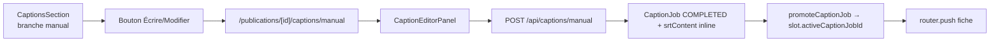

# Publication — captions manuels

## Pitch
Pour un slot dont le pattern `needsCaptionsMode = "manual"`, l'admin écrit les sous-titres à la main dans un éditeur de blocs SRT. Pas de Whisper, pas de RunPod, pas de burn-in vidéo — juste un SRT stocké inline dans `CaptionJob.srtContent` avec status COMPLETED.

## Schéma Mermaid

## Entry points UI

| Composant | Fichier:Ligne | Rôle |
|---|---|---|
| CaptionsSection (branche manual) | `web/src/components/publications/sections/CaptionsSection.tsx:152-189` | Affiche badge "Mode manuel" + CTA "Écrire/Modifier les sous-titres" |
| Page éditeur | `web/src/app/(app)/publications/[id]/captions/manual/page.tsx:1-126` | Server component : charge slot + mode + SRT existant → rend l'éditeur |
| CaptionEditorPanel | `web/src/components/publications/CaptionEditorPanel.tsx:100-243` | Stateful : blocs `{start, end, text}` + validation timecodes + save |

## Routes API

| Méthode | Path | Fichier | Auth | Effets |
|---|---|---|---|---|
| POST | `/api/captions/manual` | `route.ts:40-148` | `getUserContext` + `hasTool(CAPTIONS)` | Crée/update CaptionJob COMPLETED + srtContent + promote |

Validation côté server : rejette 400 si `mode !== "manual"` (anti-erreur de routing).

## Helpers / triggers

- `web/src/lib/publications/captionsMode.ts:40-67` — `resolveCaptionsMode()` (slot override > pattern > fallback Boolean compat)
- `web/src/lib/publications/captionsMode.ts:79-81` — `isCaptionsManual(mode)` prédicat
- `web/src/lib/publications/jobLifecycle.ts:179-195` — `promoteCaptionJob()` (set `slot.activeCaptionJobId`)

## Modèles Prisma touchés

- `CaptionJob` (`schema.prisma:43-74`) — **srtContent inline** (pas d'outputUrl), `config: '{"mode":"manual"}'`, `status: "COMPLETED"`
- `PublicationSlot` (`schema.prisma:737-853`) — `needsCaptionsModeOverride`, `activeCaptionJobId`
- `AccountPattern` (`schema.prisma:900-970`) — `needsCaptionsMode` ("none" | "auto" | **"manual"**)

## Diff vs mode auto

| Aspect | Auto | Manual |
|---|---|---|
| TranscriptionJob | Créé via Whisper | **Pas créé** |
| RunPod / local pipeline | Oui | **Non** |
| `CaptionJob.outputUrl` | URL vidéo burnée | **null** |
| `CaptionJob.srtContent` | Vide (job utilise outputUrl) | **SRT inline** |
| Status à la création | QUEUED → PROCESSING → COMPLETED | **COMPLETED direct** |

## Side effects

- `logActivity` type `CAPTIONS_COMPLETED` avec `payload: { mode: "manual" }` (`web/src/app/api/captions/manual/route.ts:140-145`)
- Pas de SSE captions broadcast (job est créé COMPLETED, le webhook RunPod ne tourne pas)
- Cascade stale s'applique au promote version comme en mode auto

## UI states (CaptionsSection)

- `isManualMode = resolveCaptionsMode(...) === "manual"` (`CaptionsSection.tsx:96-102`)
- Si pas de job COMPLETED : `Alert "Mode manuel : rédige à la main"` + bouton "Écrire les sous-titres"
- Si job COMPLETED : `Alert "Sous-titres saisis à la main"` + bouton "Modifier les sous-titres"

## Variants par rôle

| Rôle | Ce qui change |
|---|---|
| ADMIN | Peut éditer (canEdit = true via canEditCaptions) |
| CM | Idem ADMIN si assigné au slot |
| MONTEUR | Lecture seule sur la section |

## Pré-conditions / invariants

- `resolveCaptionsMode(slot, pattern) === "manual"` (sinon route API renvoie 400, page redirect vers fiche)
- Tool `CAPTIONS` requis (ou ADMIN bypass)
- Steps chain : `captionsVisible = mode === "auto" || mode === "manual"` (`steps.ts:278-286`)
- Cohérence backward-compat : `needsCaptionsMode` enum prime sur `needsCaptions` Boolean (legacy)

## Skills/agents pertinents

- `.claude/skills/captions-transcription/SKILL.md`
- Agent `toolbox-generalist` pour modification UI éditeur
- Agent `ux-auditor` pour audit du flow éditeur

## Liens vers code

- Tests unit : `web/src/lib/publications/__tests__/captionsMode.test.ts`, `pattern-coherence.test.ts:389-437` (P5)
- Tests E2E : `web/e2e/production-chain-v8.spec.ts` (V8.2 suite), scenario `captions-manual-workflow`
