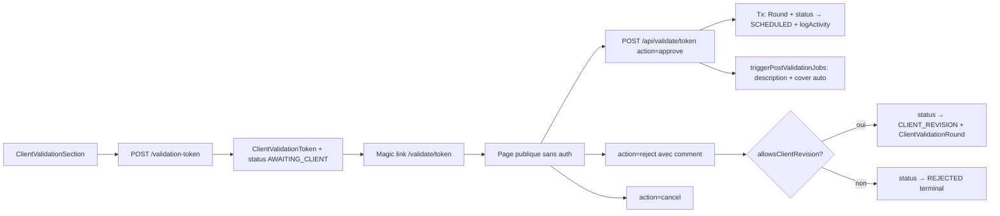

# Publication client validation & revision loop

## Pitch
Admin génère un token magic link `/validate/[token]` (TTL 7j, sha256 hashed). Client (sans auth) voit preview, peut approuver / rejeter avec commentaire / annuler. Si `allowsClientRevision=true` : reject crée un ClientValidationRound + bascule slot CLIENT_REVISION (monteur peut uploader V2). Si false : reject terminal. Approve déclenche `triggerPostValidationJobs` (description + cover auto).

## Schéma Mermaid

## Entry points UI

| Composant | Fichier:Ligne | Rôle |
|---|---|---|
| Page publique | `app/validate/[token]/page.tsx:1-249` | Sans auth (token=auth). Preview vidéo + description + historique rounds. Boutons conditionnels selon `allowsClientRevision` |
| ValidationActions | `app/validate/[token]/ValidationActions.tsx:1-183` | Client component : approve (sage), reject (peach form + commentaire), cancel (red confirm) |
| ClientValidationSection | `components/publications/sections/ClientValidationSection.tsx:1-483` | Section admin fiche : génère/régénère/révoque tokens. Lien shareable. Boutons manual-approve/cancel. **Verrou `canSendValidation=false` si captions non-COMPLETED** |

## Routes API

| Méthode | Path | Effets |
|---|---|---|
| POST | `/api/admin/publications/[id]/validation-token:1-169` | **ADMIN only**. Génère token (révoque anciens) + bascule slot READY_FOR_CM → AWAITING_CLIENT |
| GET | `/api/admin/publications/[id]/validation-token` | Token actif (sans rawToken) |
| DELETE | `/api/admin/publications/[id]/validation-token` | Révoque + retour AWAITING_CLIENT → READY_FOR_CM |
| POST | `/api/validate/[token]:1-367` | **Publique** (token=auth). Actions approve/reject/cancel. Crée Round + logActivity + révoque token + **fire-and-forget `triggerPostValidationJobs`** |
| POST | `/api/admin/publications/[id]/manual-validate:1-105` | **Admin bypass**. ⚠️ **Pas de post-validation triggers**. Override hors magic link (téléphone/WhatsApp) |

## Helpers

- `lib/publications/clientValidation.ts:1-137` :
  - `generateClientValidationToken()` : `randomBytes(32) + sha256` + TTL 7j
  - `verifyClientValidationToken()` : **timing-safe compare**
  - `revokeClientValidationTokens()` : idempotent
  - `hashToken()` + `compareHashes()` : timing-safe
- `lib/services/slot/config.ts:1-200` — **`resolveClientValidationConfig()`** :
  - Override per-slot prime sur pattern
  - `resolveOverride()` générique
  - Retour `{ needsClientValidation, allowsClientRevision, source }`
- `lib/services/slot/activity.ts:1-93` — `logActivity()` wrapper. Types :
  - `CLIENT_VALIDATION_TOKEN_GENERATED`
  - `CLIENT_VALIDATION_TOKEN_REVOKED`
  - `CLIENT_VALIDATION_APPROVED`
  - `CLIENT_VALIDATION_REJECTED`
  - `CLIENT_VALIDATION_CANCELLED`
  - + `STATUS_CHANGED` (payload `roundNumber`, `comment`, `trigger`)

## Modèles Prisma

- **`ClientValidationToken`** :
  - `id, slotId, tokenHash` (sha256), `expiresAt, createdAt, revokedAt?, createdByUserId`
  - Index `[slotId, revokedAt]`
- **`ClientValidationRound`** :
  - `id, slotId, roundNumber, action` (approved/rejected/cancelled), `comment?, respondedAt`
  - Unique `[slotId, roundNumber]`
- **`PublicationSlot`** :
  - `needsClientValidationOverride?`, `allowsClientRevisionOverride?`
  - `clientValidationTokens[]`, `clientValidationRounds[]`
- **`AccountPattern`** :
  - `needsClientValidation: Boolean`
  - `allowsClientRevision: Boolean`
  - Slot hérite sauf override explicit

## Side Effects / Status Transitions

### Transaction validate (`/api/validate/[token]:162-225`)
- UPDATE slot status :
  - approve → `SCHEDULED`
  - reject avec revision → `CLIENT_REVISION`
  - cancel → `CANCELLED`
- INSERT ClientValidationRound
- logActivity × 2 (VALIDATION event + STATUS_CHANGED)

### Post-validation jobs (`/api/validate/[token]:235-366`)
**`triggerPostValidationJobs()`** fire-and-forget post-approve :
1. Charge slot + transcription (version ou render)
2. Lance `triggerAutoDescriptionForTranscription()` OR `transcribeRenderLocal()` (RunPod vs local)
3. `triggerAutoCoverPackForRender()`
4. Crée DescriptionJob FAILED si render absent + `needsAutoDescription`

### Token génération (`validation-token:83-95`)
- POST → token + auto-bascule slot READY_FOR_CM → AWAITING_CLIENT
- logActivity CLIENT_VALIDATION_TOKEN_GENERATED

### Token révocation (`validation-token:150-165`)
- DELETE → révoque tokens + retour AWAITING_CLIENT → READY_FOR_CM
- logActivity STATUS_CHANGED avec trigger `CLIENT_VALIDATION_TOKEN_REVOKED`

### Token génération atomique (`clientValidation.ts:66-70`)
- Tx : UPDATE anciens tokens (`revokedAt = now`) + INSERT nouveau token
- **Un seul actif par slot** à la fois

## Variantes / Notes importantes

- **Fix 2026-05-30** (`validate/[token]/page.tsx:32-49`) : token révoqué/expiré post-approve → fallback lookup via `tokenHash` (trouve slot même token révoqué) pour afficher état résolu. Seul `"not_found"` = vrai 404 (anti-énumération)
- **Choix dernier CaptionJob** (`validate/[token]/page.tsx:99-107`) : dernier COMPLETED+outputUrl (pas dernier tout court) — évite montrer brute en PROCESSING après retry
- **Verrou métier V8.10** (`ClientValidationSection.tsx:320-333`) : `canSendValidation?` — si false, bouton "Envoyer pour validation" désactivé. Raison affichée : captions non-COMPLETED ou amont bloqué
- **Manual-validate bypass admin** (`manual-validate/route.ts:1-20`) : ⚠️ ≠ validation client réelle. **Ne déclenche PAS post-validation jobs**. Utile si client valide hors-flux (téléphone)
- **Ordre process CM** (`PublicationFiche.tsx:93-96`) : render → captions → **clientValidation** → description → cover → publish

## Pré-conditions / invariants

- `pattern.needsClientValidation === true` OR override per-slot
- Slot status READY_FOR_CM (avant) → AWAITING_CLIENT (token actif)
- Token unique actif par slot (atomic révocation anciens)
- `allowsClientRevision` détermine si reject = terminal OU revision possible
- TTL token = 7 jours
- Timing-safe compare (anti-timing attack)
- Verrou `canSendValidation` côté UI : captions COMPLETED requis

## Variants par rôle

| Rôle | Ce qui change |
|---|---|
| ADMIN | Génère/révoque tokens + bypass manual-validate |
| CM/MONTEUR | Voit résultat validation (lecture) |
| Client externe | Sans auth via magic link, formulaire approve/reject/cancel |

## Skills/agents pertinents

- `.claude/skills/admin-permissions/SKILL.md`
- Voir aussi : `publication-validation-client` (workflow associé), `publication-publish`
