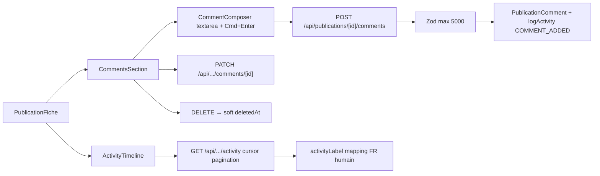

# Publication comments & activity

## Pitch
Sur chaque fiche publication : fil de discussion (PublicationComment) + log d'activité (PublicationActivity). CRUD comment avec soft-delete, édition par auteur ou ADMIN. Activity log automatique 24+ types (STATUS_CHANGED, ASSIGNEE_CHANGED, RENDER_COMPLETED, COMMENT_ADDED, PUBLISHED, etc.) avec mapping FR humain.

## Schéma Mermaid

## Entry points UI

| Composant | Fichier:Ligne | Rôle |
|---|---|---|
| CommentsSection | `components/publications/CommentsSection.tsx:66` | Wrapper liste + composer + callbacks CRUD |
| CommentComposer | `components/publications/CommentComposer.tsx:28` | Textarea + Cmd+Enter submit |
| CommentItem | `components/publications/CommentItem.tsx:71` | Affichage + édition inline + soft-delete modal confirm |
| ActivityTimeline | `components/publications/ActivityTimeline.tsx:278` | Timeline + pagination "Charger plus" + mapping humain FR 24+ types |
| PublicationFiche mount comments | `app/(app)/publications/[id]/PublicationFiche.tsx:863` | Non-primary VIDEASTE, primary autres |
| PublicationFiche mount activity | `app/(app)/publications/[id]/PublicationFiche.tsx:874` | Non-blocking, visible tous sauf EXTERNAL_GENERATOR |

## Routes API

### Comments
| Méthode | Path | Effets |
|---|---|---|
| GET | `/api/publications/[id]/comments:32` | 50 récents ASC, include author, `canCommentOnPublication` check |
| POST | `/api/publications/[id]/comments:70` | Zod max 5000, `authorId = effectiveUser`, logActivity COMMENT_ADDED, race FK fix P2003 |
| PATCH | `/api/.../comments/[commentId]:68` | Édition non-vide, body trim, `canEditComment` (auteur OR ADMIN), refuse si `deletedAt != null` |
| DELETE | `/api/.../comments/[commentId]:122` | Soft-delete (`deletedAt`), `canEditComment`, 409 si déjà supprimé |

### Activity
| Méthode | Path | Effets |
|---|---|---|
| GET | `/api/publications/[id]/activity:25` | Ordre DESC (newest first), pagination cursor `createdAt`, include `actor.{id, name}`, hasMore detection (+1 fetch) |

## Permissions

- `lib/permissions/publications.ts:172` — **`canCommentOnPublication()`** :
  - ADMIN → true
  - MONTEUR/CM/VIDEASTE → si assignee match
  - EXTERNAL_GENERATOR → false
- `lib/permissions/publications.ts:251` — **`canEditComment()`** :
  - ADMIN → true
  - `authorId === userId` → true
  - Autres → false (refuse si `deletedAt != null` côté route)

## Modèles Prisma

- **`PublicationComment`** — `id, slotId, authorId, body Text, createdAt, updatedAt, deletedAt (soft-delete)`, `@@index([slotId, createdAt])`
- **`PublicationActivity`** — `id, slotId, actorId nullable, type String, payload Json, createdAt`, `@@index([slotId, createdAt])`

## Activity Types Enum (24+ types)

`lib/services/slot/activity.ts:17` — **`ActivityType`** union :

- Slot lifecycle : `STATUS_CHANGED`, `ASSIGNEE_CHANGED`, `SLOT_CREATED`
- Rendu : `RENDER_COMPLETED`, `RENDER_QUEUED`, `RENDER_FAILED`
- Cover : `COVER_QUEUED`, `COVER_READY`, `COVER_COMPLETED`, `COVER_FAILED`, `COVER_CONFIG_ERROR`
- Captions : `CAPTIONS_COMPLETED` (etc. queued/failed via sse jobType)
- Description : `DESCRIPTION_COMPLETED`
- Versions : `VERSION_UPLOADED`, `VERSION_PROMOTED`, `VERSION_DELETED`, `VERSION_RESTORED`, `CURRENT_VERSION_CHANGED`
- Validation client : `CLIENT_VALIDATION_TOKEN_GENERATED`, `CLIENT_VALIDATION_TOKEN_REVOKED`, `CLIENT_VALIDATION_APPROVED`, `CLIENT_VALIDATION_REJECTED`, `CLIENT_VALIDATION_CANCELLED`
- Métier : `BRIEF_UPDATED`, `RUSHES_UPLOADED`, `RUSHES_DELETED`, `COMMENT_ADDED`, `PUBLISHED`

## Core Helpers

- `lib/services/slot/activity.ts:69` — **`logActivity(prisma, input)`** : crée PublicationActivity, **tolérant erreurs** (warn + return null), accepte PrismaClient | TransactionClient
- `app/api/publications/[id]/mark-published/route.ts:144` — `logActivity PUBLISHED + payload {url, publishedAt}`
- `app/(app)/publications/[id]/page.tsx:195` — Batch parallel fetch (`Promise.all`) : 50 comments DESC reverse ASC, 30 activities, rushes, versions, brief

## UI Rendering Rules

- `ActivityTimeline.tsx:89` — **`activityLabel()`** : switch 24 types → texte FR avec payload interpolation (ex: "V3 promue", "Client : validé (round 2)")
- `ActivityTimeline.tsx:203` — **`ActivityIcon()`** : icône + color (neutral `bg-gray-100`, success/danger/warning pour PUBLISHED/DELETE/REJECTED)
- `CommentsSection.tsx:96` — **`canEdit`** : ADMIN OR (`authorId === currentUserId && !deletedAt`), buttons `opacity-0 group-hover:opacity-100` Linear row pattern

## Variantes d'Accès

- Comments visibles si `canUserAccessSlot` (anti-énumération 404)
- Activity visible si `canUserAccessSlot` (tous rôles sauf EXTERNAL_GENERATOR via `shouldRenderForRole`)
- Commentaires créés uniquement par assignees (MONTEUR/CM/VIDEASTE/ADMIN)
- Edit/Delete : auteur OR ADMIN uniquement

## Pré-conditions

- Slot accessible + `effectiveUser` présent
- Body non-vide après trim + max 5000 chars validation
- Race condition FK : Prisma P2003 → 404 (slot disparu entre check et create)
- **logActivity non-bloquant** : warn + null si échoue, ne casse pas l'action métier

## Skills/agents pertinents

- `.claude/skills/admin-permissions/SKILL.md`
