# Publication — cover autoPack

## Pitch
Pour un slot dont le pattern `coverMode = "autoPack"`, le pipeline génère automatiquement un pack de frames candidates via RunPod (extract-covers). Le CM choisit une frame parmi les candidates, compose avec overlay text si défini, puis le pack passe en SELECTED.

## Schéma Mermaid

```mermaid
flowchart LR
  RenderDone[Render DONE] --> Trigger[triggerAutoCoverPackForRender]
  Trigger --> CreatePack[CoverFramePack QUEUED]
  CreatePack --> Prep[prepareCoverFramePack]
  Prep --> Runpod["RunPod /extract-covers"]
  Runpod --> ReadyState[status: READY + candidates]
  ReadyState --> CM[CM CoverGenerator panneau Packs]
  CM --> Select["POST /cover-packs/[id]/select"]
  Select --> RenderFinal[renderFinalCover composite + overlay]
  RenderFinal --> Selected[status: SELECTED + finalCoverUrl]
  Selected --> Promote[promoteCoverPack → slot.activeCoverPackId]
```



## Entry points UI

| Composant | Fichier:Ligne | Rôle |
|---|---|---|
| CoverSection | `web/src/components/publications/sections/CoverSection.tsx:71` | Verdict autoPack + boutons regénération |
| Page cover | `web/src/app/(app)/publications/[id]/cover/page.tsx:31` | `initialTab="packs"` si autoPack |
| CoverGenerator | `web/src/components/covers/CoverGenerator.tsx:106` | Onglet "Packs semi-auto" + sélection candidate + preview overlay |

## Routes API

| Méthode | Path | Fichier | Effets |
|---|---|---|---|
| GET | `/api/cover-packs?slotId=X` | `route.ts:59` | Liste packs + stall detection (30min) |
| POST | `/api/cover-packs/[id]/select` | `select/route.ts:10` | Sélection candidate par CM + composite final + SELECTED |
| POST | `/api/cover-packs/[id]/regenerate` | `regenerate/route.ts:9` | Relance extraction (back to QUEUED) |
| PATCH | `/api/cover-packs/[id]` | `[id]/route.ts:38` | Ajuste overlay offsets + groupIds |
| GET | `/api/cover-packs/[id]/overlay` | (preview PNG) | Preview drag-n-drop offset |
| POST | `/api/publications/[id]/trigger-cover` | `trigger-cover/route.ts:21` | Lance pack manuellement sur PublicationVersion (ADMIN) |
| POST webhook | `/api/webhooks/runpod/renders` | `route.ts:140` | `triggerAutoCoverPackForRender` fire-and-forget post-DONE |

## Helpers / triggers

### Source de la vidéo pour extraction (Phase 2 — commit `e401d3a`)

Avant fix : `prepareCoverFramePack` utilisait `pack.sourceVideoUrl` qui pointait sur la **vidéo finale rendue** (avec overlays texte + DPE + etc.) → les frames extraites contenaient les overlays.

Fix : `resolveNativeCoverSources` (`coverAuto.ts:240-300`) parcourt `template.videoSequence` ou `template.blocks` (videoBlocks) et résout `sourceUrl` via :
- **`resolveSlotNativeUrl`** : pour les slots de videoSequence, lookup direct MediaAsset.
- **`resolveVideoBlockNativeUrl`** : pour VideoBlock standalone, lookup via `usedAssets.videoAssets[blockId]` → `MediaAsset.url` du clip de base R2.
- Fallback `pack.sourceVideoUrl` (vidéo finale) UNIQUEMENT si aucune source native résolue (rétro-compat).

Conséquence : les frames cover candidates sont extraites du clip de base brut, sans overlays.

### Helpers / triggers (legacy section)

- `web/src/lib/coverAuto.ts:565` — **`triggerAutoCoverPackForRender()`** : gates centralisées :
  - `pattern.coverMode === "autoPack"`
  - Preset résolu (template.coverPresets sortOrder min si name absent)
  - Slot-level pack unification (V7.6) : findFirst non-stale pour éviter doublons
  - POST_VALIDATION_STATUSES guard (ne lance pas si client n'a pas approuvé pour `needsClientValidation=true`)
- `web/src/lib/coverAuto.ts:372` — **`prepareCoverFramePack()`** : QUEUED → PROCESSING → READY
  - Extraction frames via RunPod /extract-covers
  - Persistance images R2 (fallback `public/covers/userId/packId` si R2 absent)
  - Création `CoverFrameCandidate` rows
  - Update `usedTimestamps` pour tirages suivants (anti-doublon frame)
- `web/src/lib/coverAuto.ts:858` — **`renderFinalCover()`** : composite template + frame + overlay text (groupIds) → PNG final R2
- `web/src/lib/services/slot/autoCoverTrigger.ts:37` — `tryAutoTriggerCover` : helper partagé (trigger-cover + promote routes), retourne `AutoCoverResult` (jamais throw)
- `web/src/lib/publications/jobLifecycle.ts:200` — `promoteCoverPack` : atomic update `slot.activeCoverPackId`

## Modèles Prisma touchés

- `CoverFramePack` (`schema.prisma:295-335`) — id, status (QUEUED/PROCESSING/READY/SELECTED/FAILED), sourceVideoUrl, frameCount, `usedTimestamps` JSON, `config` JSON (CoverAutoConfig snapshot), `overlayGroupIds` JSON, `overlayOffsetX/Y`, `selectedCandidateId`, `finalCoverUrl`, `finalCoverKey`, `staleSince`
- `CoverFrameCandidate` — id, packId (FK Cascade), timestamp, imageUrl, imageKey, sequenceIndex
- `AccountPattern.coverMode = "autoPack"`, `coverConfig` JSON
- `Template.coverPresets` (`TemplateCoverPreset`) — presets fixés sur template

## Lifecycle

```
QUEUED                  (création auto/manuel)
  ↓
PROCESSING              (extraction RunPod prepareCoverFramePack)
  ↓
READY                   (candidates dispo, CM doit choisir)
  ↓
SELECTED                (renderFinalCover composite + finalCoverUrl)
  ↓
promoteCoverPack        → slot.activeCoverPackId
```

Stall detection : 30min en QUEUED/PROCESSING → marqué FAILED (`/api/cover-packs/route.ts:59`).

## Side effects

- `logActivity` types : `COVER_QUEUED`, `COVER_READY`, `COVER_COMPLETED`, `COVER_FAILED`, `COVER_CONFIG_ERROR`
- `notifyUser SSE` jobType="cover" pour refresh UI
- `deleteCoverCandidateAssets` cleanup R2 post-SELECTED (supprime candidates intermediate)
- `revertLibraryCursors` si extraction échoue (sécurise compteurs rotation)

## Variants par rôle

| Rôle | Ce qui change |
|---|---|
| CM/ADMIN | Voient CoverSection, choisissent frame, ajustent overlay |
| MONTEUR | N'a pas accès (sauf coverMode=monteurUpload, workflow dédié) |

## Pré-conditions / invariants

- `pattern.coverMode === "autoPack"` (sinon skip)
- Template avec au moins 1 `TemplateCoverPreset` (sortOrder min sert par défaut)
- Render DONE ou PublicationVersion avec fileUrl
- Pour `needsClientValidation=true` : slot doit être post-AWAITING_CLIENT
- Pack non-stale unification : findFirst staleSince=null pour éviter divergence
- RunPod accessible + R2 ou fallback local `/public/covers/`

## Skills/agents pertinents

- `.claude/skills/render-engine/SKILL.md` (RunPod extract-covers)
- `.claude/skills/template-builder/SKILL.md` (TemplateCoverPreset)
- Agent `toolbox-generalist`

## Liens vers code

- Tests : `web/src/lib/__tests__/coverAuto.test.ts`
- Pattern coherence : `P1`, `P2`, `P4`, `P7` (autoPack)
