# Publication — cover manualSelect

## Pitch
Pour un slot dont le pattern `coverMode = "manualSelect"`, l'admin extrait des frames librement depuis la vidéo et choisit l'une d'elles comme cover finale. La frame sélectionnée crée un `CoverFramePack` directement en status SELECTED rattaché au slot.

## Schéma Mermaid

```mermaid
flowchart LR
  Fiche[CoverSection<br/>badge Mode manuel] --> Page["/publications/[id]/cover?tab=manual"]
  Page --> Gen[CoverGenerator onglet manual]
  Gen --> Extract[Extraction frames libre]
  Extract --> CTA["Utiliser comme cover<br/>OU overlay Cover finale"]
  CTA --> API["POST /api/.../cover/manual-select"]
  API --> Pack[CoverFramePack SELECTED]
  Pack --> Promote[promoteCoverPack → slot.activeCoverPackId]
  Promote --> Redirect[router.push fiche]
```



## Entry points UI

| Composant | Fichier:Ligne | Rôle |
|---|---|---|
| CoverSection badge | `web/src/components/publications/sections/CoverSection.tsx:292-297` | Badge "Mode manuel · extraction libre" si mode = manualSelect |
| Page cover | `web/src/app/(app)/publications/[id]/cover/page.tsx:76` | `initialTab = "manual"` si manualSelect |
| CoverGenerator | `web/src/components/covers/CoverGenerator.tsx:106` | Composant principal (props `slotId`, `prefillVideoUrl`, `initialTab`) |
| Bouton "Utiliser comme cover" | `CoverGenerator.tsx:1160-1176` | V8.12 — CTA primaire dark quand `slotId && selected.size === 1` |
| Bouton overlay "Cover finale" | `CoverGenerator.tsx:1000-1023` | Chemin rapide : 1 click direct sur la frame au hover |

## Routes API

| Méthode | Path | Fichier | Auth | Effets |
|---|---|---|---|---|
| POST | `/api/publications/[id]/cover/manual-select` | `route.ts:1-151` | `getUserContext` + `canUserAccessSlot` + `hasTool(COVERS)` | Upsert CoverFramePack SELECTED + finalCoverUrl + promote |

Body : `{ frameUrl: string, timestamp: number }`.

## Helpers / triggers

- `web/src/components/covers/CoverGenerator.tsx:469-498` — `handleApplyFrameAsCover(frameUrl, timestamp)` côté client
- `web/src/lib/publications/jobLifecycle.ts:200-221` — `promoteCoverPack(prisma, slotId, packId)` (valide rattachement render/version puis set `slot.activeCoverPackId`)

## Modèles Prisma touchés

- `CoverFramePack` (`schema.prisma:295-335`) — `status: "SELECTED"`, `finalCoverUrl`, `renderId` XOR `publicationVersionId`, `config: '{"mode":"manual"}'`, `selectedCandidateId: null`, `finalCoverKey: null`, `staleSince`
- `PublicationSlot` (`schema.prisma:737-853`) — `activeCoverPackId` (@unique)
- `AccountPattern` (`schema.prisma:900-970`) — `coverMode` ("none" | **"manualSelect"** | "autoPack" | "monteurUpload")
- `PublicationActivity` (`schema.prisma:869-880`) — type `COVER_COMPLETED`, `payload: { mode: "manual", finalCoverUrl, timestamp }`

## Rattachement du pack

```
Si slot.render exists → pack.renderId = slot.render.id     (cas auto_template)
Sinon                 → pack.publicationVersionId = slot.currentVersionId
                                                            (cas manual_rushes / external_upload)
Si ni l'un ni l'autre → 400 "Slot sans render ni version courante"
```

## Side effects

- `logActivity` type `COVER_COMPLETED` avec mode `"manual"`
- `router.push("/publications/${slotId}")` + `toast.success("Cover appliquée à la publication.")`
- Pas d'extraction RunPod (la frame extraite côté front via render-engine est l'URL R2 finale)

## Diff vs autoPack

| Aspect | autoPack | manualSelect |
|---|---|---|
| Extraction frames | Pack candidates RunPod | Tirage libre côté front |
| `CoverFramePack.status` | QUEUED → READY → SELECTED | **SELECTED direct** |
| `frameCount` | N candidates | 0 |
| `selectedCandidateId` | ID d'un FrameCandidate | **null** |
| `finalCoverKey` | Clé R2 dédiée si overlay text | **null** (frame source) |

## Variants par rôle

| Rôle | Ce qui change |
|---|---|
| ADMIN | Voit l'outil entier, peut choisir |
| CM | Idem (canEditCover = true) |
| MONTEUR | N'a pas accès (sauf si coverMode = monteurUpload, voir workflow dédié) |

## Pré-conditions / invariants

- `pattern.coverMode === "manualSelect"` (ou override slot)
- Au moins une vidéo source : `slot.render.videoUrl` OU `slot.currentVersion.fileUrl`
- Tool `COVERS` requis (ou ADMIN bypass)
- Anti-énumération : `canUserAccessSlot` (404 si slot inaccessible)
- Idempotence : pack non-stale existant → update au lieu de re-create

## Skills/agents pertinents

- `.claude/skills/content-library/SKILL.md` (pour les fonts/assets)
- Agent `toolbox-generalist` pour modification de l'outil cover
- Agent `ux-auditor` pour audit du flow extraction

## Liens vers code

- Tests E2E : `web/e2e/production-chain-v8.spec.ts:123-156` (V8.1 suite), scenario `full-manual-workflow` step 11
- Pattern coherence : `web/src/lib/publications/__tests__/pattern-coherence.test.ts:133-141` (P5 manualSelect)
