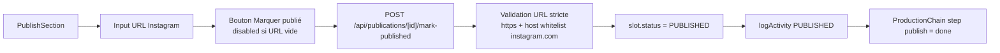

# Publication — Marquer publié

## Pitch
L'étape finale du pipeline éditorial : le CM/admin marque le slot comme publié sur Instagram en collant l'URL Instagram du post. Le slot passe en status `PUBLISHED` (statut terminal). Pas de POST réel à Instagram — l'app stocke juste l'URL + le timestamp.

## Schéma Mermaid



## Entry points UI

| Composant | Fichier:Ligne | Rôle |
|---|---|---|
| PublishSection | `web/src/components/publications/sections/PublishSection.tsx:27-42` | Props `publishedUrl, publishedAt, canPublish, incompleteSteps` |
| État non-publié | `PublishSection.tsx:65-96` | FormField URL Instagram + bouton "Marquer publié" disabled si vide |
| État publié | `PublishSection.tsx:141-224` | Affiche URL + date + bouton "Corriger l'URL" (CM/ADMIN) |
| Warning étapes incomplètes | `PublishSection.tsx:238-254` | Banner ambre "X étapes pas finalisées" (non-bloquant) |
| Injection fiche | `PublicationFiche.tsx:836-853` | Calcule `incompleteSteps` depuis ProductionChain |

V8.7 — Le bouton "Marquer publié" du **header** (`PublicationHeader.tsx`) a été retiré (doublon piège).

## Routes API

| Méthode | Path | Fichier | Auth | Effets |
|---|---|---|---|---|
| POST | `/api/publications/[id]/mark-published` | `route.ts:1-159` | `getUserContext` + `canMarkPublished` | slot.status=PUBLISHED + publishedUrl + publishedAt + logActivity |
| PATCH | `/api/calendar/slots/[id]` | `route.ts:42-63` | — | **Rejette** body `status=PUBLISHED` (force passage par /mark-published) |

## Validation URL stricte

`web/src/app/api/publications/[id]/mark-published/route.ts:76-109` :
- Protocole : `https` uniquement
- Hôte : whitelist `instagram.com` ou `www.instagram.com`
- Max 500 chars
- Parsing via `URL()` (anti-injection)

`route.ts:110-130` — `publishedAt` (ISO optionnel) : fenêtre `2020-01-01 ≤ date ≤ now+1an` (E4 fix anti-dates aberrantes).

## Helpers / permissions

- `web/src/lib/permissions/publications.ts:217-224` — `canMarkPublished(user, slot)` : ADMIN=true ; CM=true si `assigneeCmId === user.id` ; MONTEUR/USER=false
- `web/src/app/(app)/publications/[id]/page.tsx:468` — `canPublish = canMarkPublished(userForPermission, slotForPermission)` propagé via props PublicationFiche

## Modèles Prisma touchés

- `PublicationSlot` (`schema.prisma:765-767`) — `publishedUrl` (String?), `publishedAt` (DateTime?), `status` (enum, transitions PUBLISHED)
- Migration : `prisma/migrations/20260525134426_add_published_url_to_slot/migration.sql`
- `PublicationActivity` (`schema.prisma:869-880`) — type `PUBLISHED`, payload `{ url, publishedAt }`

## Transitions de statut

```
READY_FOR_CM → PUBLISHED       (depuis fiche directement)
SCHEDULED    → PUBLISHED       (post validation client)
PUBLISHED    → ARCHIVED        (statut suivant terminal)
```

Référence : `web/src/lib/services/slot/transitions.ts:44-48`, `canTransition(from, to, role)` permet ADMIN bypass.

`web/src/lib/services/slot/slotService.ts:304,410-437` — `RESERVED_TERMINAL_STATUSES = [PUBLISHED, CANCELLED, ARCHIVED, REJECTED]` : PATCH direct rejeté même pour ADMIN (force `/mark-published`).

## ProductionChain step "publish"

`web/src/lib/publications/steps.ts:315-323, 462-468` :
- `visible = true` (toujours)
- `status = "done"` si `slot.status === "PUBLISHED"`
- `status = "blocked"` si CANCELLED/REJECTED/ARCHIVED
- Sinon `"todo"` (V8.9 — step `publish` est `STATUS_DRIVEN`, exclu de la propagation amont)
- `label = "Publier"`, `roles = [CM]`

## Side effects

- `logActivity` type `PUBLISHED` avec payload `{ url, publishedAt }`
- ActivityTimeline label "Publié sur Instagram" + lien externe (`ActivityTimeline.tsx:109-110, 228-229, 350-365`)
- Slot devient affichable comme "publié" dans HomeAdmin KPI + calendrier

## Variants par rôle

| Rôle | Ce qui change |
|---|---|
| ADMIN | Peut marquer / corriger toujours |
| CM | Peut marquer / corriger **si assigné** au slot |
| MONTEUR | Pas d'action sur cette section |
| EXTERNAL_GENERATOR | N'a pas accès à la fiche publication |

## Pré-conditions / invariants

- URL Instagram requise non-vide **sauf pour un ADMIN**, qui peut marquer publié sans lien
  (le slot est alors signalé « lien manquant » sur la fiche et le calendrier, et le lien
  reste ajoutable ensuite via la même route). Bouton disabled pour les autres rôles.
- URL https://instagram.com/ ou https://www.instagram.com/ uniquement, quand elle est fournie
- `publishedAt` dans fenêtre raisonnable (anti-dates aberrantes) ; sur un slot déjà publié
  qu'on complète, la date d'origine est conservée
- Slot doit être dans un statut autorisé (transitions whitelist). Exception : un slot déjà
  `PUBLISHED` n'effectue aucune transition — compléter/corriger son URL est autorisé
- PATCH direct `status=PUBLISHED` rejeté → forçage du flow via `/mark-published`
  (idem en lot : `bulk-patch` le refuse, l'entrée dédiée est `/api/calendar/slots/bulk-mark-published`)
- Bulk calendrier (ADMIN) : ne porte que sur les statuts de `BULK_PUBLISHABLE_STATUSES`
  (vidéo validée) et les slots ayant un compte Instagram ; jamais d'URL en lot

## Skills/agents pertinents

- `.claude/skills/security-review/SKILL.md` (validation URL)
- Agent `toolbox-generalist`
- Agent `bug-hunter` si transitions statut suspectes

## Liens vers code

- Tests E2E : `web/e2e/calendar.spec.ts:144` (test PATCH status=PUBLISHED → 403)
- Scenario E2E : `web/scripts/capture-ux-screenshots.ts` scenario `full-manual-workflow` steps 13-14 (URL + Marquer publié)
