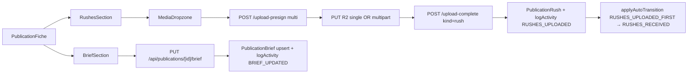

# Publication rushes & brief

## Pitch
Phase amont du pipeline avant montage. VIDEASTE/CM/MONTEUR uploadent rushes (vidéo + images max 10 Go via multipart), CM édite brief markdown (8000 chars max) + pièces jointes PDF/images (50 Mo max). Auto-transition `RUSHES_EXPECTED → RUSHES_RECEIVED` au premier upload. Soft-delete rushes, hard-delete attachments.

## Schéma Mermaid

## Entry points UI

| Composant | Fichier:Ligne | Rôle |
|---|---|---|
| RushesSection dropzone | `components/publications/sections/RushesSection.tsx:216` | Vidéos (mp4/mov/m4v/webm) + images (jpg/png/webp) — 10 Go max, multipart auto >100 Mo |
| RushesSection download/delete | `RushesSection.tsx:143-179` | GET presigned URL + DELETE soft |
| RushesSection ZIP | `RushesSection.tsx:103-128` | Download ZIP via `/api/.../rushes/zip` |
| BriefSection textarea | `components/publications/sections/BriefSection.tsx:91-130` | PUT brief markdown (max 8000 chars) |
| BriefSection attachments | `BriefSection.tsx (attachments)` | Dropzone PDF + images (max 50 Mo) |

## Routes API

### Rushes
| Méthode | Path | Effets |
|---|---|---|
| GET | `/api/publications/[id]/rushes:16` | Liste non-supprimés, scope `canUserAccessSlot`, retour avec user + uploadedAt |
| POST | `/api/publications/[id]/upload-presign:59` | URLs presigned (`kind=rush|version|brief-attachment`), single OR multipart si ≥100 Mo |
| POST | `/api/publications/[id]/upload-complete:56` | Finalise multipart OR vérifie objectExists. Rush → insert + logActivity RUSHES_UPLOADED + auto-transition RUSHES_UPLOADED_FIRST. Brief attachment → upsert PublicationBrief + insert PublicationBriefAttachment + logActivity BRIEF_UPDATED |
| GET | `/api/.../rushes/[rushId]:22` | Presigned download (1h expire) |
| DELETE | `/api/.../rushes/[rushId]:59` | Soft-delete (`canDeleteRushes`) + logActivity RUSHES_DELETED |

### Brief
| Méthode | Path | Effets |
|---|---|---|
| GET | `/api/publications/[id]/brief:27` | `{ brief: { id, body, updatedAt, updatedByUserId }, attachments[] }` |
| PUT | `/api/publications/[id]/brief:27` | Permission `canEditBrief` + logActivity BRIEF_UPDATED |
| GET | `/api/.../brief/attachments/[attId]:25` | Presigned download |
| DELETE | `/api/.../brief/attachments/[attId]:25` | **Hard-delete** (pas de soft), cleanup R2, logActivity BRIEF_UPDATED |

## Helpers & Libs

- `lib/r2Multipart.ts:94` — `createMultipartUpload(key, contentType)` → `{ uploadId }`
- `lib/r2Multipart.ts:150+` — `createPresignedUploadPartUrl(key, uploadId, partNumber)` → presigned PUT URL
- `lib/r2Multipart.ts:213` — `completeMultipartUpload(key, uploadId, parts[])` — parts `{partNumber, etag}[]`
- `lib/r2Keys.ts:54-87` — Générateurs clés R2 :
  - `rushKey(slotId, filename)` → `publications/{slotId}/rushes/{ts}-{rand}.{ext}`
  - `versionKey(slotId, versionNumber, filename)` → `publications/{slotId}/versions/v{versionNumber}-{ts}-{rand}.{ext}`
  - `briefAttachmentKey(slotId, filename)` → `publications/{slotId}/brief/{ts}-{rand}.{ext}`
  - Sanitization : alphanumeric + `-`

## Modèles Prisma

- **`PublicationRush`** (`schema.prisma:1073`) :
  - id, slotId, **r2Key @unique**, fileName, mimeType, sizeBytes, durationSec, `uploadedByUserId FK User`, uploadedAt, **deletedAt** (soft-delete)
  - Index `[slotId, deletedAt]`
- **`PublicationSlot`** (`schema.prisma:825`) :
  - `rushes: PublicationRush[]`
  - `needsRushesOverride? Boolean` (override pattern)
  - `needsBriefOverride? Boolean` (override pattern)
- **`PublicationBrief`** (`schema.prisma:1047`) :
  - id, **slotId @unique** (1-to-1), `body @Text`, updatedAt, `updatedByUserId FK User nullable`, attachments[]
- **`PublicationBriefAttachment`** (`schema.prisma:1059`) :
  - id, briefId FK, **r2Key @unique**, fileName, mimeType, sizeBytes, createdAt
  - Index `[briefId]`

## Permissions

- `lib/permissions/publications.ts:285` — **`canUploadRushes(user, slot)`** :
  - ADMIN → true
  - VIDEASTE → si `assigneeVideasteId === user.id`
  - CM → si `assigneeCmId === user.id`
  - Autres → false
- `lib/permissions/publications.ts:374` — **`canEditBrief(user, slot)`** :
  - ADMIN → true
  - CM → si `assigneeCmId === user.id`
  - Autres → false
- `lib/permissions/publications.ts:302` — **`canDeleteRushes(user, rush)`** :
  - ADMIN → true
  - Auteur → si `uploadedByUserId === user.id`
  - Autres → false

## Side Effects & Logging

### Activity Log Types
- `RUSHES_UPLOADED` (payload `{rushId, fileName, mimeType}`)
- `RUSHES_DELETED` (payload `{rushId, fileName}`)
- `BRIEF_UPDATED` (payload `{action, ...}` — `body_updated` ou `attachment_deleted`)
- `VERSION_UPLOADED` / `VERSION_PROMOTED` si version uploadée après rushes
- Auto-transition trigger `RUSHES_UPLOADED_FIRST` → `RUSHES_EXPECTED → RUSHES_RECEIVED`

### Auto-transitions (upload-complete:269-271)
- `RUSHES_UPLOADED_FIRST` quand `rushCount === 1`
- Matrice : `RUSHES_EXPECTED → RUSHES_RECEIVED` via `applyAutoTransition`

### Version auto-promotion (upload-complete:359-377)
- Si `needsAdminValidation === false` : version → currentVersion auto
- Si `needsAdminValidation === true` : version → EDIT_REVIEW (attend promote manuelle)

### Post-auto-promote cascade (upload-complete:387-407)
- Après 1ère version auto-promue : auto-cover + `triggerAutoTranscriptionForVersion` (enchaîne captions + description)

### Cleanup en cas d'erreur (upload-complete:202-218)
- Si insert Prisma fail : abort/delete multipart OR single object R2 (best-effort)

## Variants par rôle

| Rôle | Ce qui change |
|---|---|
| VIDEASTE | Upload rushes si assigné |
| CM | Upload rushes + édite brief si assigné |
| MONTEUR | Voit rushes (lecture) |
| ADMIN | Tout |

## Skills/agents pertinents

- `.claude/skills/admin-permissions/SKILL.md`
- Voir aussi : `publication-versions-lifecycle`, `upload-rush-promote-version`
