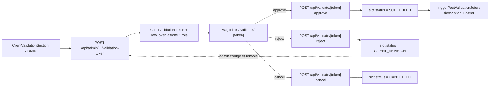

# Publication — validation client

## Pitch
Pour un slot dont le pattern `needsClientValidation = true`, l'admin génère un magic link envoyé au client externe (sans login). Le client valide ou refuse via le magic link. Si `allowsClientRevision = true`, ping-pong CLIENT_REVISION → corrections admin → re-envoi autorisé.

## Schéma Mermaid



## Entry points UI

| Composant | Fichier:Ligne | Rôle |
|---|---|---|
| ClientValidationSection | `web/src/components/publications/sections/ClientValidationSection.tsx:70` | Section ADMIN, boutons Envoyer / Régénérer / Révoquer / Bypass |
| Bouton "Envoyer pour validation" | `ClientValidationSection.tsx:339` | POST génération token. V8.10 — désactivé si captions pas COMPLETED |
| Bouton "Bypass admin (validé)" | `ClientValidationSection.tsx:364` | Avance statut sans déclencher post-validation triggers |
| Pattern form toggles | `AccountPatternForm.tsx:799-806` | Checkbox `needsClientValidation` + nested `allowsClientRevision` |
| **Page client externe** | `web/src/app/validate/[token]/page.tsx:29` | Magic link landing, **pas d'auth** (token EST l'auth) |
| ValidationActions | `web/src/app/validate/[token]/ValidationActions.tsx:64-129` | Boutons "Valider" / "Demander modifications" / "Annuler" |

## Routes API

| Méthode | Path | Fichier | Auth | Effets |
|---|---|---|---|---|
| POST | `/api/admin/publications/[id]/validation-token` | `route.ts:25` | getUserContext + canAdminBypass | Révoque actifs, crée token, retourne rawToken 1 fois |
| GET | `/api/admin/publications/[id]/validation-token` | `route.ts:114` | admin | Info token actif (sans rawToken) |
| DELETE | `/api/admin/publications/[id]/validation-token` | `route.ts:137` | admin | Révoque tous tokens actifs |
| POST | `/api/validate/[token]` | `route.ts:65` | **token-based, rate-limit 10/min/IP** | Submit action client (approve/reject/cancel) |
| POST | `/api/admin/publications/[id]/manual-validate` | `route.ts:33` | admin | Bypass admin (sans trigger post-validation) |

## Helpers / triggers

- `web/src/lib/publications/clientValidation.ts:18-90` — `hashToken`, `compareHashes` (timing-safe), `generateClientValidationToken` (transaction atomique)
- `web/src/lib/services/slot/config.ts:74` — `resolveClientValidationConfig` (override prime sur pattern)
- `web/src/app/api/validate/[token]/route.ts:235-360` — `triggerPostValidationJobs()` (description IA + cover auto en parallèle)

## Modèles Prisma touchés

- `ClientValidationToken` (`schema.prisma:977`) — `tokenHash` unique, `expiresAt` (7 jours), `revokedAt`, `createdByUserId`, contrainte un seul actif par slot
- `ClientValidationRound` (`schema.prisma:996`) — `roundNumber`, `action` ("approve" | "rejected" | "cancelled"), `comment`, `respondedAt`, `ip`, unique sur `(slotId, roundNumber)`
- `PublicationSlot` (`schema.prisma:737-853`) — `status`, `needsClientValidationOverride`, `allowsClientRevisionOverride`
- `AccountPattern` (`schema.prisma:900-970`) — `needsClientValidation`, `allowsClientRevision`

## Transitions de statut

```
READY_FOR_CM   → AWAITING_CLIENT       (envoi magic link)
AWAITING_CLIENT → SCHEDULED             (approve)
AWAITING_CLIENT → CLIENT_REVISION       (reject + allowsClientRevision=true)
AWAITING_CLIENT → CANCELLED             (cancel ou reject + !allowsClientRevision)
CLIENT_REVISION → AWAITING_CLIENT       (admin re-envoie après corrections)
CLIENT_REVISION → IN_EDIT               (admin annule ping-pong, retour montage)
CLIENT_REVISION → CANCELLED             (admin annule complètement)
```

Référence : `web/src/lib/services/slot/transitions.ts:44-48`.

## Side effects

- `logActivity` types :
  - `CLIENT_VALIDATION_TOKEN_GENERATED` (payload: tokenId, expiresAt)
  - `CLIENT_VALIDATION_TOKEN_REVOKED`
  - `CLIENT_VALIDATION_APPROVED` (payload: roundNumber, comment, ip)
  - `CLIENT_VALIDATION_REJECTED` (payload: roundNumber, comment)
  - `CLIENT_VALIDATION_CANCELLED`
- Post-validation triggers (approve uniquement, pas bypass) :
  - `triggerAutoDescriptionForTranscription` si description autoGenerate + transcription COMPLETED
  - `triggerAutoCoverPackForRender` si render DONE + autoPack
- `ActivityTimeline.tsx:158-169` affiche "Client : validé / modifications demandées / annulé (round N)"

## Garde-fous métier (V8.10)

- `canSendValidation = !captionsActive || latestCaptionJob?.status === "COMPLETED"` (`PublicationFiche.tsx:714`)
- Si false → bouton "Envoyer" disabled + banner peach "Envoi bloqué — Les sous-titres ne sont pas encore générés."
- Statuts autorisés pour envoyer : `READY_FOR_CM`, `CLIENT_REVISION`, `AWAITING_CLIENT` (`validation-token/route.ts:62`)
- Statut autorisé pour action client : `AWAITING_CLIENT` uniquement (idempotence anti-double-click)
- Token : 256 bits random, hashé SHA-256, jamais le raw en DB, TTL 7 jours
- Rate-limit `/api/validate/[token]` : 10 req/min/IP

## Variants par rôle

| Rôle | Ce qui change |
|---|---|
| ADMIN | Voit tout, peut envoyer / révoquer / bypass |
| CM | Informatif (lecture statut + historique rounds) |
| MONTEUR | Observe pour CLIENT_REVISION (peut être ré-enrôlé) |
| Client externe | Magic link sans login — voit preview + boutons action |

## Pré-conditions / invariants

- `pattern.needsClientValidation` ou override slot = true
- V8.10 : captions COMPLETED si captions actives
- Statut slot whitelist pour envoyer / agir
- Magic link expiré → erreur 404 (anti-énumération)

## Skills/agents pertinents

- `.claude/skills/security-review/SKILL.md` (token hashing + rate-limit)
- Agent `security-auditor` pour audit magic link
- Agent `toolbox-generalist` pour modif UI section

## Liens vers code

- Tests unit : `web/src/lib/publications/__tests__/clientValidation.test.ts` (si existe)
- Tests E2E : `web/scripts/capture-ux-screenshots.ts` patterns P2 / P8 (ping-pong)
- Page client : `web/src/app/validate/[token]/page.tsx` (server component, no auth)
