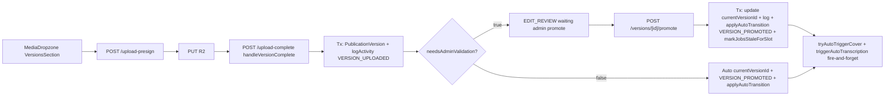

# Publication versions lifecycle

## Pitch
Cycle de vie complet des PublicationVersion sur un slot. Upload V1 → auto-promote si `needsAdminValidation=false`, sinon admin doit promouvoir. Promote V2 → cascade `markJobsStaleForSlot` (captions/cover/description marqués stale). Soft-delete avec restore ADMIN. 5 types d'activity log dédiés.

## Schéma Mermaid

## Entry points UI

| Composant | Fichier:Ligne | Rôle |
|---|---|---|
| VersionCard | `components/publications/sections/VersionsSection.tsx:100-426` | Boutons "Promouvoir" (Star, ADMIN), "Télécharger" (Download), "Supprimer" (DeleteButton, auteur+ADMIN), "Restaurer" (RotateCcw, ADMIN seul) |
| VersionsSection | `VersionsSection.tsx:477-533` | MediaDropzone upload + filter soft-deleted (ADMIN=all, autres=non-deleted) |
| PublicationFiche | `app/(app)/publications/[id]/PublicationFiche.tsx:610` | Intégration VersionsSection + `promoteCoherenceWarning` côté parent |

## Routes API

| Méthode | Path | Effets |
|---|---|---|
| GET | `/api/publications/[id]/versions:1-55` | Versions triées DESC, filter soft-deleted selon role |
| GET | `/api/publications/[id]/versions/[versionId]:50-77` | Presigned download URL (1h expiry) |
| PUT | `/.../versions/[versionId]:81-135` | Update notes (max 2000 chars, auteur/ADMIN, **pas loggé** pour éviter bruit) |
| DELETE | `/.../versions/[versionId]:139-200` | Soft-delete (`deletedAt`), refuse si currentVersion, `canDeleteVersion`, log VERSION_DELETED |
| POST | `/.../versions/[versionId]/promote:32-193` | **ADMIN seul**, tx atomique : log VERSION_PROMOTED + CURRENT_VERSION_CHANGED + applyAutoTransition + markJobsStaleForSlot + tryAutoTriggerCover + triggerAutoTranscription |
| POST | `/.../versions/[versionId]/restore:21-79` | **ADMIN seul**, reset `deletedAt=null`, log VERSION_RESTORED |
| POST | `/api/publications/[id]/upload-complete:304-385` | `handleVersionComplete` tx : versionNumber max+1, create version, log VERSION_UPLOADED, re-read status, `needsAdminValidation` check → auto-promote OR EDIT_REVIEW |

## Helpers & Services

- `lib/publications/jobLifecycle.ts:117-171` — **`markJobsStaleForSlot(prisma, slotId, reason)`** : marque stale captionJob/descriptionJob/coverFramePack/transcriptionJob, reset `activeXJobId` à null (idempotent, préserve `staleSince` original)
- `lib/publications/jobLifecycle.ts:179-195` — `promoteCaptionJob/promoteCoverPack/promoteTranscriptionJob` : promotion explicite
- `lib/publications/jobLifecycle.ts:262-297` — `autoPromoteIfNoActive(prisma, slotId, jobType, jobId)` : auto-promotion si aucun actif (webhooks RunPod COMPLETED)
- `lib/publications/actions.ts:267-281` — **`promoteVersionWarning(ctx)`** : détecte si jobs COMPLETED sur ancienne version → warning "sous-titres/cover déjà générés… tu devras les relancer"
- `lib/services/slot/transitions.ts:1-100` — **`applyAutoTransition(tx, slotId, status, trigger, actorId)`** : calcule transition selon trigger (`VERSION_PROMOTED`, `VERSION_UPLOADED_FIRST`, `VERSION_UPLOADED_AGAIN`), log STATUS_CHANGED si mutation
- `lib/triggerAutoTranscriptionForVersion.ts:1-100` — Lance TranscriptionJob via RunPod/local si `pattern.needsCaptions=true` OR `needsDescription !== "none"`, fire-and-forget post-promote

## Modèles Prisma

- **`PublicationVersion`** (`schema.prisma:1014-1042`) :
  - id, slotId FK, **`versionNumber @@unique([slotId, versionNumber])`**, r2Key unique, fileUrl, fileName, fileSizeBytes, mimeType, durationSec, `uploadedByUserId FK User`, notes, createdAt, **`deletedAt?` (soft-delete)**
  - `currentForSlot` inverse, `coverFramePack` inverse, `transcriptionJob` inverse
- **`PublicationSlot`** (`schema.prisma:737-823`) :
  - `currentVersionId @unique FK` (`@relation("SlotCurrentVersion")`)
  - `versions[]` inverse (`@relation("SlotVersions")`)
  - `needs*Override` cascade overrides
  - `activeCaptionJobId / activeCoverPackId / activeTranscriptionJobId` FKs (V6.4)

## Activity Log Types

`lib/services/slot/activity.ts:17-45` — Types :
- **`VERSION_UPLOADED`** (upload initial)
- **`VERSION_PROMOTED`** (explicit OU auto)
- **`VERSION_DELETED`** (soft-delete)
- **`VERSION_RESTORED`** (undelete)
- **`CURRENT_VERSION_CHANGED`** (log distinct pour track V1→V2 transition)

UI labels : `ActivityTimeline.tsx:129-152` :
- "V{n} téléversée…"
- "V{n} promue version courante"
- "V{n} supprimée"
- "V{n} restaurée"
- "Version courante : V{prev} → V{next}"

## Permissions

- `lib/permissions/publications.ts:335-361` :
  - **`canPromoteVersion({role})`** : ADMIN seul
  - **`canDeleteVersion(user, version)`** : ADMIN OR `uploadedByUserId === user.id`
  - **`canRestoreVersion({role})`** : ADMIN seul

## Upload Complete Transaction (handleVersionComplete)

`/api/publications/[id]/upload-complete:304-385` :
1. Tx atomique : calcul versionNumber `max+1`
2. Create PublicationVersion
3. log VERSION_UPLOADED
4. Re-read status fresh
5. **`needsAdminValidation` check** :
   - `false` → auto-set `currentVersionId` + log VERSION_PROMOTED + applyAutoTransition si v1
   - `true` → log `VERSION_UPLOADED_FIRST` (v1) OR `VERSION_UPLOADED_AGAIN`
6. Post-tx best-effort (`:390-408`) : si auto-promote + v1 → auto-cover + `triggerAutoTranscriptionForVersion`

## Variants par rôle

| Rôle | Ce qui change |
|---|---|
| MONTEUR | Upload versions (MediaDropzone), edit notes propres, download |
| ADMIN | Promotion exclusive + soft-delete + restore |
| Autres rôles | Download non-deleted seul |

## Pré-conditions / invariants

- `versionNumber` unique par slot
- `currentVersionId` doit pointer vers une version non-deleted
- Delete refuse si version est currentVersion
- Promote = ADMIN seul (matrice transitions)
- Cascade stale après promote (anti-désynchronisation captions/cover/description)
- Auto-transition : `RUSHES_UPLOADED_FIRST`, `VERSION_PROMOTED`, etc.

## Skills/agents pertinents

- `.claude/skills/admin-permissions/SKILL.md`
- Voir aussi : `upload-rush-promote-version`, `publication-comments-activity`
