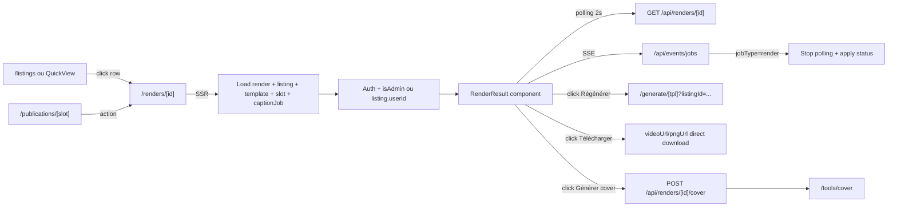

# Render result viewer

## Pitch

Page dédiée `/renders/[id]` qui affiche le résultat d'une génération unique : status pill, message d'erreur ou avertissements résolution, progression (stage + statusDetail + progress bar), preview media (video ou image), et actions principales (Régénérer / Télécharger / Générer une cover si autopack activé).

Surface autonome au layout Liquid Glass v2 — distincte de `/listings` (qui liste). Breadcrumb contextualisé : `Calendrier > Publication > Render` quand le render est lié à un slot, ou `Templates > Template > Render` sinon. Polling 2s + SSE pour arrêter le polling dès que le webhook RunPod arrive.

## Schéma Mermaid



## Entry points UI

| Composant | Fichier:Ligne | Rôle |
|---|---|---|
| Page SSR | `app/(app)/renders/[id]/page.tsx:23-181` | Load render + permission + back href dynamique + breadcrumb |
| RenderResult client | `components/renders/RenderResult.tsx:48-269` | Live status, preview, actions inline |
| StatusPill | `components/renders/RenderResult.tsx:272-293` | Pill glass v2 par tonalité (peach/sage/rose) |
| Liens d'entrée | depuis `ListingsClient` (Eye/click row) ou `RenderQuickView`, depuis `/publications/[id]` |

## Routes API consommées

| Méthode | Path | Effets |
|---|---|---|
| GET | `/api/renders/[id]` | Polling status (2s) — retourne status, videoUrl, pngUrl, errorMsg, stage, statusDetail, progress |
| POST | `/api/renders/[id]/cover` | Lance generation cover (auto extraction de frames) puis redirige `/tools/cover` |
| GET (SSE) | `/api/events/jobs` | EventSource : stop polling dès que webhook arrive |

## Données chargées (SSR)

`app/(app)/renders/[id]/page.tsx:28-49`

```ts
prisma.render.findUnique({
  where: { id },
  include: {
    listing: true,
    template: { select: { id, name, client, jsonData } },
    publicationSlot: {
      select: {
        id, title, account: { handle },
        pattern: { coverMode, coverConfig },
        captionJobs: { orderBy: { createdAt: "desc" }, take: 1, select: { status, outputUrl } },
      },
    },
  },
});
```

## Modèles Prisma

- `Render` — id, status (PENDING|PROCESSING|DONE|ERROR), pngUrl, videoUrl, errorMsg, stage, statusDetail, progress, templateId, listingId, publicationSlotId?
- `Template` — id, name, client, jsonData (preview info)
- `Listing` — userId (utilisé pour l'auth)
- `PublicationSlot` — title, account.handle, pattern.coverMode + coverConfig
- `Pattern.coverConfig` — `{ enabled: boolean }` (source de vérité Phase 1.8, plus `template.coverAutoConfig`)
- `CaptionJob` — status, outputUrl (latest pour résoudre `videoUrl` final via `getSlotFinalVideoUrl`)

## Helpers

- `lib/publications/finalVideo.ts` — `getSlotFinalVideoUrl({ render, latestCaptionJob })` : retourne la vidéo sous-titrée si captions COMPLETED, sinon `render.videoUrl`
- `lib/renderer/renderWorkflow.ts` — `getRenderStageLabel(stage)` : maps RENDER_STAGE enum → label FR
- `lib/hooks/useJobPolling.ts` — `useJobPolling({ fetchFn, isTerminal, intervalMs, enabled })` : polling générique avec arrêt sur terminal

## Backlink contextualisé

`page.tsx:72-101`

```ts
// Back href : publication si lié, listings sinon
backHref = render.publicationSlot?.id
  ? `/publications/${render.publicationSlot.id}`
  : "/listings";

// Breadcrumb hiérarchisé
breadcrumb = render.publicationSlot
  ? [Calendrier (admin only), Publication]
  : [Templates, Template name];
```

## Permissions

- **Authentication** : `getUserContext()` requis (sinon `notFound()`)
- **Authorization** : `canAdminBypass` → tout render OK, sinon `listing.userId === effectiveUser.id`
- **`hasCovers`** : ADMIN bypass ou user a `covers` perm → affiche bouton "Générer une cover" si `coverAutoEnabled`
- **`coverAutoEnabled`** : computed depuis `slot.pattern.coverMode === "autoPack" && pattern.coverConfig.enabled === true`

## Live updates (RenderResult)

`components/renders/RenderResult.tsx:71-99`

- **Polling** : `useJobPolling` fetch `/api/renders/[id]` toutes les 2s tant que status non terminal
- **SSE** : `new EventSource("/api/events/jobs")` — on stop le polling et apply status dès qu'un event `jobType=render && jobId=renderId` arrive
- **apply()** : maj `status, pngUrl, videoUrl, errorMsg, stage, statusDetail, progress` (callback memoized)

## Actions principales

| Action | Trigger | Effets |
|---|---|---|
| **Régénérer** | Click bouton `RotateCw` | `router.push('/generate/{templateId}?listingId={listingId}')` — préfille le form avec les data actuelles du listing |
| **Télécharger** | Click anchor `<a download>` | URL directe `videoUrl` (.mp4) ou `pngUrl` (.png) |
| **Générer une cover** | Click bouton `Sparkles` | `POST /api/renders/[id]/cover` → toast + redirect `/tools/cover` |
| **Mes générations** | Link footer | `/listings` |
| **Nouveau visuel** | Link footer | `/generate/[templateId]` (sans listingId — form vide) |

## États affichés

| État | UI |
|---|---|
| PENDING / PROCESSING | Pill peach "En attente"/"Génération en cours" + carte glass progression (stage label + statusDetail + progress bar 0-100%) |
| DONE + media | Pill sage "Terminé" + preview (video controls ou image object-contain, max-h-[55vh]) + footer actions |
| DONE + `errorMsg.startsWith("WARNINGS:")` | Pill sage + carte glass sky "Avertissements résolution" (list parsée JSON) |
| ERROR | Pill rose "Erreur" + carte glass rose avec errorMsg |

## Variants par rôle

| Rôle | Ce qui change |
|---|---|
| ADMIN | Voit tout render + breadcrumb commence par Calendrier |
| EXTERNAL_GENERATOR / autre | Doit posséder `listing.userId === effectiveUser.id` (sinon notFound) |
| User avec `covers` | Bouton "Générer une cover" si `coverAutoEnabled` |
| User sans `covers` | Bouton absent même si autopack |

## Pré-conditions / invariants

- `render.templateId` doit exister pour le bouton Régénérer (sinon "Template supprimé")
- `videoUrl` requis pour le bouton "Générer une cover" (extraction de frames vidéo)
- `pattern.coverConfig.enabled === true` requis (lecture depuis pattern, plus `template.coverAutoConfig`)
- Polling à 2s — plus rapide que `/listings` (5s) car la fiche est dédiée à un job actif

## Side effects

- `setVideoUrl` + `setErrorMsg` sur SSE event → re-render immédiat
- Génération cover → toast.success/error + `router.push("/tools/cover")`
- `getSlotFinalVideoUrl` : si captions COMPLETED avec outputUrl → affiche la version sous-titrée plutôt que la vidéo brute

## Skills/agents pertinents

- `.claude/skills/render-engine/SKILL.md` — RunPod, FFmpeg, pipeline
- `.claude/skills/captions-transcription/SKILL.md` — getSlotFinalVideoUrl resolution

## Liens vers code

- Page : `web/src/app/(app)/renders/[id]/page.tsx`
- Composant : `web/src/components/renders/RenderResult.tsx`
- Helper : `web/src/lib/publications/finalVideo.ts`
- Workflow lié : `generation-render-template.md` (création du render)
