# Slot — édition rapide

## Pitch
Admin (ou rôle assigné) édite rapidement un slot via SlotDetailPanel drawer accessible depuis "Édition rapide" sur la fiche. Selon le rôle : tabs Statut / Équipe / Ajustements / Planning. Overrides per-slot priment sur pattern. Whitelist `ALLOWED_PATCH_FIELDS_BY_ROLE` filtre les champs mutables.

## Schéma Mermaid

```mermaid
flowchart LR
  Fiche[PublicationHeader] --> Btn["Bouton Édition rapide<br/>SlotQuickEditButton"]
  Btn --> Fetch["GET /api/calendar/slots/[id]"]
  Fetch --> Panel[SlotDetailPanel drawer]
  Panel --> Tabs["Tabs selon rôle"]
  Tabs --> Edit[Modifs overrides / assignées / statut]
  Edit --> PATCH["PATCH /api/calendar/slots/[id]"]
  PATCH --> patchSlot[slotService.patchSlot]
  patchSlot --> Filter[Filter ALLOWED_PATCH_FIELDS_BY_ROLE]
  Filter --> Validate[Validations status matrix + cross-field]
  Validate --> Update[Update Prisma]
  Update --> Logs[logActivity STATUS_CHANGED / ASSIGNEE_CHANGED]
  Logs --> Cancel{CANCELLED?}
  Cancel -->|oui| Cascade[cancelPendingJobsForSlot]
```

## Entry points UI

| Composant | Fichier:Ligne | Rôle |
|---|---|---|
| SlotQuickEditButton | `web/src/components/publications/SlotQuickEditButton.tsx:34-92` | Bouton ADMIN "Édition rapide" (Settings2 icon) |
| PublicationHeader | `web/src/components/publications/PublicationHeader.tsx:69-204` | Expose le bouton |
| SlotDetailPanel | `web/src/components/calendar/SlotDetailPanel.tsx:98-884` | Drawer côté droit, 4 onglets selon rôle |
| OverrideControl | `web/src/components/ui/molecules/OverrideControl.tsx:55-110` | Pattern "hériter vs override custom" (8× dans SlotDetailPanel) |

Tabs par rôle :
- **ADMIN** : Statut / Équipe (assignées) / Ajustements (overrides) / Planning (scheduledAt)
- **MONTEUR / CM / VIDEASTE** : Statut seul

## Routes API

| Méthode | Path | Fichier | Effets |
|---|---|---|---|
| GET | `/api/calendar/slots/[id]` | `route.ts:27-40` | Lecture scopée (account, template, render, pattern, assignées) |
| PATCH | `/api/calendar/slots/[id]` | `route.ts:42-63` | `patchSlot(id, body, ctx)` |
| DELETE | `/api/calendar/slots/[id]` | `route.ts:65-78` | ADMIN only `deleteSlot()` |

Refuse `status=PUBLISHED` dans le body (force passage par `/mark-published`).

## Helpers / triggers

- `web/src/lib/services/slot/slotService.ts:330-770` — **`patchSlot()`** : pipeline complet
  - Load + scope (`canUserAccessSlot`)
  - Filter body via `ALLOWED_PATCH_FIELDS_BY_ROLE`
  - Reject statut terminal (PUBLISHED/CANCELLED/ARCHIVED/REJECTED) sauf via routes dédiées
  - Validate via `canTransition(from, to, role)` (matrice STATUS_TRANSITIONS)
  - Assignées : `assertAssigneeRole`
  - Cross-field Phase 5 (needsCaptions↔preset, etc.)
  - Sanitize notes (H2 : retire `PUBLISHED_URL:` lines)
  - Update DB
  - `logActivity STATUS_CHANGED` (payload `{from, to}`) + `ASSIGNEE_CHANGED` (payload `{monteur, cm, videaste}`)
  - Si CANCELLED → `cancelPendingJobsForSlot()` (Render → ERROR, CaptionJob → FAILED)
- `web/src/lib/permissions/slotScope.ts:164-205` — **`ALLOWED_PATCH_FIELDS_BY_ROLE`** :
  - `ADMIN`: tous champs
  - `MONTEUR`: `[status, notes, description]`
  - `CM`: `[status, title, notes, description]`
  - `VIDEASTE`: `[status, notes]`
  - `EXTERNAL_GENERATOR`: `[]`
- `web/src/lib/permissions/slotScope.ts:112-138` — `canUserAccessSlot(slot, role, userId)`
- `web/src/lib/services/slot/config.ts:181-241` — `resolveSlotConfig()` (override prime sur pattern)

## Modèles Prisma touchés

`PublicationSlot` overrides fields :
- `needsAdminValidationOverride`, `needsClientValidationOverride`, `allowsClientRevisionOverride`
- `needsCaptionsModeOverride`, `needsDescriptionOverride`, `needsRushesOverride`, `needsBriefOverride`
- `coverModeOverride`, `coverPresetIdOverride`, `captionPresetIdOverride`, `descriptionPromptIdOverride`
- `status`, `scheduledAt`, `title`, `description`, `notes`
- `assigneeMonteurId`, `assigneeCmId`, `assigneeVideasteId`

## Side effects

- `logActivity` types : `STATUS_CHANGED`, `ASSIGNEE_CHANGED`, plus indirects (cancelled cascade)
- `cancelPendingJobsForSlot` si CANCELLED : Render PENDING/PROCESSING → ERROR, CaptionJob QUEUED/PROCESSING → FAILED (best-effort)
- `actorId = actualUser.id` (pour audit, vs `effectiveUser` lors impersonation)

## Pré-conditions / invariants

- `canUserAccessSlot` true selon rôle (assigné ou ADMIN)
- Body filtré : champs non-whitelistés silencieusement ignorés
- Status terminal rejeté en PATCH (sauf via routes dédiées)
- `canTransition(from, to, role)` enforced server-side
- Cross-field Phase 5 (preset / prompt si needs* true)
- Assignées : `assertAssigneeRole` (MONTEUR/CM/VIDEASTE — ADMIN passe toujours)
- `notes` sanitized (anti-PUBLISHED_URL injection H2)
- Text fields ≤ 5000 chars
- Pattern change : cross-account guard

## Skills/agents pertinents

- `.claude/skills/admin-permissions/SKILL.md`
- `.claude/skills/ui-design/SKILL.md` (drawer + OverrideControl)
- Agent `toolbox-generalist`

## Liens vers code

- Tests : `web/src/lib/services/slot/__tests__/slotService.test.ts`, `transitions.test.ts`
- E2E : `web/e2e/slot-patch-scopes.spec.ts`, `web/e2e/calendar.spec.ts`
