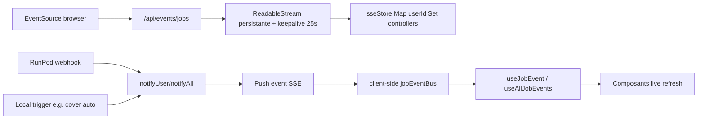

# SSE Events system

## Pitch
Système d'événements Server-Sent Events pour notifier les clients de l'avancement des jobs (Render, CaptionJob, TranscriptionJob, DescriptionJob, CoverFramePack, MediaEditJob, MediaAutocutJob). Endpoint `/api/events/jobs`, store in-memory `Map<userId, Set<controllers>>`, helpers `notifyUser/notifyAll`, hooks `useJobEvent/useAllJobEvents`.

## Schéma Mermaid



## Entry Points & Infrastructure

- `app/api/events/jobs/route.ts:24-55` — **Endpoint SSE `GET /api/events/jobs`** :
  - Auth user requise
  - Ouvre `ReadableStream` persistante
  - **Keepalive 25s** pour prévenir timeout nginx (60s par défaut)
- `lib/sseStore.ts:18-35` — **In-memory pub/sub** `Map<userId, Set<SseController>>` :
  - Isolé par userId (single-process safe)
  - Ajoute/retire connexions côté contrôleur HTTP
- `lib/sseStore.ts:41-57` — **`notifyUser(userId, event)`** : envoie à toutes connexions du user, élimine stales
- `lib/sseStore.ts:64-77` — **`notifyAll(event)`** : broadcast à TOUS (pour jobs sans userId traçable comme MediaAutocutBatch)
- `lib/sseStore.ts:8-13` — **Type `JobEventPayload`** union : `"captions" | "transcription" | "render" | "media-edit" | "media-autocut" | "cover" | "description"`

## Webhooks RunPod (Émetteurs)

| Webhook | Effets SSE |
|---|---|
| `/webhooks/runpod/renders:114-119` | `notifyUser` DONE + videoUrl |
| `/webhooks/runpod/renders:165-170` | `notifyUser` ERROR + errorMsg |
| `/webhooks/runpod/captions:77` | `notifyUser` COMPLETED + videoUrl |
| `/webhooks/runpod/captions:97` | `notifyUser` FAILED + errorMsg |
| `/webhooks/runpod/transcription:79-86` | `notifyUser` COMPLETED + metadata (segmentCount, duration, hasDiarization) |
| `/webhooks/runpod/transcription:143-147` | `notifyUser` FAILED + errorMsg |
| `/webhooks/runpod/media-autocut:85` | `notifyAll` FAILED + errorMsg (broadcast échec global) |
| `/webhooks/runpod/media-autocut:149-154` | `notifyAll` status uppercase (DONE/PARTIAL) + doneCount, failCount |

## Émetteurs Locaux

| Helper | Effets SSE |
|---|---|
| `lib/coverAuto.ts:410` | `notifyUser` FAILED config error |
| `lib/coverAuto.ts:434` | `notifyUser` PROCESSING démarrage |
| `lib/coverAuto.ts:534-539` | `notifyUser` COMPLETED + frameCount |
| `lib/transcribeRenderLocal.ts:139` | `notifyUser` PROCESSING |
| `lib/transcribeRenderLocal.ts:181` | `notifyUser` COMPLETED succès |
| `lib/triggerAutoDescriptionFromTranscription.ts:161` | `notifyUser` QUEUED |
| `lib/triggerAutoDescriptionFromTranscription.ts:543` | `notifyUser` COMPLETED succès |

## Client-side Hooks

- `lib/hooks/jobEventBus.ts:40-56` — **`useJobEvent(jobId)`** : filtre par jobId spécifique, retourne dernier payload ou null
- `lib/hooks/jobEventBus.ts:63-77` — **`useAllJobEvents(callback)`** : écoute TOUS events SSE sans filtrer, callback stable-ref'd
- `components/providers/JobEventsProvider.tsx:24-48` — **Provider** ouvre EventSource sur routes pipeline :
  - `/home`
  - `/calendar`
  - `/publications`
  - `/renders`
  - `/listings`
  - `/captions`
  - `/transcriptions`
  - `/descriptions`

## Consumer Components

| Composant | Effet |
|---|---|
| `components/publications/PublicationLiveRefresh.tsx:42-51` | Invisible, throttle `router.refresh()` sur events matchant `knownJobIds` ou `expectedJobTypes` |
| `components/listings/ListingsClient.tsx:427-446` | Update temps réel états captions/transcription via `useAllJobEvents` |

## Payload Shape

```typescript
JobEventPayload = {
  jobType: "render" | "captions" | "transcription" | "description" | "cover" | "media-edit" | "media-autocut" | "autocut"
  jobId: string
  status: "QUEUED" | "PROCESSING" | "PENDING" | "DONE" | "COMPLETED" | "FAILED" | "ERROR" | "PARTIAL"
  slotId?: string
  videoUrl?: string
  errorMsg?: string
  metadata?: Record<string, any>  // ex: segmentCount, duration, frameCount, doneCount
}
```

## Variantes & Pré-conditions

- **userId scope** : chaque connexion SSE n'écoute que ses propres events
- **EventSource auto-reconnect** natif (client-side, browser)
- **NextAuth session active** requis (`getUserContext()` 401 sinon)
- **Idempotence webhook** : deux appels = même résultat via check status terminal
- **`notifyAll` broadcast** : uniquement pour MediaAutocutBatch (pas d'userId trackable)
- **Single-process safe** : in-memory Map, KO en cluster multi-worker (à savoir si scale-out)

## Skills/agents pertinents

- `.claude/skills/render-engine/SKILL.md` (RunPod webhooks)
- `.claude/skills/captions-transcription/SKILL.md`
- Voir aussi : tous les workflows jobs (cover, captions, transcription, description, render, media-edit, autocut)
