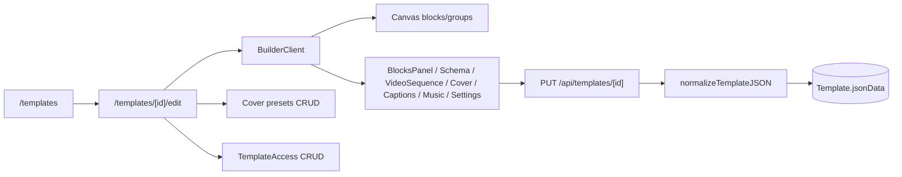

# Template Builder Studio

## Pitch
Admin crée/édite un Template via le Studio (Canvas + panels) : blocks (text/image/video/audio/shape/data/dpe), videoSequence multi-clip, captionAutoConfig, coverAutoConfig (TemplateCoverPreset), bindings MediaLibrary/DataLibrary, TemplateAccess pour EXTERNAL_GENERATOR. JSON normalisé via `normalizeTemplateJSON` à chaque lecture/écriture.

## Schéma Mermaid

## Entry points UI

| Composant | Fichier:Ligne | Rôle |
|---|---|---|
| Liste templates | `app/(app)/templates/page.tsx:1` | ADMIN voit tout, user voit ses accès |
| Studio édition | `app/(app)/templates/[id]/edit/page.tsx:1` | Charge BuilderClient |
| BuilderClient | `components/builder/BuilderClient.tsx:67` | Panels + rail tabs + dispatch save |
| Canvas | `components/builder/Canvas.tsx:34` | Éditeur blocks/groups, zoom, grid snap |
| BlocksPanel | `components/builder/BlocksPanel.tsx:1` | Hiérarchie blocks/groups |
| SchemaPanel | `components/builder/SchemaPanel.tsx:1` | Form + validation conditions |
| VideoSequencePanel | `components/builder/VideoSequencePanel.tsx:1` | Slots vidéo multi-clip |
| CoverTabPanel | `components/builder/CoverTabPanel.tsx:89` | Cover auto config + slot exclusion |
| CaptionsTabPanel | `components/builder/CaptionsTabPanel.tsx:26` | Presets captions + zones exclusion |
| PropertiesPanel | `components/builder/PropertiesPanel.tsx:1` | Édition bloc sélectionné |
| DataTabPanel | `components/builder/DataTabPanel.tsx` | Mapping DataLibrary |
| MusicPanel | `components/builder/MusicPanel.tsx` | Volume/loops/fadeIn-Out |
| SettingsPanel | `components/builder/SettingsPanel.tsx` | Format/margins/DPI/maxDuration |

## Routes API — CRUD Template

| Méthode | Path | Effets |
|---|---|---|
| POST | `/api/templates:40` | Crée vierge (ADMIN) + canvas par défaut |
| GET | `/api/templates:8` | Liste (admin=all, user=TemplateAccess) |
| GET | `/api/templates/[id]:10` | Détail + `normalizeTemplateJSON(jsonData)` |
| PUT | `/api/templates/[id]:31` | Update (ADMIN) + `serializeTemplateJSON` |
| DELETE | `/api/templates/[id]:72` | Cascade TemplateAccess + soft-delete Listing/Render |
| POST | `/api/templates/import:40` | Import JSON (ADMIN) |
| GET | `/api/templates/[id]/export:8` | Export `buildTemplateTransferPayload` |

## Routes API — Cover Presets

| Méthode | Path | Effets |
|---|---|---|
| GET | `/api/templates/[id]/cover-presets:12` | Liste orderBy sortOrder |
| POST | `/.../cover-presets:48` | Crée (ADMIN), unique(templateId, name) |
| GET | `/.../cover-presets/[presetId]:13` | Détail (user+admin) |
| PATCH | `/.../cover-presets/[presetId]:43` | Update config JSON |
| DELETE | `/.../cover-presets/[presetId]:108` | **Refuse si patterns référencent via `coverConfig.coverPresetName`** |

## Routes API — TemplateAccess

| Méthode | Path | Effets |
|---|---|---|
| GET | `/api/admin/users/[id]/accesses:1` | Liste templates assignés à user |
| POST | `/api/admin/users/[id]/accesses:21` | Upsert TemplateAccess |
| DELETE | `/api/admin/users/[id]/accesses:42` | Revoke |

## Helpers — Normalisation JSON

- `lib/templateNormalization.ts:107` — **`normalizeTemplateJSON()`** : nettoie blocks/groups/formSections, résout schema, appelle ensureVideoSequence
- `lib/templateNormalization.ts:176` — `serializeTemplateJSON()` : alias pour persist DB
- `lib/videoSequenceUtils.ts:68` — `ensureVideoSequence()` : migration lazy (1 slot si VideoBlock existe)
- `lib/videoSequenceUtils.ts:40` — `buildDefaultSlotFromVideoBlock()`

## Helpers — Transfer & Validation

- `lib/templateTransfer.ts:27` — `buildTemplateTransferPayload()` (version + exportedAt)
- `lib/templateTransfer.ts:45` — `parseTemplateTransferPayload()` (fallback rétrocompat)
- `lib/templateTransfer.ts:77` — `buildTemplateExportFilename()` (sanitize accent)
- `lib/publications/patternValidation.ts:1` — `validatePatternConfig()` cross-field

## Helpers — Permissions

- `lib/permissions.ts:115` — `canAccessTemplate()` : ADMIN=true, sinon lookup `TemplateAccess`
- `lib/permissions.ts:87` — `hasTool("templates")` pour EXTERNAL_GENERATOR

## Modèles Prisma

- `Template` (`schema.prisma:118`) — name, client, formats JSON, **jsonData JSON sérialisé**, contentType, userId FK, accesses[]
- `TemplateCoverPreset` (`schema.prisma:138`) — templateId FK, name (unique per template), config JSON (overlayGroupIds, frameCount, offsetX/Y, excludeZones), sortOrder
- `TemplateAccess` (`schema.prisma:172`) — userId+templateId unique
- `AccountPattern` (`schema.prisma:900`) — templateId FK + `coverConfig.coverPresetName`
- `PublicationSlot` (`schema.prisma:737`) — templateId FK + `coverPresetIdOverride` + `captionPresetIdOverride`

## Side effects & Persistence

- Build → JSON serialize via `serializeTemplateJSON()` avant PUT/POST DB
- Delete cascade : `TemplateAccess` (Cascade), `Render/Listing` conservés (templateId → NULL SetNull)
- Cover preset delete : **refuse** si `AccountPattern.coverConfig.coverPresetName` ref (rejet 409)
- Export filename : `buildTemplateExportFilename()` sanitize accent → slug pour `.json`
- Import : `parseTemplateTransferPayload()` + `normalizeTemplateJSON()` avant insert

## Composants UI — Templates Management

- `NewTemplateButton.tsx` — Modal création (format, client)
- `ImportTemplateButton.tsx` — Upload JSON
- `ExportTemplateButton.tsx` — Download JSON
- `DuplicateTemplateButton.tsx` — Clone template
- `DeleteTemplateButton.tsx` — Soft-delete avec cascade

## Variants par rôle

| Rôle | Ce qui change |
|---|---|
| ADMIN | Crée/édite/supprime + TemplateCoverPreset + TemplateAccess |
| CM/MONTEUR | Lecture templates + génération (ROLE_TOOL_SCOPE, pas de création) |
| EXTERNAL_GENERATOR | Génère seulement templates assignées via TemplateAccess |

## Pré-conditions / invariants

- Canvas valide : format in CANVAS_FORMATS, width/height > 0
- Blocks ordonnés : pas de trous ID, groupId résolus, orphans → setGroupId=undefined
- VideoSequence cohérent : slots id uniques, overlayGroupIds → groups existent
- Format valide : JSON parse OK, schema sans dupes sectionId
- Perms : ADMIN=créa/édit/suppr, EXTERNAL_GENERATOR limité à ses accesses

## Skills/agents pertinents

- `.claude/skills/template-builder/SKILL.md`
- Agent `toolbox-generalist` pour modifs builder
