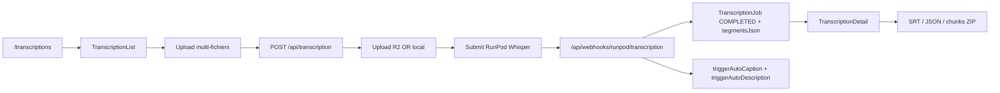

# Transcription tool

## Pitch
Outil `/transcriptions` : upload audio/vidéo, RunPod Whisper STT, résultat SRT/JSON/chunks ZIP. Config (model turbo/large-v3, language, diarisation). Aussi orchestré indirectement par le pipeline auto (CaptionJob/DescriptionJob réutilisent l'output via `triggerAutoCaption/Description`).

## Schéma Mermaid

## Entry points UI

| Composant | Fichier:Ligne | Rôle |
|---|---|---|
| Legacy redirect | `app/(app)/tools/transcription/page.tsx:10` | `/tools/transcription` → `/transcriptions` |
| Page `/transcriptions` | `app/(app)/transcriptions/page.tsx:10` | 50 derniers jobs + params `slotId` + `returnTo` |
| Page detail | `app/(app)/transcriptions/[id]/page.tsx` | TranscriptionDetail (inféré) |
| TranscriptionList | `components/transcription/TranscriptionList.tsx:1` | Uploader multi-fichiers + polling SSE + config |
| TranscriptionDetail | `components/transcription/TranscriptionDetail.tsx:47` | Status badge, polling fallback 5s, download SRT/JSON/chunks ZIP, relancer avec diarisation, CTA "Utiliser dans Captions" |

## Routes API

| Méthode | Path | Effets |
|---|---|---|
| POST | `/api/transcription:67` | multipart OR presigned mode. Auth TRANSCRIPTION tool. Crée TranscriptionJob QUEUED, upload R2 (ou local), submit RunPod ou render-engine local |
| GET | `/api/transcription:412` | Liste 50 jobs user avec cursor pagination |
| GET | `/api/transcription/[id]:60` | Status job + polling RunPod si PROCESSING + stall detection (2h PROCESSING, 15min QUEUED pré-submit) |
| PATCH | `/api/transcription/[id]:162` | Edit config (model/language/enableDiarization) pour jobs QUEUED |
| DELETE | `/api/transcription/[id]:228` | Annule QUEUED/PROCESSING + marque FAILED + cleanup R2 |
| POST | `/api/transcription/[id]/submit:23` | Atomic submit après browser upload presigned, valide R2 exists, submit RunPod/local |
| PUT | `/api/transcription/[id]/upload-local` | Mode dev R2 absent, form-data endpoint |
| GET | `/api/transcription/[id]/download:28` | `?format=srt\|json\|chunks` (SRT timestamps, JSON brut, ZIP chunks ~9000 tokens) |
| GET | `/api/transcription/[id]/audit:23` | Score qualité SRT (0-100) + warnings (durée, gaps, line breaks) |

## Webhook

| Path | Effets |
|---|---|
| `/api/webhooks/runpod/transcription:27` | Auth `RUNPOD_WEBHOOK_SECRET`. Update TranscriptionJob COMPLETED/FAILED. SSE notify. **Déclenche auto-captions + auto-description si applicable.** |

## Helpers & Libs

- `lib/transcriptionProcess.ts:1` — `generateSrt()`, `generateChunks()`, `buildSubtitlesFromWords()`, `auditSRT()` (post-processing segments Whisper)
- `lib/triggerAutoTranscription.ts:1` — Trigger auto post-render DONE (si `captionAutoConfig.enabled`)
- `lib/triggerAutoCaptionFromTranscription.ts:264` — Auto CaptionJob post-TranscriptionJob COMPLETED si renderId + template captionAutoConfig
- `lib/triggerAutoDescriptionFromTranscription.ts:169` — Auto DescriptionJob post-TranscriptionJob si autoGenerate
- `lib/permissions/tools.ts:35` — `ROLE_TOOL_SCOPE` : CM + MONTEUR ont "transcription" par défaut

## Modèles Prisma

**`TranscriptionJob`** :
- `status` (QUEUED|PROCESSING|COMPLETED|FAILED)
- `inputKey` (R2)
- `outputJsonKey` (R2 segments JSON)
- `segmentsJson` (fallback DB)
- `model` (turbo/large-v3)
- `language`, `enableDiarization`, `hasDiarization`
- `runpodJobId @unique`
- `renderId @unique` (render auto)
- `publicationVersionId @unique` (version manual)
- `slotId` (rattachement manuel)
- `staleSince`, `staleReason` (obsolescence)
- `descriptionJobs[]` (inverse relation)

## Variants & Permissions

| Rôle | Ce qui change |
|---|---|
| ADMIN | Bypass `hasTool` check (`canAdminBypass=true`) |
| CM/MONTEUR | ROLE_TOOL_SCOPE inclut "transcription" |
| USER | User.permissions JSON via `parsePermissions` |
| Auto pipeline | `job.renderId \|\| job.publicationVersionId` → conserve `inputKey` (vidéo render), exclut de cleanup R2 à COMPLETED |

## Pré-conditions / invariants

- Permission `"transcription"` OU ADMIN
- Format audio/vidéo accepté (MP3/WAV/M4A/AAC/MP4/MOV/WEBM/etc.)
- R2 ou local fallback configuré
- RunPod accessible OU render-engine local
- Stall detection : 2h PROCESSING, 15min QUEUED pré-submit
- Auto-cascade post-COMPLETED : trigger auto-captions + auto-description si conditions

## Skills/agents pertinents

- `.claude/skills/captions-transcription/SKILL.md`
- `.claude/skills/render-engine/SKILL.md` (RunPod Whisper)
