# Workflow monteur — upload rush → upload version → promote

## Pitch
Le vidéaste upload des rushs (PublicationRush) → le monteur upload une version montée (PublicationVersion) → admin/auto promote la version (currentVersionId set, déclenche la chaîne post-promote : transcription + cover si autoPack).

## Schéma Mermaid

```mermaid
flowchart LR
  Videaste[VIDEASTE upload rush] --> Presign1["POST /upload-presign kind=rush"]
  Presign1 --> R2A[PUT R2]
  R2A --> Complete1["POST /upload-complete kind=rush"]
  Complete1 --> Transition1["status: → RUSHES_RECEIVED"]
  Transition1 --> Monteur[MONTEUR upload version]
  Monteur --> Presign2["POST /upload-presign kind=version"]
  Presign2 --> R2B[PUT R2]
  R2B --> Complete2["POST /upload-complete kind=version"]
  Complete2 --> AutoPromote{needsAdminValidation?}
  AutoPromote -->|false| AutoP[Auto-promote currentVersionId]
  AutoPromote -->|true| EditReview["status: EDIT_REVIEW (admin valide)"]
  EditReview -->|Admin| ManualPromote["POST /promote"]
  AutoP --> Chain[Cascade chain]
  ManualPromote --> Chain
  Chain --> MarkStale[markJobsStaleForSlot]
  Chain --> Transcribe[triggerAutoTranscriptionForVersion]
  Chain --> CoverAuto[tryAutoTriggerCover si autoPack]
```



## Entry points UI

| Composant | Fichier:Ligne | Rôle |
|---|---|---|
| RushesSection | `web/src/components/publications/sections/RushesSection.tsx:1-295` | Dropzone rushs (VIDEASTE/CM/ADMIN) |
| VersionsSection | `web/src/components/publications/sections/VersionsSection.tsx:1-535` | Upload version + bouton "Promouvoir" (MONTEUR/ADMIN) |
| MediaDropzone | `web/src/components/ui/MediaDropzone.tsx:174-281` | Composant générique upload R2 (multipart) |
| PublicationFiche | `web/src/app/(app)/publications/[id]/PublicationFiche.tsx:1-250` | Visibilité par rôle |
| ConfirmDialog promote | `VersionsSection.tsx:108-118` | Affiche warning si captions/cover déjà completed (V6.5.2) |

## Routes API

| Méthode | Path | Fichier | Effets |
|---|---|---|---|
| POST | `/api/publications/[id]/upload-presign` | (presigned R2) | Retourne uploadId pour multipart |
| POST | `/api/publications/[id]/upload-complete` | `upload-complete/route.ts:1-460` | Finalize rush ou version |
| GET | `/api/publications/[id]/rushes` | `rushes/route.ts:1-48` | Liste rushs |
| GET | `/api/publications/[id]/versions` | `versions/route.ts:1-56` | Liste versions |
| POST | `/api/publications/[id]/versions/[v]/promote` | `promote/route.ts:1-194` | Promote manuel (ADMIN only) |

## Helpers / triggers

- `web/src/app/api/publications/[id]/upload-complete/route.ts:223-277` — `handleRushComplete()` : crée PublicationRush + logActivity RUSHES_UPLOADED + transition auto RUSHES_UPLOADED_FIRST
- `web/src/app/api/publications/[id]/upload-complete/route.ts:280-411` — `handleVersionComplete()` : crée PublicationVersion + logActivity VERSION_UPLOADED + transition auto VERSION_UPLOADED_FIRST → si `needsAdminValidation=false` auto-promote
- `web/src/app/api/publications/[id]/upload-complete/route.ts:186-189` — Résout `needsAdminValidation` (override slot > pattern > false)
- `web/src/app/api/publications/[id]/versions/[v]/promote/route.ts:104-184` — Promote manuel : TX update currentVersionId + logActivity + applyAutoTransition + markJobsStaleForSlot + tryAutoTriggerCover + triggerAutoTranscriptionForVersion
- `web/src/lib/triggerAutoTranscriptionForVersion.ts:1-100` — Phase 2.4 : déclenche TranscriptionJob pour version
- `web/src/lib/publications/jobLifecycle.ts:117-171` — `markJobsStaleForSlot()` cascade stale (captions/description/cover/transcription)
- `web/src/lib/publications/actions.ts:267-281` — `promoteVersionWarning()` : retourne warning si jobs déjà completed sur ancienne version

## Modèles Prisma touchés

- `PublicationRush` (`schema.prisma:1073-1088`) — `slotId`, `r2Key`, `fileName`, `uploadedByUserId`, `uploadedAt`, `deletedAt` (soft-delete)
- `PublicationVersion` (`schema.prisma:1014-1042`) — `slotId`, `versionNumber`, `r2Key`, `fileUrl`, `uploadedByUserId`, `createdAt`, `deletedAt`
- `PublicationSlot` (`schema.prisma:737-853`) — `currentVersionId` (@unique), `status`, `needsRushesOverride`, `needsAdminValidationOverride`, `versions[]`, `rushes[]`, `activeCaptionJobId`, `activeTranscriptionJobId`, `activeCoverPackId`
- `AccountPattern` (`schema.prisma:900-970`) — `needsRushes`, `needsBrief`, `needsAdminValidation`, source enum

## Transitions de statut

```
RUSHES_UPLOADED_FIRST    : DRAFT/PLANNED/RUSHES_EXPECTED → RUSHES_RECEIVED
VERSION_UPLOADED_FIRST   : RUSHES_RECEIVED/IN_EDIT → EDIT_REVIEW
VERSION_UPLOADED_AGAIN   : EDIT_APPROVED → EDIT_REVIEW (re-livraison)
VERSION_PROMOTED         : * → EDIT_APPROVED
```

Référence : `web/src/lib/services/slot/transitions.ts:109-139` `computeAutoTransition()`.

`applyAutoTransition` : TX, calls `logActivity STATUS_CHANGED`.

## Side effects au promote

- `markJobsStaleForSlot()` cascade (captions/description/cover/transcription marqués `staleSince`, `active*Id = null`)
- `tryAutoTriggerCover()` si `coverMode = autoPack`
- `triggerAutoTranscriptionForVersion()` si pattern demande captions ou description auto
- `logActivity` types : `RUSHES_UPLOADED`, `VERSION_UPLOADED`, `VERSION_PROMOTED`, `STATUS_CHANGED`, `CURRENT_VERSION_CHANGED`

## Permissions

| Rôle | Rushs | Version | Promote |
|---|---|---|---|
| ADMIN | ✅ | ✅ | ✅ |
| VIDEASTE | ✅ si assigné | — | — |
| MONTEUR | — | ✅ si assigné | — |
| CM | ✅ si assigné | (lecture) | — |

Helpers : `web/src/lib/permissions/publications.ts:285-337` (`canUploadRushes`, `canUploadVersion`, `canPromoteVersion`).

## Auto-promote vs validation admin

- Si `needsAdminValidation = false` (default) : version auto-promute après upload complete → `currentVersionId = newVersionId` → cascade chain
- Si `needsAdminValidation = true` (Phase 2.3) : version reste en EDIT_REVIEW jusqu'à `POST /promote` manuel par admin

## V6.5.2 — Cohérence warning

`promoteVersionWarning()` : retourne message si `captionJob` ou `coverPack` déjà COMPLETED sur l'ancienne version. ConfirmDialog `VersionsSection.tsx:108-118` affiche le warning avant d'autoriser le promote.

## Pré-conditions / invariants

- Tool ou rôle requis pour chaque action
- `slotId` valide via `canUserAccessSlot`
- `currentVersionId` `@unique` (1 seule version courante)
- Cascade stale invalide les jobs avals — l'UI affiche badge "Obsolète" via `staleSince`

## Skills/agents pertinents

- `.claude/skills/admin-permissions/SKILL.md` — gating par rôle
- Agent `toolbox-generalist` pour modif logic
- Agent `bug-hunter` si transitions douteuses

## Liens vers code

- Tests : `web/src/lib/publications/__tests__/transitions.test.ts`, `actions.test.ts`
- E2E : `web/e2e/publications-rushes-flow.spec.ts` + `web/scripts/capture-ux-screenshots.ts` scenario `full-manual-workflow`
