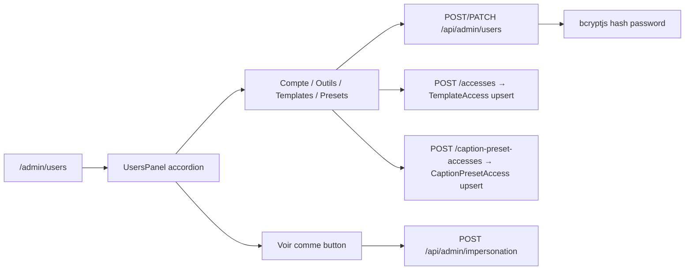

# Users admin

## Pitch
Admin gère les User (5 rôles : ADMIN/VIDEASTE/MONTEUR/CM/EXTERNAL_GENERATOR) via panel accordéon avec 4 onglets : Compte / Outils (permissions JSON) / Templates (TemplateAccess) / Presets captions (CaptionPresetAccess). Impersonation start/stop via cookie 8h. EXTERNAL_GENERATOR restreint à TEMPLATES/COVERS.

## Schéma Mermaid

## Entry points UI

| Composant | Fichier:Ligne | Rôle |
|---|---|---|
| Page users | `app/(app)/admin/users/page.tsx:1` | AuthGuard ADMIN + fetch templates+presets |
| UsersPanel | `components/admin/UsersPanel.tsx:88` | Accordéon + modaux créer/éditer |
| AppNav | `components/layout/AppNav.tsx` | Lien `/admin/users` admin-only |
| Onglet Compte | `UsersPanel.tsx:485` | role/name/username/email/password |
| Onglet Outils | `UsersPanel.tsx:578` | Grille Switch[] toggle permissions (filtre EXTERNAL_GENERATOR) |
| Onglet Templates | `UsersPanel.tsx:659` | Chips assignés + picker grant TemplateAccess |
| Onglet Presets captions | `UsersPanel.tsx:708` | Visible si userTools.includes("captions"), grant CaptionPresetAccess |

## Routes API

### User
| Méthode | Path | Effets |
|---|---|---|
| GET | `/api/admin/users:9` | Liste + TemplateAccess + compteurs casquettes (assignedAsVideaste/Monteur/Cm) |
| POST | `/api/admin/users:60` | Create (hash bcryptjs, username+email uniques) |
| PATCH | `/api/admin/users/[id]:10` | Update name/email/password/role + permissions JSON, **EXTERNAL_GENERATOR bloqué hors TEMPLATES/COVERS** |
| DELETE | `/api/admin/users/[id]:82` | Soft cascade DB (pas de self-delete : 400 si target=current) |

### TemplateAccess / CaptionPresetAccess
| Méthode | Path | Effets |
|---|---|---|
| POST | `/api/admin/users/[id]/accesses:24` | Upsert TemplateAccess |
| DELETE | `/api/admin/users/[id]/accesses:45` | Revoke template(s) |
| POST | `/api/admin/users/[id]/caption-preset-accesses:22` | Upsert CaptionPresetAccess |
| DELETE | `/api/admin/users/[id]/caption-preset-accesses:39` | Revoke preset |

### Impersonation
| Méthode | Path | Effets |
|---|---|---|
| POST | `/api/admin/impersonation:10` | Set cookie `toolbox_impersonate_user_id` (8h, httpOnly, secure, lax). **Bloque impersonation ADMIN target**. Clears view-as cookie. |
| DELETE | `/api/admin/impersonation:73` | Clear cookie + redirect `/admin/users` |

## Modèles Prisma

- **`User`** (`schema.prisma:10`) — id, username unique, email unique, name, role enum, **permissions JSON array** (`["templates","captions",...]`), createdAt
- **`TemplateAccess`** (`schema.prisma:172`) — (userId, templateId) unique
- **`CaptionPresetAccess`** (`schema.prisma:94`) — (userId, presetId) unique

## Helpers permission

- `lib/permissions.ts:57` — **`getUserTools(userId)`** : fusionne ROLE_TOOL_SCOPE + User.permissions JSON
- `lib/permissions.ts:87` — **`hasTool(userId, tool)`** : ADMIN=true, sinon role+permissions
- `lib/permissions/tools.ts:35` — **`ROLE_TOOL_SCOPE`** :
  - ADMIN = "*"
  - CM = `["captions", "transcription", "description", "cover"]`
  - MONTEUR = `["captions", "transcription"]`
  - VIDEASTE / EXTERNAL_GENERATOR = `[]`
- `lib/permissions/parsePermissions.ts:18` — `parsePermissions(rawPermissions)` safe parse
- `lib/permissions.ts:51` — **`EXTERNAL_GENERATOR_ALLOWED_TOOLS`** readonly `["templates", "covers"]`

## Auth & Impersonation

- `lib/userContext.ts:37` — **`canAdminBypass`** : true ⟺ role="ADMIN" RÉEL (false en impersonation)
- `lib/userContext.ts:30` — **`isImpersonating`** : true ⟺ admin voit comme un autre user
- `/api/admin/impersonation/route.ts:34` — **Bloque impersonation ADMIN target** (400)

## Pré-conditions & Validations

- Email + username uniques (POST + PATCH)
- Role enum valide (`USER_ROLES`)
- Permissions JSON parsable + filtré si EXTERNAL_GENERATOR
- Pas de self-delete (400 si id == currentUser.id)
- Pas d'impersonation circulaire (400 si userId == actualUser.id)
- Admin-only via `canAdminBypass` (pas de read perms pour non-admins)

## Variants par rôle

| Rôle | Ce qui change |
|---|---|
| ADMIN | CRUD complet + impersonation + view-as |
| Autres | Aucun accès à `/admin/users` |

## Skills/agents pertinents

- `.claude/skills/admin-permissions/SKILL.md`
- Agent `toolbox-generalist`
